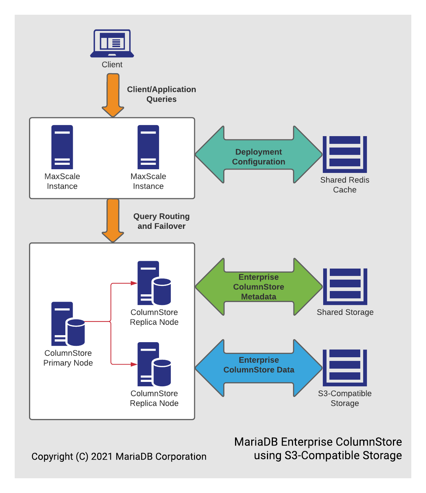
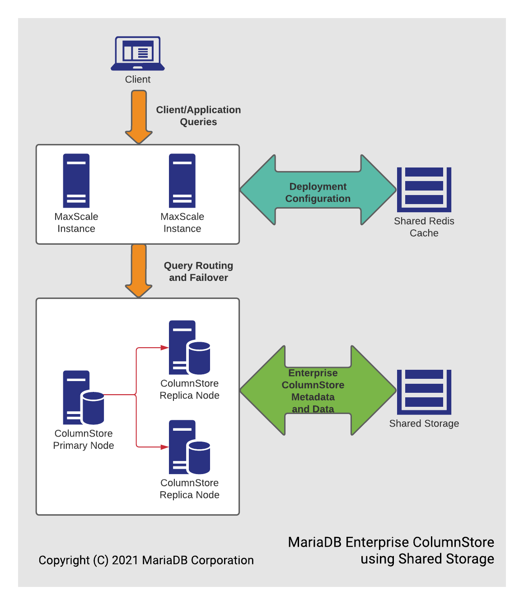
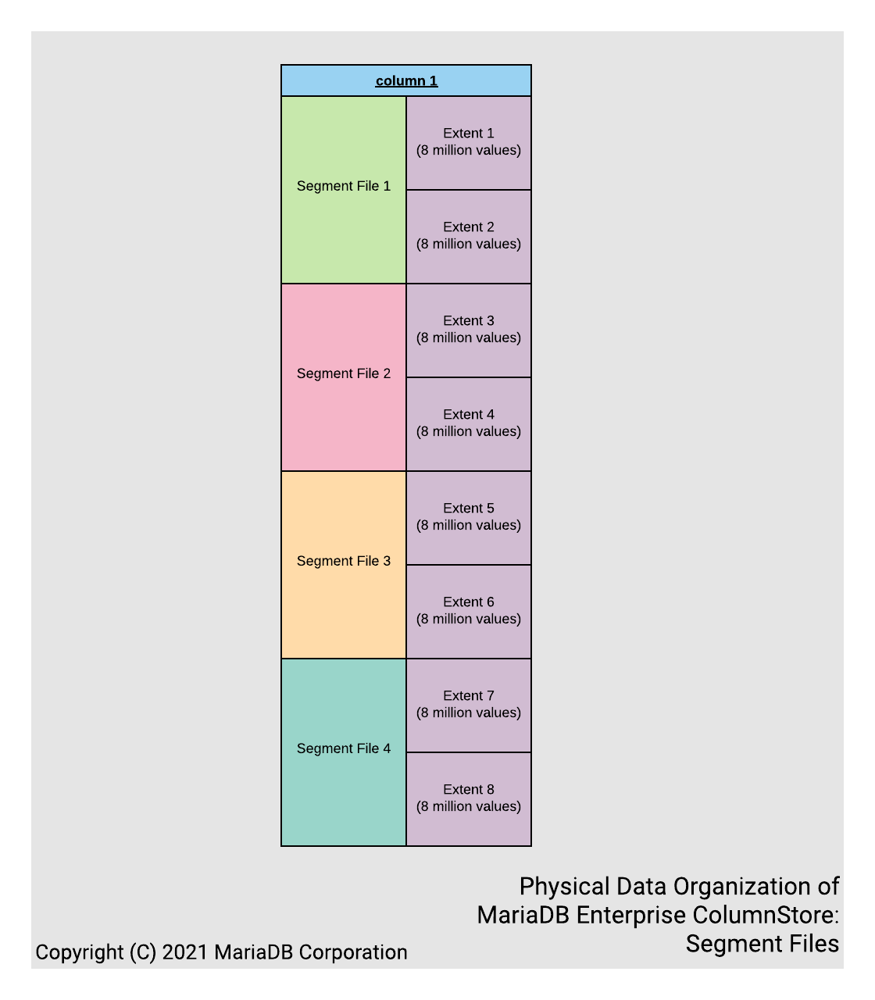
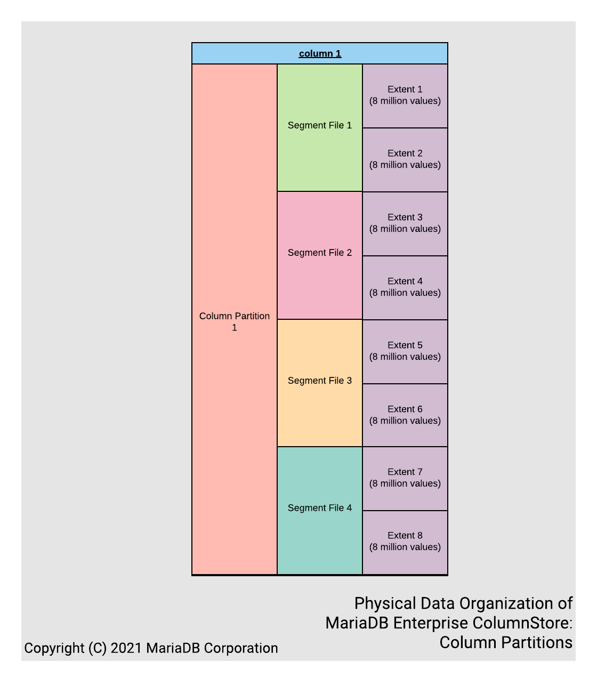
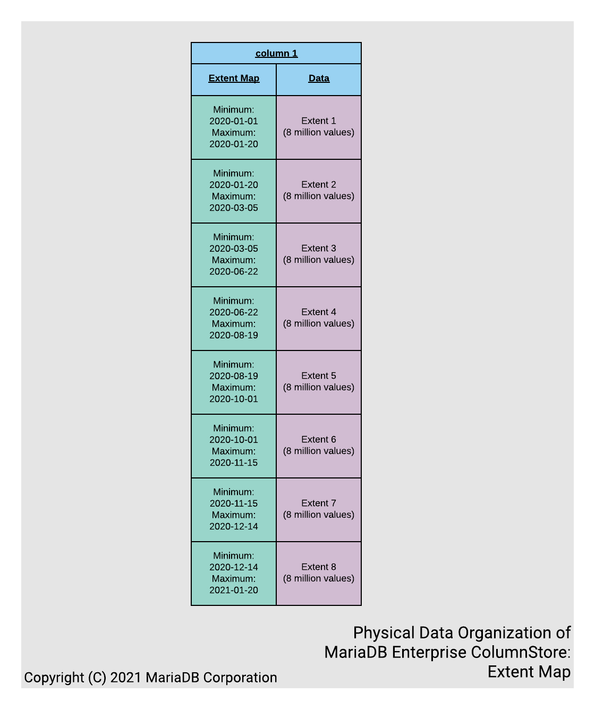

# ColumnStore Storage Architecture

## Overview

MariaDB Enterprise ColumnStore's storage architecture is designed to provide great performance for analytical queries.

### Columnar Storage Engine

MariaDB Enterprise ColumnStore is a columnar storage engine for [MariaDB Enterprise Server](../../en/mariadb-enterprise-server/). MariaDB Enterprise ColumnStore enables ES to perform analytical workloads, including online analytical processing (OLAP), data warehousing, decision support systems (DSS), and hybrid transactional-analytical processing (HTAP) workloads.

Most traditional relational databases use row-based storage engines. In row-based storage engines, all columns for a table are stored contiguously. Row-based storage engines perform very well for transactional workloads, but are less performant for analytical workloads.

Columnar storage engines store each column separately. Columnar storage engines perform very well for analytical workloads. Analytical workloads are characterized by ad hoc queries on very large data sets by relatively few users.

MariaDB Enterprise ColumnStore automatically partitions each column into extents, which helps improve query performance without using indexes.

### OLAP Workloads

MariaDB Enterprise ColumnStore enables MariaDB Enterprise Server to perform analytical or online analytical processing (OLAP) workloads.

OLAP workloads are generally characterized by ad hoc queries on very large data sets. Some other typical characteristics are:

* Each query typically reads a subset of columns in the table
* Most activity typically consists of read-only queries that perform aggregations, window functions, and various calculations
* Analytical applications typically require only a few concurrent queries
* Analytical applications typically require scalability of large, complex queries
* Analytical applications typically require efficient bulk loads of new data

OLAP workloads are typically required for:

* Business intelligence (BI)
* Health informatics
* Historical data mining

Row-based storage engines have a disadvantage for OLAP workloads. Indexes are not usually very useful for OLAP workloads, because the large size of the data set and the ad hoc nature of the queries preclude the use of indexes to optimize queries.

Columnar storage engines are much better suited for OLAP workloads. MariaDB Enterprise ColumnStore is a columnar storage engine that is designed for OLAP workloads:

* When a query reads a subset of columns in the table, Enterprise ColumnStore is able to reduce I/O by reading those columns and ignoring all others, because each column is stored separately
* When most activity consists of read-only queries that perform aggregations, window functions, and various calculations, Enterprise ColumnStore is able to efficiently execute those queries using extent elimination, distributed query execution, and massively parallel processing (MPP) techniques
* When only a few concurrent queries are required, Enterprise ColumnStore is able to maximize the use of system resources by using multiple threads and multiple nodes to perform work for each query
* When scalability of large, complex queries is required, Enterprise ColumnStore is able to achieve horizontal and vertical scalability using distributed query execution and massively parallel processing (MPP) techniques
* When efficient bulk loads of new data is required, Enterprise ColumnStore is able to bulk load new data without affecting existing data using automatic partitioning with the extent map

### OLTP Workloads

MariaDB Enterprise Server has had excellent performance for transactional or online transactional processing (OLTP) workloads since the beginning.

OLTP workloads are generally characterized by a fixed set of queries using a relatively small data set. Some other typical characteristics are:

* Each query typically reads and/or writes many columns in the table
* Most activity typically consists of small transactions that only read and/or write a small number of rows
* Transactional applications typically require many concurrent transactions
* Transactional applications typically require a fast response time and low latency
* Transactional applications typically require ACID properties to protect data

OLTP workloads are typically required for:

* Financial transactions performed by financial institutions and e-commerce sites
* Store inventory changes performed by brick-and-mortar stores and e-commerce sites
* Account metadata changes performed by many sites that stores personal data

Row-based storage engines have several advantages for OLTP workloads:

* When a query reads and/or writes many columns in the table, row-based storage engines can find all columns on a single page, so the I/O costs of the operation are low
* When a transaction reads/writes a small number of rows, row-based storage engines can use an index to find the page for each row without a full table scan
* When many concurrent transactions are operating, row-based storage engines can implement transactional isolation by storing multiple versions of changed rows
* When a fast response time and low latency are required, row-based storage engines can use indexes to optimize the most common queries
* When ACID properties are required, row-based storage engines can implement consistency and durability with fewer performance trade-offs, since each row's columns are stored contiguously

[InnoDB](../../en/storage-engines-overview-innodb-storage-engine/) is ES's default storage engine, and it is a highly performant row-based storage engine.

### Hybrid Workloads

MariaDB Enterprise ColumnStore enables MariaDB Enterprise Server to function as a single-stack solution for [Hybrid transactional-analytical processing (HTAP)](../../en/deploy-htap-topology/) workloads.

Hybrid workloads are characterized by a mix of transactional and analytical queries. Hybrid workloads are also known as "Smart Transactions", "Augmented Transactions" "Translytical", or "Hybrid Operational-Analytical Processing (HOAP)".

Hybrid workloads are typically required for applications that require real-time analytics that lead to immediate action:

* Financial institutions use transactional queries to handle financial transactions and analytical queries to analyze the transactions for business intelligence
* Insurance companies use transactional queries to accept/process claims and analytical queries to analyze those claims for business opportunities or risks
* Health providers use transactional queries to track electronic health records (EHR) and analytical queries to analyze the EHRs to discover health trends or prevent adverse drug interactions

MariaDB Enterprise Server provides multiple components to perform hybrid workloads:

* For analytical queries, the Enterprise ColumnStore storage engine can be used.
* For transactional queries, row-based storage engines, such as InnoDB, can be used.
* For queries that reference both analytical and transactional data, ES's cross-engine join functionality can be used to join Enterprise ColumnStore tables with InnoDB tables.
* [MariaDB MaxScale](../../en/maxscale/) is a high-performance database proxy, which can dynamically route analytical queries to Enterprise ColumnStore and transactional queries to the transactional storage engine.

## Storage Options

MariaDB Enterprise ColumnStore supports multiple storage types:

| Storage Type                                                                                                                                  | Description                                                                                                                                                                                                                                                                                                                                                                                                                                                                                   |
| --------------------------------------------------------------------------------------------------------------------------------------------- | --------------------------------------------------------------------------------------------------------------------------------------------------------------------------------------------------------------------------------------------------------------------------------------------------------------------------------------------------------------------------------------------------------------------------------------------------------------------------------------------- |
| Storage Type                                                                                                                                  | Description                                                                                                                                                                                                                                                                                                                                                                                                                                                                                   |
| [S3-Compatible Object Storage](../columnstore-architecture/mariadb-enterprise-columnstore-storage-architecture/#s3-compatible-object-storage) | • S3-compatible object storage is optional, but recommended • Enterprise ColumnStore can use S3-compatible object storage to store data. •With multi-node Enterprise ColumnStore, the [Storage Manager directory](../columnstore-architecture/mariadb-enterprise-columnstore-storage-architecture/#storage-manager-directory) should use [shared local storage](../columnstore-architecture/mariadb-enterprise-columnstore-storage-architecture/#shared-local-storage) for high availability. |
| [Shared Local Storage](../columnstore-architecture/mariadb-enterprise-columnstore-storage-architecture/#shared-local-storage)                 | • Required for multi-node Enterprise ColumnStore with high availability • Enterprise ColumnStore can use shared local storage to store data and metadata. •If S3-compatible storage is used for data, the shared local storage will only be used for the [Storage Manager directory](../columnstore-architecture/mariadb-enterprise-columnstore-storage-architecture/#storage-manager-directory).                                                                                             |
| Non-Shared Local Storage                                                                                                                      | • Appropriate for single-node Enterprise ColumnStore. • Enterprise ColumnStore can use non-shared local storage to store data and metadata.                                                                                                                                                                                                                                                                                                                                                   |

### Deployment with S3-Compatible Storage



### Deployment with Shared Storage



## S3-Compatible Object Storage

MariaDB Enterprise ColumnStore supports S3-compatible object storage.

S3-compatible object storage is optional, but highly recommended. If S3-compatible object storage is used, Enterprise ColumnStore requires the [Storage Manager directory](../columnstore-architecture/mariadb-enterprise-columnstore-storage-architecture/#storage-manager-directory) to use [Shared Local Storage](../columnstore-architecture/mariadb-enterprise-columnstore-storage-architecture/#shared-local-storage) (such as NFS) for high availability.

S3-compatible object storage is:

* Compatible: Many object storage services are compatible with the Amazon S3 API.
* Economical: S3-compatible object storage is often very low cost.
* Flexible: S3-compatible object storage is available for both cloud and on-premises deployments.
* Limitless: S3-compatible object storage is often virtually limitless.
* Resilient: S3-compatible object storage is often low maintenance and highly available, since many services use resilient cloud infrastructure.
* Scalable: S3-compatible object storage is often highly optimized for read and write scaling.
* Secure: S3-compatible object storage is often encrypted-at-rest.

Many S3-compatible object storage services exist. MariaDB Corporation cannot make guarantees about all S3-compatible object storage services, because different services provide different functionality.

If you have any questions about using specific S3-compatible object storage with MariaDB Enterprise ColumnStore, contact us.

### S3 API

MariaDB Enterprise ColumnStore can use any object store that is compatible with the Amazon S3 API.

Many object storage services are compatible with the Amazon S3 API, and compatible object storage services are available for cloud deployments and on-premises deployments, so vendor lock-in is not a concern.

### Storage Manager

MariaDB Enterprise ColumnStore's Storage Manager enables remote S3-compatible object storage to be efficiently used. The Storage Manager uses a persistent local disk cache for read/write operations, so that network latency has minimal performance impact on Enterprise ColumnStore. In some cases, it will even perform better than local disk operations.

Enterprise ColumnStore only uses the Storage Manager when S3-compatible storage is used for data.

Storage Manager is configured using [storagemanager.cnf](../clients-and-tools/storagemanager/storagemanager-sample-storagemanagercnf.md).

### Storage Manager Directory

MariaDB Enterprise ColumnStore's Storage Manager directory is at the following path by default:

`/var/lib/columnstore/storagemanager`

To enable high availability when S3-compatible object storage is used, the Storage Manager directory should use [Shared Local Storage](../columnstore-architecture/mariadb-enterprise-columnstore-storage-architecture/#shared-local-storage) and be mounted on every ColumnStore node.

### Configure the S3 Storage Manager

When you want to use S3-compatible storage for Enterprise ColumnStore, you must configure Enterprise ColumnStore's S3 Storage Manager to use S3-compatible storage.

To configure Enterprise ColumnStore to use S3-compatible storage, edit `/etc/columnstore/storagemanager.cnf`:

```
[ObjectStorage]
…
service = S3
…
[S3]
region = your_columnstore_bucket_region
bucket = your_columnstore_bucket_name
endpoint = your_s3_endpoint
aws_access_key_id = your_s3_access_key_id
aws_secret_access_key = your_s3_secret_key
# iam_role_name = your_iam_role
# sts_region = your_sts_region
# sts_endpoint = your_sts_endpoint
# ec2_iam_mode=enabled
# port_number = your_port_number

[Cache]
cache_size = your_local_cache_size
path = your_local_cache_path
```

The S3-compatible object storage options are configured under \[S3]:

* The bucket option must be set to the name of the bucket.
* The endpoint option must be set to the endpoint for the S3-compatible object storage.
* The `aws_access_key_id` and `aws_secret_access_key` options must be set to the access key ID and secret access key for the S3-compatible object storage.
* To use a specific IAM role, you must uncomment and set `iam_role_name, sts_region, and sts_endpoint`.
* To use the IAM role assigned to an EC2 instance, you must uncomment `ec2_iam_mode=enabled`.
* To use a non-default port number, you must set port\_number to the desired port.

The local cache options are configured under \[Cache]:

* The `cache_size` option is set to 2 GB by default.
* The path option is set to `/var/lib/columnstore/storagemanager/cache` by default.

Ensure that the specified path has sufficient storage space for the specified cache size.

### Shared Local Storage

MariaDB Enterprise ColumnStore can use shared local storage.

Shared local storage is required for high availability. The specific [Shared Local Storage](../columnstore-architecture/mariadb-enterprise-columnstore-storage-architecture/#shared-local-storage) requirements depend on whether Enterprise ColumnStore is configured to use [S3-compatible object storage](../columnstore-architecture/mariadb-enterprise-columnstore-storage-architecture/#s3-compatible-object-storage):

When S3-compatible object storage is used, Enterprise ColumnStore requires the [Storage Manager directory](../columnstore-architecture/mariadb-enterprise-columnstore-storage-architecture/#storage-manager-directory) to use shared local storage for high availability.

When S3-compatible object storage is not used, Enterprise ColumnStore requires the [DB Root directories](../columnstore-architecture/mariadb-enterprise-columnstore-storage-architecture/#db-root-directories) to use shared local storage for high availability.

The most common shared local storage options for on-premises and cloud deployments are:

* NFS (Network File System)
* GlusterFS

The most common shared local storage options for AWS (Amazon Web Services) deployments are:

* EBS (Elastic Block Store) Multi-Attach
* EFS (Elastic File System)

The most common shared local storage option for GCP (Google Cloud Platform) deployments is:

* Filestore

## Shared Local Storage Options

The most common options for shared local storage are:

| Shared Local Storage                   | Description                                                                                                                                                                                                                                                                                                                                                                                                                                                                                                                                                                                                                     |
| -------------------------------------- | ------------------------------------------------------------------------------------------------------------------------------------------------------------------------------------------------------------------------------------------------------------------------------------------------------------------------------------------------------------------------------------------------------------------------------------------------------------------------------------------------------------------------------------------------------------------------------------------------------------------------------- |
| Shared Local Storage                   | Description                                                                                                                                                                                                                                                                                                                                                                                                                                                                                                                                                                                                                     |
| EBS (Elastic Block Store) Multi-Attach | • EBS is a high-performance block-storage service for AWS (Amazon Web Services). • EBS Multi-Attach allows an EBS volume to be attached to multiple instances in AWS. Only clustered file systems, such as GFS2, are supported. • For deployments in AWS, EBS Multi-Attach is a recommended option for the [Storage Manager directory](../columnstore-architecture/mariadb-enterprise-columnstore-storage-architecture/#storage-manager-directory) , and [Amazon S3 storage](../columnstore-architecture/mariadb-enterprise-columnstore-storage-architecture/#s3-compatible-object-storage) is the recommended option for data. |
| EFS (Elastic File System)              | • EFS is a scalable, elastic, cloud-native NFS file system for AWS (Amazon Web Services). • For deployments in AWS, EFS is a recommended option for the [Storage Manager directory](../columnstore-architecture/mariadb-enterprise-columnstore-storage-architecture/#storage-manager-directory) , and Amazon S3 storage is the recommended option for data.                                                                                                                                                                                                                                                                     |
| Filestore                              | • Filestore is high-performance, fully managed storage for GCP (Google Cloud Platform). • For deployments in GCP, Filestore is the recommended option for the [Storage Manager directory](../columnstore-architecture/mariadb-enterprise-columnstore-storage-architecture/#storage-manager-directory), and [Google Object Storage (S3-compatible)](../columnstore-architecture/mariadb-enterprise-columnstore-storage-architecture/#s3-compatible-object-storage) is the recommended option for data.                                                                                                                           |
| NFS (Network File System)              | • NFS is a distributed file system. • If NFS is used, the storage should be mounted with the sync option to ensure that each node flushes its changes immediately. • For on-premises deployments, NFS is the recommended option for the [Storage Manager directory](../columnstore-architecture/mariadb-enterprise-columnstore-storage-architecture/#storage-manager-directory) , and any [S3-compatible storage](../columnstore-architecture/mariadb-enterprise-columnstore-storage-architecture/#s3-compatible-object-storage) is the recommended option for data.                                                            |
| GlusterFS                              | • GlusterFS is a distributed file system. • GlusterFS supports replication and failover.                                                                                                                                                                                                                                                                                                                                                                                                                                                                                                                                        |

## Directories Requiring Shared Local Storage for HA

Multi-node MariaDB Enterprise ColumnStore requires some directories to use shared local storage for high availability. The specific requirements depend on if MariaDB Enterprise ColumnStore is configured to use [S3-compatible object storage](../columnstore-architecture/mariadb-enterprise-columnstore-storage-architecture/#s3-compatible-object-storage):

| Using S3-Compatible Object Storage? | Directories to use Shared Local Storage                                                                                                 |
| ----------------------------------- | --------------------------------------------------------------------------------------------------------------------------------------- |
| Using S3-Compatible Object Storage? | Directories to use Shared Local Storage                                                                                                 |
| Yes                                 | [Storage Manager directory](../columnstore-architecture/mariadb-enterprise-columnstore-storage-architecture/#storage-manager-directory) |
| No                                  | [DB Root directories](../columnstore-architecture/mariadb-enterprise-columnstore-storage-architecture/#db-root-directories)             |

## Recommended Storage Options

For best results, MariaDB Corporation would recommend the following storage options:

| Environment | Object Storage For Data               | Shared Local Storage For Storage Manager |
| ----------- | ------------------------------------- | ---------------------------------------- |
| Environment | Object Storage For Data               | Shared Local Storage For Storage Manager |
| AWS         | Amazon S3 storage                     | EBS Multi-Attach or EFS                  |
| GCP         | Google Object Storage (S3-compatible) | Filestore                                |
| On-premises | Any S3-compatible object storage      | NFS                                      |

## Storage Format

MariaDB Enterprise ColumnStore's storage format is optimized for analytical queries.

### DB Root Directories

MariaDB Enterprise ColumnStore stores data in DB Root directories when S3-compatible object storage is not configured.

In multi-node Enterprise ColumnStore, each node has its own DB Root directory.

The DB Root directories are at the following path by default:

* `/var/lib/columnstore/dataN`

The N in dataN represents a range of integers that starts at 1 and stops at the number of nodes in the deployment. For example, with a 3-node Enterprise ColumnStore deployment, this would refer to the following directories:

* `/var/lib/columnstore/data1`
* `/var/lib/columnstore/data2`
* `/var/lib/columnstore/data3`

To enable high availability for the DB Root directories, each directory should be mounted on every ColumnStore node using [Shared Local Storage](../columnstore-architecture/mariadb-enterprise-columnstore-storage-architecture/#shared-local-storage).

### Extents


Each column in a table is stored in units called extents.

By default, each extent contains the column values for 8 million rows. The physical size of each extent can range from 8 MB to 64 MB. When an extent reaches the maximum number of column values, Enterprise ColumnStore creates a new extent.

Each extent is stored in 8 KB blocks, and each block has a logical block identifier (LBID).

If a string column is longer than 8 characters, the value is stored in a separate dictionary file, and a pointer to the value is stored in the extent.

### Segment Files



A segment file is used to store Enterprise ColumnStore data within a DB Root directory.

A segment file always contains two extents. When a segment file reaches its maximum size, Enterprise ColumnStore creates a new segment file.

The relevant configuration options are:

| Option                | Description                                                                                               |
| --------------------- | --------------------------------------------------------------------------------------------------------- |
| Option                | Description                                                                                               |
| ExtentsPerSegmentFile | • Configures the maximum number of extents that can be stored in each segment file. • Default value is 2. |

For example, to configure Enterprise ColumnStore to store more extents in each segment file using the mcsSetConfig utility:

```
$ mcsSetConfig ExtentMap ExtentsPerSegmentFile 4
```

### Column Partitions



Enterprise ColumnStore automatically groups a column's segment files into column partitions.

On disk, each column partition is represented by a directory in the DB Root. The directory contains the segment files for the column partition.

By default, a column partition can contain four segment files, but you can configure Enterprise ColumnStore to store more segment files in each column partition. When a column partition reaches the maximum number of segment files, Enterprise ColumnStore creates a new column partition.

The relevant configuration options are:

| Option                  | Description                                                                                                         |
| ----------------------- | ------------------------------------------------------------------------------------------------------------------- |
| Option                  | Description                                                                                                         |
| FilesPerColumnPartition | • Configures the maximum number of segment files that can be stored in each column partition. • Default value is 4. |

For example, to configure Enterprise ColumnStore to store more segment files in each column partition using the mcsSetConfig utility:

```
$ mcsSetConfig ExtentMap FilesPerColumnPartition 8
```

### Extent Map



Enterprise ColumnStore maintains an Extent Map to determine which values are located in each extent.

The Extent Map identifies each extent using its logical block identifier (LBID) values, and it maintains the minimum and maximum values within each extent.

The Extent Map is used to implement a performance optimization called [Extent Elimination](mariadb-enterprise-columnstore-query-evaluation.md#extent-elimination).

The primary node has a master copy of the Extent Map. When Enterprise ColumnStore is started, the primary node copies the Extent Map to the replica nodes.

While Enterprise ColumnStore is running, each node maintains a copy of the Extent Map in its main memory, so that it can be accessed quickly without additional I/O.

If the Extent Map gets corrupted, the mcsRebuildEM utility can rebuild the Extent Map from the contents of the database file system. The mcsRebuildEM utility is available starting in MariaDB Enterprise ColumnStore 6.2.2.

### Compression

Enterprise ColumnStore automatically compresses all data on disk using either snappy or LZ4 compression. See the columnstore\_compression\_type system variable for how to select the desired compression type.

Since Enterprise ColumnStore stores a single column's data in each segment file, the data in each segment file tends to be very similar. The similar data usually allows for excellent compressibility. However, the specific data compression ratio will depend on a lot of factors, such as the randomness of the data and the number of distinct values.

Enterprise ColumnStore's compression strategy is tuned to optimize the performance of I/O-bound queries, because the decompression rate is optimized to maximize read performance.

### Version Buffer

Enterprise ColumnStore uses the version buffer to store blocks that are being modified.

The version buffer is used for multiple tasks:

* It is used to rollback a transaction.
* It is used for multi-version concurrency control (MVCC). With MVCC, Enterprise ColumnStore can implement read snapshots, which allows a statement to have a consistent view of the database, even if some of the underlying rows have changed. The snapshot for a given statement is identified by the system change number (SCN).

The version buffer is split between data structures that are in-memory and on-disk.

The in-memory data structures are hash tables that keep track of in-flight transaction. The hash tables store the LBIDs for each block that is being modified by a transaction. The in-memory hash tables start at 4 MB, and they grow as-needed. The size of the hash tables increases as the number of modified blocks increases.

An on-disk version buffer file is stored in each DB Root. By default, the on-disk version buffer file is 1 GB, but you can configure Enterprise ColumnStore to use a different file size. The relevant configuration options are:

| Option                | Description                                                                                   |
| --------------------- | --------------------------------------------------------------------------------------------- |
| Option                | Description                                                                                   |
| VersionBufferFileSize | • Configures the size of the on-disk version buffer in each DB Root. • Default value is 1 GB. |

For example, to configure Enterprise ColumnStore to use a larger on-disk version buffer file using the mcsSetConfig utility:

```
$ mcsSetConfig VersionBuffer VersionBufferFileSize 2GB
```

### Extent Elimination

Using the Extent Map, ColumnStore can perform logical range partitioning and only retrieve the blocks needed to satisfy the query. This is done through Extent Elimination, the process of eliminating Extents from the results that don't meet the given join and filter conditions of the query, which reduces the overall I/O operations.


In Extent Elimination, ColumnStore scans the columns in join and filter conditions. It then extracts the logical horizontal partitioning information of each extent along with the minimum and maximum values for the column to further eliminate Extents. To eliminate an Extent when a column scan involves a filter, that filter is compared to the minimum and maximum values stored in each extent for the column. If the filter value is outside the Extents minimum and maximum value range, ColumnStore eliminates the Extent.

This behavior is automatic and well suited for series, ordered, patterned and time-based data, where the data is loaded frequently and often referenced by time. Any column with clustered values is a good candidate for Extent Elimination.

CC BY-SA / Gnu FDL


