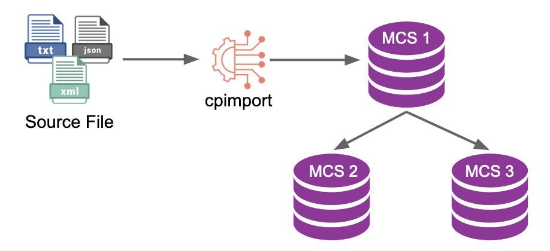
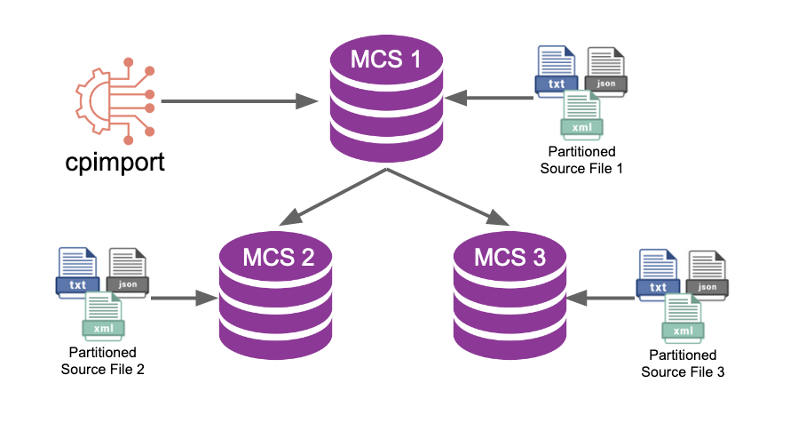
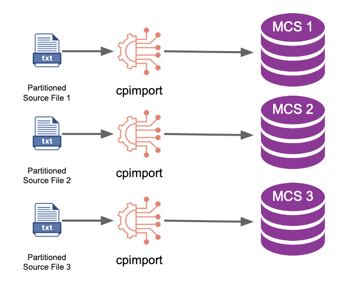

# ColumnStore Bulk Data Loading

## Overview

cpimport is a high-speed bulk load utility that imports data into ColumnStore tables in a fast and efficient\
manner. It accepts as input any flat file containing data that contains a delimiter between fields of\
data (i.e. columns in a table). The default delimiter is the pipe (‘|’) character, but other delimiters such as\
commas may be used as well. The data values must be in the same order as the create table statement, i.e. column 1 matches the first column in the table and so on. Date values must be specified in the format 'yyyy-mm-dd'.

cpimport – performs the following operations when importing data into a MariaDB ColumnStore database:

* Data is read from specified flat files.
* Data is transformed to fit ColumnStore’s column-oriented storage design.
* Redundant data is tokenized and logically compressed.
* Data is written to disk.

It is important to note that:

* The bulk loads are an append operation to a table so they allow existing data to be read and remain unaffected during the process.
* The bulk loads do not write their data operations to the transaction log; they are not transactional in nature but are considered an atomic operation at this time. Information markers, however, are placed in the transaction log so the DBA is aware that a bulk operation did occur.
* Upon completion of the load operation, a high water mark in each column file is moved in an atomic operation that allows for any subsequent queries to read the newly loaded data. This append operation provides for consistent read but does not incur the overhead of logging the data.

There are two primary steps to using the cpimport utility:

1. Optionally create a job file that is used to load data from a flat file into multiple tables.
2. Run the cpimport utility to perform the data import.

## Syntax

The simplest form of cpimport command is

```
cpimport dbName tblName [loadFile]
```

The full syntax is like this:

```
cpimport dbName tblName [loadFile]
[-h] [-m mode] [-f filepath] [-d DebugLevel]
[-c readBufferSize] [-b numBuffers] [-r numReaders]
[-e maxErrors] [-B libBufferSize] [-s colDelimiter] [-E EnclosedByChar]
[-C escChar] [-j jobID] [-p jobFilePath] [-w numParsers]
[-n nullOption] [-P pmList] [-i] [-S] [-q batchQty]

positional parameters:
	dbName     Name of the database to load
	tblName    Name of table to load
	loadFile   Optional input file name in current directory,
			unless a fully qualified name is given.
			If not given, input read from STDIN.
Options:
	-b	Number of read buffers
	-c	Application read buffer size(in bytes)
	-d	Print different level(1-3) debug message
	-e	Max number of allowable error per table per PM
	-f	Data file directory path.
			Default is current working directory.
			In Mode 1, -f represents the local input file path.
			In Mode 2, -f represents the PM based input file path.
			In Mode 3, -f represents the local input file path.
	-l	Name of import file to be loaded, relative to -f path. (Cannot be used with -p)
	-h	Print this message.
	-q	Batch Quantity, Number of rows distributed per batch in Mode 1
	-i	Print extended info to console in Mode 3.
	-j	Job ID. In simple usage, default is the table OID.
			unless a fully qualified input file name is given.
	-n	NullOption (0-treat the string NULL as data (default);
			1-treat the string NULL as a NULL value)
	-p	Path for XML job description file.
	-r	Number of readers.
	-s	The delimiter between column values.
	-B	I/O library read buffer size (in bytes)
	-w	Number of parsers.
	-E	Enclosed by character if field values are enclosed.
	-C	Escape character used in conjunction with 'enclosed by'
			character, or as part of NULL escape sequence ('\N');
			default is '\'
	-I	Import binary data; how to treat NULL values:
			1 - import NULL values
			2 - saturate NULL values
	-P	List of PMs ex: -P 1,2,3. Default is all PMs.
	-S	Treat string truncations as errors.
	-m	mode
			1 - rows will be loaded in a distributed manner across PMs.
			2 - PM based input files loaded onto their respective PM.
			3 - input files will be loaded on the local PM.
```

## cpimport modes

### Mode 1: Bulk Load from a central location with single data source file

In this mode, you run the cpimport from your primary node (mcs1). The source file is located at this primary location and the data from cpimport is distributed across all the nodes. If no mode is specified, then this is the default.



Example:

```
cpimport -m1 mytest mytable mytable.tbl
```

### Mode 2: Bulk load from central location with distributed data source files

In this mode, you run the cpimport from your primary node (mcs1). The source data is in already partitioned data files residing on the PMs. Each PM should have the source data file of the same name but containing the partitioned data for the PM



Example:

```
cpimport -m2 mytest mytable -l /home/mydata/mytable.tbl
```

### Mode 3: Parallel distributed bulk load

In this mode, you run cpimport from the individual nodes independently, which will import the source file that exists on that node. Concurrent imports can be executed on every node for the same table.



Example:

```
cpimport -m3 mytest mytable /home/mydata/mytable.tbl
```

Note:

* The bulk loads are an append operation to a table so they allow existing data to be read and remain\
  unaffected during the process.
* The bulk loads do not write their data operations to the transaction log; they are not transactional in nature but are considered an atomic operation at this time. Information markers, however, are placed in the transaction log so the DBA is aware that a bulk operation did occur.
* Upon completion of the load operation, a high water mark in each column file is moved in an atomic\
  operation that allows for any subsequent queries to read the newly loaded data. This append operation\
  provides for consistent read but does not incur the overhead of logging the data.

## Bulk loading data from STDIN

Data can be loaded from STDIN into ColumnStore by simply not including the loadFile parameter

Example:

```
cpimport db1 table1
```

## Bulk loading from AWS S3

Similarly the AWS cli utility can be utilized to read data from an s3 bucket and pipe the output into cpimport allowing direct loading from S3. This assumes the aws cli program has been installed and configured on the host:

Example:

```
aws s3 cp --quiet s3://dthompson-test/trades_bulk.csv - | cpimport test trades -s ","
```

For troubleshooting connectivity problems remove the --quiet option which suppresses client logging including permission errors.

## Bulk loading output of SELECT FROM Table(s)

Standard in can also be used to directly pipe the output from an arbitrary SELECT statement into cpimport. The select statement may select from non-columnstore tables such as [MyISAM](https://app.gitbook.com/s/SsmexDFPv2xG2OTyO5yV/reference/storage-engines/myisam-storage-engine) or [InnoDB](https://app.gitbook.com/s/SsmexDFPv2xG2OTyO5yV/reference/storage-engines/innodb). In the example below, the db2.source\_table is selected from, using the -N flag to remove non-data formatting. The -q flag tells the mysql client to not cache results which will avoid possible timeouts causing the load to fail.

Example:

```
mariadb -q -e 'select * from source_table;' -N <source-db> | cpimport -s '\t' <target-db> <target-table>
```

## Bulk loading from JSON

Let's create a sample ColumnStore table:

```
CREATE DATABASE `json_columnstore`;

USE `json_columnstore`;

CREATE TABLE `products` (
  `product_name` varchar(11) NOT NULL DEFAULT '',
  `supplier` varchar(128) NOT NULL DEFAULT '',
  `quantity` varchar(128) NOT NULL DEFAULT '',
  `unit_cost` varchar(128) NOT NULL DEFAULT ''
) ENGINE=Columnstore DEFAULT CHARSET=utf8;
```

Now let's create a sample products.json file like this:

```
[{
  "_id": {
    "$oid": "5968dd23fc13ae04d9000001"
  },
  "product_name": "Sildenafil Citrate",
  "supplier": "Wisozk Inc",
  "quantity": 261,
  "unit_cost": "$10.47"
}, {
  "_id": {
    "$oid": "5968dd23fc13ae04d9000002"
  },
  "product_name": "Mountain Juniperus Ashei",
  "supplier": "Keebler-Hilpert",
  "quantity": 292,
  "unit_cost": "$8.74"
}, {
  "_id": {
    "$oid": "5968dd23fc13ae04d9000003"
  },
  "product_name": "Dextromethorphan HBR",
  "supplier": "Schmitt-Weissnat",
  "quantity": 211,
  "unit_cost": "$20.53"
}]
```

We can then bulk load data from JSON into Columnstore by first piping the data to [jq](https://stedolan.github.io/jq/manual/v1.6/) and then to [cpimport](columnstore-bulk-data-loading.md) using a one line command.

Example:

```
cat products.json | jq -r '.[] | [.product_name,.supplier,.quantity,.unit_cost] | @csv' | cpimport json_columnstore products -s ',' -E '"'
```

In this example, the JSON data is coming from a static JSON file but this same method will work for and output streamed from any datasource using JSON such as an API or NoSQL database. For more information on 'jq', please view the manual here [here](https://stedolan.github.io/jq/manual/v1.6/).

## Bulk loading into multiple tables

There are two ways multiple tables can be loaded:

1. Run multiple cpimport jobs simultaneously. Tables per import should be unique or [PMs](../../columnstore-architecture/columnstore-performance-module.md) for each import should be unique if using mode 3.
2. Use colxml utility : colxml creates an XML job file for your database schema before you can import data. Multiple tables may be imported by either importing all tables within a schema or listing specific tables using the -t option in colxml. Then, using cpimport, that uses the job file generated by colxml. Here is an example of how to use colxml and cpimport to import data into all the tables in a database schema

```
colxml mytest -j299
cpimport -m1 -j299
```

### colxml syntax

```
Usage: colxml [options] dbName

Options: 
   -d Delimiter (default '|')
   -e Maximum allowable errors (per table)
   -h Print this message
   -j Job id (numeric)
   -l Load file name
   -n "name in quotes"
   -p Path for XML job description file that is generated
   -s "Description in quotes"
   -t Table name
   -u User
   -r Number of read buffers
   -c Application read buffer size (in bytes)
   -w I/O library buffer size (in bytes), used to read files
   -x Extension of file name (default ".tbl")
   -E EnclosedByChar (if data has enclosed values)
   -C EscapeChar
   -b Debug level (1-3)
```

### Example usage of colxml

The following tables comprise a database name ‘tpch2’:

```
MariaDB[tpch2]> show tables;
+---------------+
| Tables_in_tpch2 |
+--------------+
| customer    |
| lineitem    |
| nation      |
| orders      |
| part        |
| partsupp    |
| region      |
| supplier    |
+--------------+
8 rows in set (0.00 sec)
```

1. First, put delimited input data file for each table in /usr/local/mariadb/columnstore/data/bulk/data/import. Each file should be named .tbl.
2. Run colxml for the load job for the ‘tpch2’ database as shown here:

```
/usr/local/mariadb/columnstore/bin/colxml tpch2 -j500
Running colxml with the following parameters:
2015-10-07 15:14:20 (9481) INFO :
Schema: tpch2
Tables:
Load Files:
-b 0
-c 1048576
-d |
-e 10
-j 500
-n
-p /usr/local/mariadb/columnstore/data/bulk/job/
-r 5
-s
-u
-w 10485760
-x tbl
File completed for tables:
tpch2.customer
tpch2.lineitem
tpch2.nation
tpch2.orders
tpch2.part
tpch2.partsupp
tpch2.region
tpch2.supplier
Normal exit.
```

Now actually run cpimport to use the job file generated by the colxml execution

```
/usr/local/mariadb/columnstore/bin/cpimport -j 500
Bulkload root directory : /usr/local/mariadb/columnstore/data/bulk
job description file : Job_500.xml
2015-10-07 15:14:59 (9952) INFO : successfully load job file /usr/local/mariadb/columnstore/data/bulk/job/Job_500.xml
2015-10-07 15:14:59 (9952) INFO : PreProcessing check starts
2015-10-07 15:15:04 (9952) INFO : PreProcessing check completed
2015-10-07 15:15:04 (9952) INFO : preProcess completed, total run time : 5 seconds
2015-10-07 15:15:04 (9952) INFO : No of Read Threads Spawned = 1
2015-10-07 15:15:04 (9952) INFO : No of Parse Threads Spawned = 3
2015-10-07 15:15:06 (9952) INFO : For table tpch2.customer: 150000 rows processed and 150000 rows inserted.
2015-10-07 15:16:12 (9952) INFO : For table tpch2.nation: 25 rows processed and 25 rows inserted.
2015-10-07 15:16:12 (9952) INFO : For table tpch2.lineitem: 6001215 rows processed and 6001215 rows inserted.
2015-10-07 15:16:31 (9952) INFO : For table tpch2.orders: 1500000 rows processed and 1500000 rows inserted.
2015-10-07 15:16:33 (9952) INFO : For table tpch2.part: 200000 rows processed and 200000 rows inserted.
2015-10-07 15:16:44 (9952) INFO : For table tpch2.partsupp: 800000 rows processed and 800000 rows inserted.
2015-10-07 15:16:44 (9952) INFO : For table tpch2.region: 5 rows processed and 5 rows inserted.
2015-10-07 15:16:45 (9952) INFO : For table tpch2.supplier: 10000 rows processed and 10000 rows inserted.
```

## Handling Differences in Column Order and Values

If there are some differences between the input file and table definition then the colxml utility can be utilized to handle these cases:

* Different order of columns in the input file from table order
* Input file column values to be skipped / ignored.
* Target table columns to be defaulted.

In this case run the colxml utility (the -t argument can be useful for producing a job file for one table if preferred) to produce the job xml file and then use this a template for editing and then subsequently use that job file for running cpimport.

Consider the following simple table example:

```
create table emp (
emp_id int, 
 dept_id int,
name varchar(30), 
salary int, 
hire_date date) engine=columnstore;
```

This would produce a colxml file with the following table element:

```
<Table tblName="test.emp" 
      loadName="emp.tbl" maxErrRow="10">
   <Column colName="emp_id"/>
   <Column colName="dept_id"/>
   <Column colName="name"/>
   <Column colName="salary"/>
   <Column colName="hire_date"/>
 </Table>
```

If your input file had the data such that hire\_date comes before salary then the following modification will allow correct loading of that data to the original table definition (note the last 2 Column elements are swapped):

```
<Table tblName="test.emp" 
      loadName="emp.tbl" maxErrRow="10">
   <Column colName="emp_id"/>
   <Column colName="dept_id"/>
   <Column colName="name"/>
   <Column colName="hire_date"/>
   <Column colName="salary"/>
 </Table>
```

The following example would ignore the last entry in the file and default salary to it's default value (in this case null):

```
<Table tblName="test.emp"        
           loadName="emp.tbl" maxErrRow="10">
      <Column colName="emp_id"/>
      <Column colName="dept_id"/>
      <Column colName="name"/>
      <Column colName="hire_date"/>
      <IgnoreField/>
      <DefaultColumn colName="salary"/>
    </Table>
```

* IgnoreFields instructs cpimport to ignore and skip the particular value at that position in the file.
* DefaultColumn instructs cpimport to default the current table column and not move the column pointer forward to the next delimiter.

Both instructions can be used indepedently and as many times as makes sense for your data and table definition.

## Binary Source Import

It is possible to import using a binary file instead of a CSV file using fixed length rows in binary data. This can be done using the '-I' flag which has two modes:

* -I1 - binary mode with NULLs accepted\
  Numeric fields containing NULL will be treated as NULL unless the column has a default value
* -I2 - binary mode with NULLs saturated\
  NULLs in numeric fields will be saturated

```
Example
cpimport -I1 mytest mytable /home/mydata/mytable.bin
```

The following table shows how to represent the data in the binary format:

| Datatype                    | Description                                                                                                                                                                                                          |
| --------------------------- | -------------------------------------------------------------------------------------------------------------------------------------------------------------------------------------------------------------------- |
| Datatype                    | Description                                                                                                                                                                                                          |
| INT/TINYINT/SMALLINT/BIGINT | Little-endian format for the numeric data                                                                                                                                                                            |
| FLOAT/DOUBLE                | IEEE format native to the computer                                                                                                                                                                                   |
| CHAR/VARCHAR                | Data padded with '\0' for the length of the field. An entry that is all '\0' is treated as NULL                                                                                                                      |
| DATE                        | Using the Date struct below                                                                                                                                                                                          |
| DATETIME                    | Using the DateTime struct below                                                                                                                                                                                      |
| DECIMAL                     | Stored using an integer representation of the DECIMAL without the decimal point. With precision/width of 2 or less 2 bytes should be used, 3-4 should use 3 bytes, 4-9 should use 4 bytes and 10+ should use 8 bytes |

For NULL values the following table should be used:

| Datatype     | Signed NULL           | Unsigned NULL         |
| ------------ | --------------------- | --------------------- |
| Datatype     | Signed NULL           | Unsigned NULL         |
| BIGINT       | 0x8000000000000000ULL | 0xFFFFFFFFFFFFFFFEULL |
| INT          | 0x80000000            | 0xFFFFFFFE            |
| SMALLINT     | 0x8000                | 0xFFFE                |
| TINYINT      | 0x80                  | 0xFE                  |
| DECIMAL      | As equiv. INT         | As equiv. INT         |
| FLOAT        | 0xFFAAAAAA            | N/A                   |
| DOUBLE       | 0xFFFAAAAAAAAAAAAAULL | N/A                   |
| DATE         | 0xFFFFFFFE            | N/A                   |
| DATETIME     | 0xFFFFFFFFFFFFFFFEULL | N/A                   |
| CHAR/VARCHAR | Fill with '\0'        | N/A                   |

### Date Struct

```
struct Date
{
  unsigned spare : 6;
  unsigned day : 6;
  unsigned month : 4;
  unsigned year : 16
};
```

The spare bits in the Date struct "must" be set to 0x3E.

### DateTime Struct

```
struct DateTime
{
  unsigned msecond : 20;
  unsigned second : 6;
  unsigned minute : 6;
  unsigned hour : 6;
  unsigned day : 6;
  unsigned month : 4;
  unsigned year : 16
};
```

## Working Folders & Logging

As of version 1.4, **cpimport** uses the `/var/lib/columnstore/bulk` folder for all work being done. This folder contains:

1. Logs
2. Rollback info
3. Job info
4. A staging folder

The log folder typically contains:

```
-rw-r--r--. 1 root  root        0 Dec 29 06:41 cpimport_1229064143_21779.err
-rw-r--r--. 1 root  root     1146 Dec 29 06:42 cpimport_1229064143_21779.log
```

A typical log might look like this:

```
2020-12-29 06:41:44 (21779) INFO : Running distributed import (mode 1) on all PMs...
2020-12-29 06:41:44 (21779) INFO2 : /usr/bin/cpimport.bin -s , -E " -R /tmp/columnstore_tmp_files/BrmRpt112906414421779.rpt -m 1 -P pm1-21779 -T SYSTEM -u388952c1-4ab8-46d6-9857-c44827b1c3b9 bts flights
2020-12-29 06:41:58 (21779) INFO2 : Received a BRM-Report from 1
2020-12-29 06:41:58 (21779) INFO2 : Received a Cpimport Pass from PM1
2020-12-29 06:42:03 (21779) INFO2 : Received a BRM-Report from 2
2020-12-29 06:42:03 (21779) INFO2 : Received a Cpimport Pass from PM2
2020-12-29 06:42:03 (21779) INFO2 : Received a BRM-Report from 3
2020-12-29 06:42:03 (21779) INFO2 : BRM updated successfully
2020-12-29 06:42:03 (21779) INFO2 : Received a Cpimport Pass from PM3
2020-12-29 06:42:04 (21779) INFO2 : Released Table Lock
2020-12-29 06:42:04 (21779) INFO2 : Cleanup succeed on all PMs
2020-12-29 06:42:04 (21779) INFO : For table bts.flights: 374573 rows processed and 374573 rows inserted.
2020-12-29 06:42:04 (21779) INFO : Bulk load completed, total run time : 20.3052 seconds
2020-12-29 06:42:04 (21779) INFO2 : Shutdown of all child threads Finished!!
```

_Prior to version 1.4, this folder was located at_ `/usr/local/mariadb/columnstore/bulk`_._

CC BY-SA / Gnu FDL
