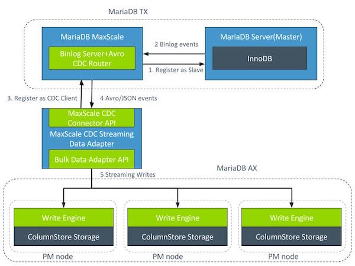
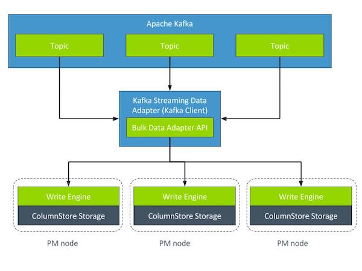
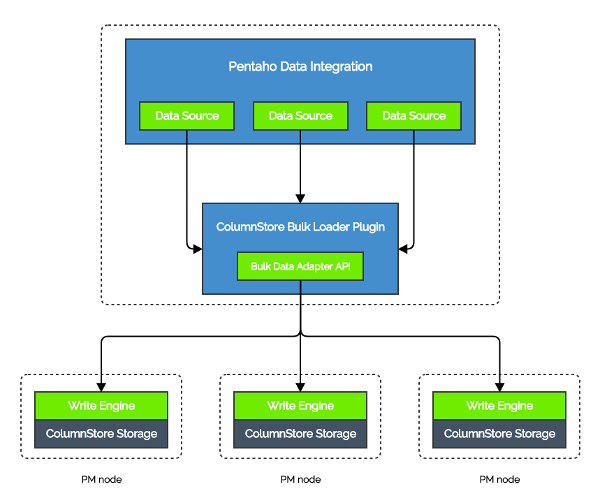
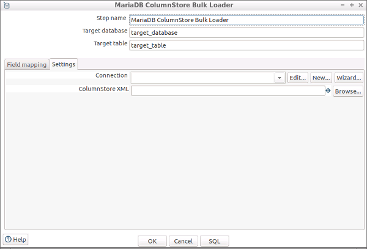
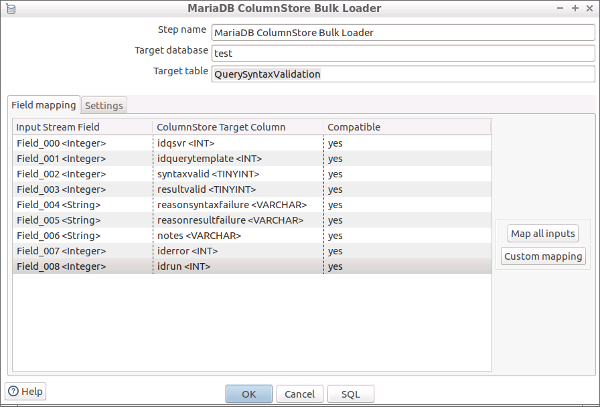

---
layout:
  title:
    visible: true
  description:
    visible: true
  tableOfContents:
    visible: true
  outline:
    visible: true
  pagination:
    visible: true
---

# ColumnStore Streaming Data Adapters

The [ColumnStore Bulk Data API](columnstore-bulk-data-loading.md) enables the creation of higher performance adapters for ETL integration and data ingestions. The Streaming Data Adapters are out of box adapters using these API for specific data sources and use cases.

* MaxScale CDC Data Adapter is integration of the MaxScale CDC streams into MariaDB ColumnStore.
* Kafka Data Adapter is integration of the Kafka streams into MariaDB ColumnStore.

## MaxScale CDC Data Adapter


The MaxScale CDC Data Adapter has been deprecated.


The MaxScale CDC Data Adapter allows to stream change data events(binary log events) from MariaDB Master hosting non-columnstore engines(InnoDB, MyRocks, MyISAM) to MariaDB ColumnStore. In another words replicate data from MariaDB Master to MariaDB ColumnStore. It acts as a CDC Client for MaxScale and uses the events received from MaxScale as input to MariaDB ColumnStore Bulk Data API to push the data to MariaDB ColumnStore.\
It registers with MariaDB MaxScale as a CDC Client using the [MaxScale CDC Connector API](https://mariadb.com/downloads/mariadb-ax/connector), receiving change data records from MariaDB MaxScale (that are converted from binlog events received from the Master on MariaDB TX) in a JSON format. Then, using the MariaDB ColumnStore bulk write SDK, converts the JSON data into API calls and streams it to a MariaDB PM node. The adapter has options to insert all the events in the same schema as the source database table or insert each event with metadata as well as table data. The event meta data includes the event timestamp, the GTID, event sequence and event type (insert, update, delete).

### Installation

#### Pre-requisite:

* Download and install MaxScale CDC Connector API from [connector](https://mariadb.com/downloads/mariadb-ax/connector)
* Download and install MariaDB ColumnStore bulk write SDK from columnstore-bulk-write-sdk.md

#### CentOS 7

```
sudo yum -y install epel-release
sudo yum -y install <data adapter>.rpm
```

#### Debian 9/Ubuntu Xenial:

```
sudo apt-get update
sudo dpkg -i <data adapter>.deb
sudo apt-get -f install
```

#### Debian 8:

```
sudo echo "deb http://httpredir.debian.org/debian jessie-backports main contrib non-free" >> /etc/apt/sources.list
sudo apt-get update
sudo dpkg -i <data adapter>.deb
sudo apt-get -f install
```

### Usage

```
Usage: mxs_adapter [OPTION]... DATABASE TABLE

 -f FILE      TSV file with database and table names to stream (must be in `database TAB table NEWLINE` format)
  -h HOST      MaxScale host (default: 127.0.0.1)
  -P PORT      Port number where the CDC service listens (default: 4001)
  -u USER      Username for the MaxScale CDC service (default: admin)
  -p PASSWORD  Password of the user (default: mariadb)
  -c CONFIG    Path to the Columnstore.xml file (default: '/usr/local/mariadb/columnstore/etc/Columnstore.xml')
  -a           Automatically create tables on ColumnStore
  -z           Transform CDC data stream from historical data to current data (implies -n)
  -s           Directory used to store the state files (default: '/var/lib/mxs_adapter')
  -r ROWS      Number of events to group for one bulk load (default: 1)
  -t TIME      Connection timeout (default: 10)
  -n           Disable metadata generation (timestamp, GTID, event type)
  -i TIME      Flush data every TIME seconds (default: 5)
  -l FILE      Log output to FILE instead of stdout
  -v           Print version and exit
  -d           Enable verbose debug output
```

#### Streaming Multiple Tables

To stream multiple tables, use the -f parameter to define a path to a TSV formatted file. The file must have one database and one table name per line. The database and table must be separated by a TAB character and the line must be terminated in a newline \n.

Here is an example file with two tables, t1 and t2 both in the test database.

```
test	t1
test	t2
```

#### Automated Table Creation on ColumnStore

You can have the adapter automatically create the tables on the ColumnStore instance with the -a option. In this case, the user used for cross-engine queries will be used to create the table (the values in Columnstore.CrossEngineSupport). This user will require CREATE privileges on all streamed databases and tables.

#### Data Transformation Mode

The -z option enables the data transformation mode. In this mode, the data is converted from historical, append-only data to the current version of the data. In practice, this replicates changes from a MariaDB master server to ColumnStore via the MaxScale CDC.


Note: This mode is not as fast as the append-only mode and might not be suitable for heavy workloads. This is due to the fact that the data transformation is done via various DML statements.


### Quick Start

Download and install both [MaxScale](https://mariadb.com/downloads/mariadb-tx/maxscale) and [ColumnStore](https://mariadb.com/downloads/mariadb-ax).

Copy the Columnstore.xml file from `/usr/local/mariadb/columnstore/etc/Columnstore.xml` from one of the ColumnStore UM or PMnodese to the server where the adapter is installed.

Configure MaxScale according to the [CDC tutorial](https://app.gitbook.com/s/0pSbu5DcMSW4KwAkUcmX/other-maxscale-versions/mariadb-maxscale-21-06).

Create a CDC user by executing the following MaxAdmin command on the MaxScale server. Replace the `<service>` with the name of the avrorouter service and `<user>` and `<password>` with the credentials that are to be created.

```
maxadmin call command cdc add_user <service> <user> <password>
```

Then we can start the adapter by executing the following command.

```
mxs_adapter -u <user> -p <password> -h <host> -P <port> -c <path to Columnstore.xml> <database><table>
```

The `<database>` and `<table>` define the table that is streamed to ColumnStore. This table should exist on the master server where MaxScale is reading events from. If the table is not created on ColumnStore, the adapter will print instructions on how to define it in the correct way.

The `<user>` and `<password>` are the users created for the CDC user, `<host>` is the MaxScale address and `<port>` is the port where the CDC service listener is listening.

The `-c` flag is optional if you are running the adapter on the server where ColumnStore is located.

## Kafka to ColumnStore Adapter

The Kafka data adapter streams all messages published to Apache Kafka topics in Avro format to MariaDB AX automatically and continuously - enabling data from many sources to be streamed and collected for analysis without complex code. The Kafka adapter is built using [librdkafka](https://cwiki.apache.org/confluence/display/KAFKA/Clients#Clients-C/C++) and the MariaDB ColumnStore bulk write SDK

A tutorial for the Kafka adapter for ingesting Avro formatted data can be found in the [kafka-to-columnstore-data-adapter](columnstore-streaming-data-adapters.md#kafka-to-columnstore-adapter) document.

## ColumnStore - Pentaho Data Integration - Data Adapter

Starting with MariaDB ColumnStore 1.1.4, a data adapter for Pentaho Data Integration (PDI) / Kettle is available to import data directly into ColumnStore’s WriteEngine. It is built on MariaDB’s rapid-paced Bulk Write SDK.



### Compatibility notice

The plugin was designed for the following software composition:

* Operating system: Windows 10 / Ubuntu 16.04 / RHEL/CentOS 7+
* MariaDB ColumnStore >= 1.1.4
* MariaDB Java Database client\* >= 2.2.1
* Java >= 8
* Pentaho Data Integration >= 7

+not officially supported by Pentaho.

\*Only needed if you want to execute DDL.

### Installation

The following steps are necessary to install the ColumnStore Data adapter (bulk loader plugin):

1. Build the plugin from [source](https://github.com/mariadb-corporation/mariadb-columnstore-data-adapters/tree/master/kettle-columnstore-bulk-exporter-plugin) or download it from our [website](https://mariadb.com/downloads/mariadb-ax/data-adapters)
2. Extract the archive mariadb-columnstore-kettle-bulk-exporter-plugin-\*.zip into your PDI installation directory $PDI-INSTALLATION/plugins.
3. Copy [MariaDB's JDBC Client](https://mariadb.com/downloads/mariadb-ax/connector) mariadb-java-client-2.2.x.jar into PDI's lib directory $PDI-INSTALLATION/lib.
4. Install the additional library dependencies

#### Ubuntu dependencies

```
sudo apt-get install libuv1 libxml2 libsnappy1v5
```

#### CentOS dependencies

```
sudo yum install epel-release
sudo yum install libuv libxml2 snappy
```

#### Windows 10 dependencies

On Windows the installation of the [Visual Studio 2015/2017 C++ Redistributable (x64)](https://www.microsoft.com/en-us/download/details.aspx?id=48145) is required.

### Configuration

Each MariaDB ColumnStore Bulk Loader block needs to be configured. On the one hand, it needs to know how to connect to the underlying Bulk Write SDK to inject data into ColumnStore, and on the other hand, it needs to have a proper JDBC connection to execute DDL.

Both configurations can be set in each block’s settings tab.



The database connection configuration follows PDI’s default schema.

By default the plugin tries to use ColumnStore's default configuration _/usr/local/mariadb/columnstore/etc/Columnstore.xml_ to connect to the ColumnStore instance through the Bulk Write SDK. In addition, individual paths or variables can be used too.

Information on how to prepare the _Columnstore.xml_ configuration file can be found here.

### Usage



Once a block is configured and all inputs are connected in PDI, the inputs have to be mapped to ColumnStore’s table format.

One can either choose “Map all inputs”, which sets target columns of adequate type, or choose a custom mapping based on the structure of the existing table.

The SQL button can be used to generate DDL based on the defined mapping and to execute it.

### Limitations

This plugin is a beta release.

In addition, it can't handle blob data types and only supports multiple inputs to one block if the input field names are equal for all input sources.

CC BY-SA / Gnu FDL


