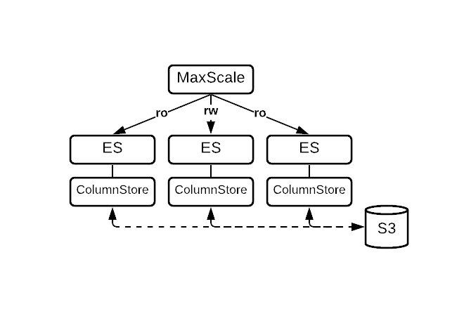
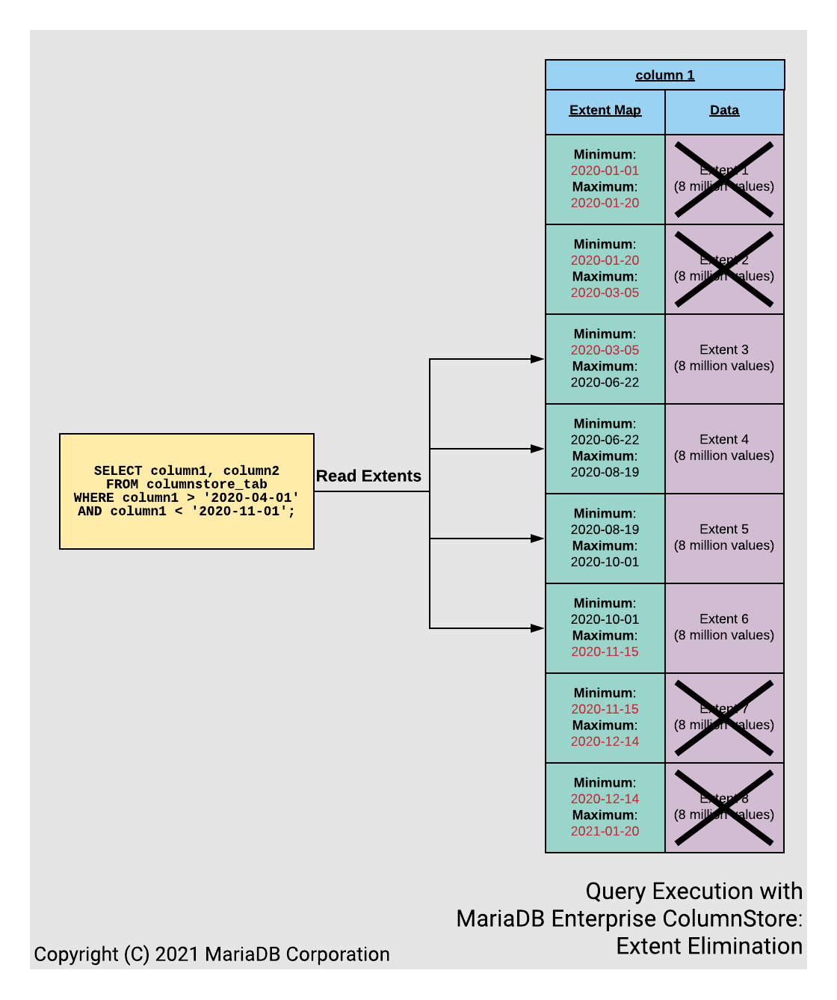
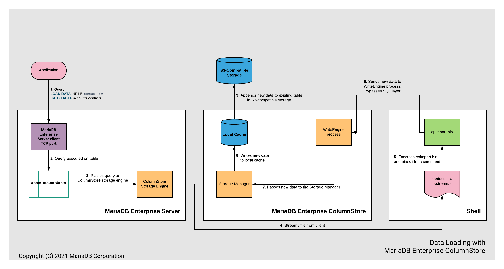

---
layout:
  title:
    visible: true
  description:
    visible: true
  tableOfContents:
    visible: true
  outline:
    visible: true
  pagination:
    visible: true
---

# ColumnStore Architectural Overview

_MariaDB ColumnStore enhances MariaDB Enterprise Server with a columnar engine for OLAP and HTAP workloads, using MPP for scalability. It supports cross-engine JOINs, integrates with S3 storage, and provides high-speed bulk loading with multi-node management via REST API._

MariaDB ColumnStore is a columnar storage engine designed for distributed massively parallel processing (MPP), such as for big data analysis. Deployments can be composed of several MariaDB servers or just one, each running several subprocess working together to provide linear scalability and exceptional performance with real-time response to analytical queries.

It provides a highly available, fault tolerant, and performant columnar storage engine for MariaDB Enterprise Server. MariaDB Enterprise ColumnStore is designed for data warehousing, decision support systems (DSS), online analytical processing (OLAP), and hybrid transactional-analytical processing (HTAP).

## Benefits

* Columnar storage engine that enables MariaDB Enterprise Server to perform new workloads
* Optimized for online analytical process (OLAP) workloads including data warehousing, decision support systems, and business intelligence
* Single-stack solution for hybrid transactional-analytical workloads to eliminate barriers and prevent data silos
* Implements cross-engine JOINs to join Enterprise ColumnStore tables with tables using row-based storage engines, such as [InnoDB](../../kb/en/storage-engines-overview-innodb-storage-engine/)
* Smart storage engine that plans and optimizes its own queries using a custom select handler
* Scalable query execution using massively parallel processing (MPP) strategies, parallel query execution, and distributed function evaluation
* S3-compatible object storage can be used for highly available, low-cost, multi-regional, resilient, scalable, secure, and virtually limitless data storage
* High availability and automatic failover by leveraging [MariaDB MaxScale](../../kb/en/maxscale/)
* REST API for multi-node administration with the Cluster Management API (CMAPI) server
* Connectors for popular BI platforms such as Microsoft Power BI and Tableau
* High-speed bulk data loading that bypasses the SQL layer and does not block concurrent read-only queries

## Topologies

MariaDB Enterprise ColumnStore supports multiple topologies. Several options are described below. MariaDB Enterprise ColumnStore can be deployed in other topologies. The topologies on this page are representative of basic product capabilities.

MariaDB products can be deployed to form other topologies that leverage advanced product capabilities and combine the capabilities of multiple topologies.

### Enterprise ColumnStore with Object Storage

The MariaDB Enterprise ColumnStore topology with Object Storage delivers production analytics with high availability, fault tolerance, and limitless data storage by leveraging S3-compatible storage.

The topology consists of:

* One or more MaxScale nodes
* An odd number of ColumnStore nodes (minimum of 3) running ES, Enterprise ColumnStore, and CMAPI

The MaxScale nodes:

* Monitor the health and availability of each ColumnStore node using the MariaDB Monitor (mariadbmon)
* Accept client and application connections
* Route queries to ColumnStore nodes using the Read/Write Split Router (readwritesplit)

The ColumnStore nodes:

* Receive queries from MaxScale
* Execute queries
* Use [S3-compatible object storage](mariadb-enterprise-columnstore-storage-architecture/#s3-compatible-object-storage) for data
* Use [Shared Local Storage](mariadb-enterprise-columnstore-storage-architecture/#shared-local-storage) for the [Storage Manager directory](mariadb-enterprise-columnstore-storage-architecture/#storage-manager-directory).

### Enterprise ColumnStore with Shared Local Storage

The MariaDB Enterprise ColumnStore topology with Shared Local Storage delivers production analytics with high availability and fault tolerance by leveraging shared local storage, such as NFS.

The topology consists of:

* One or more MaxScale nodes
* An odd number of ColumnStore nodes (minimum of 3) running ES, Enterprise ColumnStore, and CMAPI

The MaxScale nodes:

* Monitor the health and availability of each ColumnStore node using the MariaDB Monitor (mariadbmon)
* Accept client and application connections
* Route queries to ColumnStore nodes using the Read/Write Split Router (readwritesplit)

The ColumnStore nodes:

* Receive queries from MaxScale
* Execute queries
* Use [Shared Local Storage](mariadb-enterprise-columnstore-storage-architecture/#shared-local-storage) for the [DB Root directories](mariadb-enterprise-columnstore-storage-architecture/#db-root-directories).

## Software Architecture

| Software Component                                                                                                   | Role                                                                                               |
| -------------------------------------------------------------------------------------------------------------------- | -------------------------------------------------------------------------------------------------- |
| Software Component                                                                                                   | Role                                                                                               |
| [MariaDB Enterprise ColumnStore](../../kb/en/mariadb-columnstore/)                                                   | • Columnar storage engine • Query execution • Data storage                                         |
| [MariaDB Enterprise Server](../../kb/en/mariadb-enterprise-server/)                                                  | Enterprise-grade database server                                                                   |
| [ColumnStore Storage Engine Plugin](columnstore-architectural-overview.md#columnstore-storage-engine-plugin)         | • Storage engine plugin • Integrates MariaDB Enterprise ColumnStore into MariaDB Enterprise Server |
| [Cluster Management API (CMAPI)](columnstore-architecture-from-enterprise-docs/#cluster-management-api-cmapi-server) | • REST API • Used for administrative tasks                                                         |
| [MariaDB MaxScale](../../kb/en/maxscale/)                                                                            | • Database proxy • Accepts connections • Routes queries • Performs auto-failover                   |

### MariaDB Enterprise ColumnStore

MariaDB Enterprise ColumnStore is the columnar storage engine that handles data storage and query optimization/execution.

MariaDB Enterprise ColumnStore is a columnar storage engine that is optimized for analytical or online analytical processing (OLAP) workloads, data warehousing, and DSS. MariaDB Enterprise ColumnStore can be used for hybrid transactional-analytical processing (HTAP) workloads when paired with a row-based storage engine, like [InnoDB](../../kb/en/storage-engines-overview-innodb-storage-engine/).

### MariaDB Enterprise Server

MariaDB Enterprise ColumnStore is built on top of [MariaDB Enterprise Server](../../kb/en/mariadb-enterprise-server/). MariaDB Enterprise ColumnStore 5 is included with the standard MariaDB Enterprise Server 10.5 releases, while MariaDB Enterprise ColumnStore 6 is included with the standard MariaDB Enterprise Server 10.6 releases.

Enterprise ColumnStore interfaces with the Enterprise Server SQL engine through the ColumnStore storage engine plugin.

MariaDB has been continually improving the integration of MariaDB Enterprise ColumnStore with MariaDB Enterprise Server:

* MariaDB ColumnStore required special custom-built releases of MariaDB Server.
* MariaDB Enterprise ColumnStore was included with the standard MariaDB Enterprise Server 10.5 releases up to ES 10.5.5-3. It was the first release to replace the Operations/Administration/Maintenance (OAM) API with the more modern Cluster Management API (CMAPI), which is still in use.
* Starting with ES 10.5.6-4, MariaDB Enterprise ColumnStore is included with the standard MariaDB Enterprise Server 10.5 releases.

### ColumnStore Storage Engine Plugin

MariaDB Enterprise ColumnStore integrates with MariaDB Enterprise Server using the ColumnStore storage engine plugin. The ColumnStore storage engine plugin enables MariaDB Enterprise Server to interact with ColumnStore tables.

The ColumnStore storage engine plugin is a smart storage engine that implements a custom select handler to fully take advantage of Enterprise ColumnStore's capabilities, such as:

* Using a custom query planner
* Selecting data by column instead of by row
* Parallel query evaluation
* Distributed aggregations
* Distributed functions
* Extent elimination

As a smart storage engine, the ColumnStore storage engine plugin tightly integrates Enterprise ColumnStore with ES, but it has enough independence to efficiently execute analytical queries using a completely unique approach.

For additional information, see "[ColumnStore Storage Engine](../../kb/en/columnstore-storage-engine/)".

### Cluster Management API (CMAPI) Server

The [Cluster Management API (CMAPI)](columnstore-architecture-from-enterprise-docs/#cluster-management-api-cmapi-server) server provides a REST API that can be used to configure and manage Enterprise ColumnStore.

CMAPI must run on every ColumnStore node in a multi-node deployment but is not required in a single-node deployment.

The REST API can be used to perform multiple operations:

* Add ColumnStore nodes
* Remove ColumnStore nodes
* Start Enterprise ColumnStore
* Shutdown Enterprise ColumnStore
* Check the status of Enterprise ColumnStore

### MariaDB MaxScale

MariaDB Enterprise ColumnStore leverages [MariaDB MaxScale](../../kb/en/maxscale/) as an advanced database proxy and query router.

Multi-node Enterprise ColumnStore deployments must have one or more [MaxScale](../../kb/en/maxscale/) nodes. MaxScale performs many different roles:

* Routing write queries to the primary server
* Load balancing read queries on replica servers
* Monitoring node health
* Performing automatic failover if a node fails

## Storage Architecture

MariaDB Enterprise ColumnStore's storage architecture provides a columnar storage engine with high availability, fault tolerance, compression, and automatic partitioning for production analytics and data warehousing.

For additional information, see "[MariaDB Enterprise ColumnStore Storage Architecture](../architecture/columnstore-storage-architecture.md)".

### Columnar Storage Engine

MariaDB Enterprise ColumnStore is a columnar storage engine for [MariaDB Enterprise Server](../../kb/en/mariadb-enterprise-server/). MariaDB Enterprise ColumnStore enables ES to perform analytical workloads, including online analytical processing (OLAP), data warehousing, decision support systems (DSS), and hybrid transactional-analytical processing (HTAP) workloads.

Most traditional relational databases use row-based storage engines. In row-based storage engines, all columns for a table are stored contiguously. Row-based storage engines perform very well for transactional workloads, but are less performant for analytical workloads.

Columnar storage engines store each column separately. Columnar storage engines perform very well for analytical workloads. Analytical workloads are characterized by ad hoc queries on very large data sets by relatively few users.

MariaDB Enterprise ColumnStore automatically partitions each column into extents, which helps improve query performance without using indexes.

### S3-Compatible Object Storage

MariaDB Enterprise ColumnStore supports S3-compatible object storage.

S3-compatible object storage is optional, but **highly recommended**. If S3-compatible object storage is used, Enterprise ColumnStore requires the [Storage Manager directory](mariadb-enterprise-columnstore-storage-architecture/#storage-manager-directory) to use [Shared Local Storage](mariadb-enterprise-columnstore-storage-architecture/#shared-local-storage) (such as NFS) for high availability.

S3-compatible object storage is:

* Compatible: Many object storage services are compatible with the Amazon S3 API.
* Economical: S3-compatible object storage is often very low cost.
* Flexible: S3-compatible object storage is available for both cloud and on-premises deployments.
* Limitless: S3-compatible object storage is often virtually limitless.
* Resilient: S3-compatible object storage is often low maintenance and highly available, since many services use resilient cloud infrastructure.
* Scalable: S3-compatible object storage is often highly optimized for read and write scaling.
* Secure: S3-compatible object storage is often encrypted-at-rest.

Many S3-compatible object storage services exist. MariaDB Corporation cannot make guarantees about all S3-compatible object storage services, because different services provide different functionality.

If you have any questions about using specific S3-compatible object storage with MariaDB Enterprise ColumnStore, contact us.

### Shared Local Storage

MariaDB Enterprise ColumnStore can use shared local storage.

Shared local storage is required for high availability. The specific [Shared Local Storage requirements](mariadb-enterprise-columnstore-storage-architecture/#shared-local-storage) depend on whether Enterprise ColumnStore is configured to use [S3-compatible object storage](mariadb-enterprise-columnstore-storage-architecture/#s3-compatible-object-storage):

* When S3-compatible object storage is used, Enterprise ColumnStore requires the [Storage Manager directory](mariadb-enterprise-columnstore-storage-architecture/#storage-manager-directory) to use shared local storage for high availability.
* When S3-compatible object storage is not used, Enterprise ColumnStore requires the [DB Root directories](mariadb-enterprise-columnstore-storage-architecture/#db-root-directories) to use shared local storage for high availability.

The most common shared local storage options for on-premises and cloud deployments are:

* NFS (Network File System)
* GlusterFS

The most common shared local storage options for AWS (Amazon Web Services) deployments are:

* EBS (Elastic Block Store) Multi-Attach
* EFS (Elastic File System)

The most common shared local storage option for GCP (Google Cloud Platform) deployments is:

* Filestore

## Query Evaluation Architecture

MariaDB Enterprise ColumnStore uses distributed query execution and massively parallel processing (MPP) techniques to achieve vertical and horizontal scalability for production analytics and data warehousing.

For additional information, see "[MariaDB Enterprise ColumnStore Query Evaluation](../architecture/mariadb-enterprise-columnstore-query-evaluation.md)".

### Extent Elimination

MariaDB Enterprise ColumnStore uses extent elimination to scale query evaluation as table size increases.

Most databases are row-based databases that use manually-created indexes to achieve high performance on large tables. This works well for transactional workloads. However, analytical queries tend to have very low selectivity, so traditional indexes are not typically effective for analytical queries.

Enterprise ColumnStore uses extent elimination to achieve high performance, without requiring manually created indexes. Enterprise ColumnStore automatically partitions all data into extents. Enterprise ColumnStore stores the minimum and maximum values for each [extent](../architecture/columnstore-storage-architecture.md#extents) in the extent map. Enterprise ColumnStore uses the minimum and maximum values in the [extent map](../architecture/columnstore-storage-architecture.md#extent-map) to perform extent elimination.

When Enterprise ColumnStore performs extent elimination, it compares the query's join conditions and filter conditions (i.e., WHERE clause) to the minimum and maximum values for each extent in the extent map. If the extent's minimum and maximum values fall outside the bounds of the query's conditions, Enterprise ColumnStore skips that extent for the query.

Extent elimination is automatically performed for every query. It can significantly decrease I/O for columns with clustered values. For example, extent elimination works effectively for series, ordered, patterned, and time-based data.

### Custom Select Handler

The ColumnStore storage engine plugin implements a custom select handler to fully take advantage of Enterprise ColumnStore's capabilities.

All storage engines interact with ES using an internal handler API, which is highly extensible. Storage engines can implement different features by implementing different methods within the handler API.

For select statements, the handler API transforms each query into a SELECT\_LEX object, which is provided to the select handler.

The generic select handler is not optimal for Enterprise ColumnStore, because:

* Enterprise ColumnStore selects data by column, but the generic select handler selects data by row
* Enterprise ColumnStore supports parallel query evaluation, but the generic select handler does not
* Enterprise ColumnStore supports distributed aggregations, but the generic select handler does not
* Enterprise ColumnStore supports distributed functions, but the generic select handler does not
* Enterprise ColumnStore supports extent elimination, but the generic select handler does not
* Enterprise ColumnStore has its own query planner, but the generic select handler cannot use it

## Smart Storage Engine

The ColumnStore storage engine plugin is known as a smart storage engine, because it implements a custom select handler. MariaDB Enterprise ColumnStore integrates with MariaDB Enterprise Server using the ColumnStore storage engine plugin. The ColumnStore storage engine plugin enables MariaDB Enterprise Server to interact with ColumnStore tables.

If a storage engine implements a custom select handler, it is known as a smart storage engine.

As a smart storage engine, the ColumnStore storage engine plugin tightly integrates Enterprise ColumnStore with ES, but it has enough independence to efficiently execute analytical queries using a completely unique approach.

### Query Planning

The ColumnStore storage engine plugin is a smart storage engine, so MariaDB Enterprise ColumnStore to plan its own queries using the [custom select handler](../architecture/mariadb-enterprise-columnstore-query-evaluation.md#custom-select-handler).

MariaDB Enterprise ColumnStore's query planning is divided into two steps:

1. ES provides the query's SELECT\_LEX object to the [custom select handler](../architecture/mariadb-enterprise-columnstore-query-evaluation.md#custom-select-handler). The custom select handler builds a [ColumnStore Execution Plan (CSEP)](../high-availability/columnstore-query-tuning/query-plans-and-optimizer-trace/columnstore-execution-plan-csep-for-mariadb-enterprise-columnstore.md).
2. The custom select handler provides the CSEP to the [ExeMgr process](../architecture/mariadb-enterprise-columnstore-query-evaluation.md#exemgr-processfacility) on the same node. The ExeMgr process performs [extent elimination](../architecture/mariadb-enterprise-columnstore-query-evaluation.md#extent-elimination) and creates a job list.

### Job Steps

When Enterprise ColumnStore executes a query, the ExeMgr process on the initiator/aggregator node translates the ColumnStore execution plan (CSEP) into a job list. A job list is a sequence of job steps.

Enterprise ColumnStore uses many different types of job steps that provide different scalability benefits:

* Some types of job steps perform operations in a distributed manner using multiple nodes to operate on different extents. Distributed operations provide horizontal scalability.
* Some types of job steps perform operations in a multi-threaded manner using a thread pool. Performing multi-threaded operations provides vertical scalability.

As you increase the number of ColumnStore nodes or the number of cores on each node, Enterprise ColumnStore can use those resources to more efficiently execute job steps.

## High Availability and Failover

MariaDB Enterprise ColumnStore leverages common technologies to provide highly available production analytics with automatic failover:

| Technology                                                                                                                  | Role                                                                                                                                                                                                                                               |
| --------------------------------------------------------------------------------------------------------------------------- | -------------------------------------------------------------------------------------------------------------------------------------------------------------------------------------------------------------------------------------------------- |
| Technology                                                                                                                  | Role                                                                                                                                                                                                                                               |
| [S3-compatible object storage](mariadb-enterprise-columnstore-storage-architecture/#s3-compatible-object-storage)           | • HA for data • Optional.                                                                                                                                                                                                                          |
| [Shared Local Storage](mariadb-enterprise-columnstore-storage-architecture/#shared-local-storage)                           | • With S3: HA for [Storage Manager directory](mariadb-enterprise-columnstore-storage-architecture/#storage-manager-directory) • Without S3: HA for [DB Root directories](mariadb-enterprise-columnstore-storage-architecture/#db-root-directories) |
| [MariaDB Replication](columnstore-architectural-overview.md#mariadb-replication)                                            | • Schema replication (ColumnStore tables) • Schema and data replication (non-ColumnStore tables) • Database object replication                                                                                                                     |
| [MaxScale](columnstore-architectural-overview.md#maxscale)                                                                  | • Monitoring • Automatic failover • Load balancing                                                                                                                                                                                                 |
| [Cluster Management API (CMAPI) Server](columnstore-architecture-from-enterprise-docs/#cluster-management-api-cmapi-server) | • REST API • Administration • Add nodes • Remove nodes                                                                                                                                                                                             |

### Shared Local Storage

MariaDB Enterprise ColumnStore can use shared local storage.

Shared local storage is required for high availability. The specific [Shared Local Storage requirements](mariadb-enterprise-columnstore-storage-architecture/#shared-local-storage) depend on whether Enterprise ColumnStore is configured to use [S3-compatible object storage](mariadb-enterprise-columnstore-storage-architecture/#s3-compatible-object-storage):

* When S3-compatible object storage is used, Enterprise ColumnStore requires the [Storage Manager directory](mariadb-enterprise-columnstore-storage-architecture/#storage-manager-directory) to use shared local storage for high availability.
* When S3-compatible object storage is not used, Enterprise ColumnStore requires the [DB Root directories](mariadb-enterprise-columnstore-storage-architecture/#db-root-directories) to use [Shared Local Storage](mariadb-enterprise-columnstore-storage-architecture/#shared-local-storage) for high availability.

The most common shared local storage options for on-premises and cloud deployments are:

* NFS (Network File System)
* GlusterFS

The most common shared local storage options for AWS (Amazon Web Services) deployments are:

* EBS (Elastic Block Store) Multi-Attach
* EFS (Elastic File System)

The most common shared local storage option for GCP (Google Cloud Platform) deployments is:

* Filestore

### MariaDB Replication

MariaDB Enterprise ColumnStore requires [MariaDB Replication](https://app.gitbook.com/s/SsmexDFPv2xG2OTyO5yV/ha-and-performance/standard-replication) to synchronize various database objects on multiple nodes for high availability.

MariaDB replication synchronizes:

* The schemas for all ColumnStore tables on all nodes
* The schemas and data for all non-ColumnStore tables on all nodes
* All other databases objects (stored procedures, stored functions, user accounts, and other objects) on all nodes

### MaxScale

MariaDB Enterprise ColumnStore requires [MariaDB MaxScale](../../kb/en/maxscale/) to achieve high availability, automatic failover, and load balancing.

MariaDB Monitor (mariadbmon) in MaxScale monitors the health of each Enterprise ColumnStore node.

MaxScale provides load balancing by routing queries and/or connections to healthy nodes by:

* Providing query-based routing using Read/Write Split Router (readwritesplit).
* Providing connection-based routing using Read Connection Router (readconnroute).

When MaxScale's MariaDB Monitor notices the primary node fail, MariaDB Monitor performs automatic failover by:

* Promoting a replica node to become the new primary node.
* Re-configuring all replica nodes to replicate from the new primary node.

### Cluster Management API (CMAPI) Server

MariaDB Enterprise ColumnStore requires the \[\[Cluster Management API (CMAPI) Server for high availability.

The CMAPI server provides a REST API that can be used to manage and configure Enterprise ColumnStore.

The CMAPI server has a role in automatic failover. After MaxScale performs automatic failover, the CMAPI server detects the topology change and automatically re-configures the roles of each Enterprise ColumnStore node.

## Data Loading

MariaDB Enterprise ColumnStore performs bulk data loads very efficiently using a variety of mechanisms including the cpimport tool, specialized handling of certain SQL statements, and minimal locking during data import.

For additional information, see "MariaDB Enterprise ColumnStore Data Loading".

### cpimport

MariaDB Enterprise ColumnStore includes a bulk data loading tool called cpimport, which provides several benefits:

* Bypasses the SQL layer to decrease overhead
* Does not block read queries
* Requires a write metadata lock on the table, which can be monitored with the [METADATA\_LOCK\_INFO plugin](https://app.gitbook.com/s/SsmexDFPv2xG2OTyO5yV/reference/plugins/other-plugins/metadata-lock-info-plugin).
* Appends the new data to the table. While the bulk load is in progress, the newly appended data is temporarily hidden from queries. After the bulk load is complete, the newly appended data is visible to queries.
* Inserts each row in the order the rows are read from the source file. Users can optimize data loads for Enterprise ColumnStore's automatic partitioning by loading presorted data files. For additional information, see "[Load Ordered Data in Proper Order](../high-availability/columnstore-query-tuning/query-tuning-recommendations-for-mariadb-enterprise-columnstore.md#load-ordered-data-in-proper-order)".
* Supports parallel distributed bulk loads
* Imports data from text files
* Imports data from binary files
* Imports data from standard input (stdin)

### Batch Insert Mode

MariaDB Enterprise ColumnStore enables batch insert mode by default.

When batch insert mode is enabled, MariaDB Enterprise ColumnStore, MariaDB Enterprise ColumnStore has special handling for the following statements:

* [LOAD DATA INFILE](https://app.gitbook.com/s/SsmexDFPv2xG2OTyO5yV/reference/sql-statements/data-manipulation/inserting-loading-data/load-data-into-tables-or-index/load-data-infile)
* [INSERT INTO .. SELECT FROM](https://app.gitbook.com/s/SsmexDFPv2xG2OTyO5yV/reference/sql-statements/data-manipulation/inserting-loading-data/insert) .

Enterprise ColumnStore uses the following rules:

* If the statement is executed outside of a transaction, Enterprise ColumnStore loads the data using cpimport, which is a command-line utility that is designed to efficiently load data in bulk. Enterprise ColumnStore executes cpimport using a wrapper called cpimport.bin.
* If the statement is executed inside of a transaction, Enterprise ColumnStore loads the data using the DML interface, which is slower.

Batch insert mode can be disabled by setting the columnstore\_use\_import\_for\_batchinsert system variable. When batch insert mode is disabled, Enterprise ColumnStore executes the statements using the DML interface, which is slower.

### Locking

MariaDB Enterprise ColumnStore requires a write metadata lock (MDL) on the table when a bulk data load is performed with cpimport.

When a bulk data load is running:

* Read queries will not be blocked.
* Write queries and concurrent bulk data loads on the same table will be blocked until the bulk data load operation is complete, and the write metadata lock on the table has been released.
* The write metadata lock (MDL) can be monitored with the [METADATA\_LOCK\_INFO plugin](https://app.gitbook.com/s/SsmexDFPv2xG2OTyO5yV/reference/plugins/other-plugins/metadata-lock-info-plugin).

## Backup and Restore

MariaDB Enterprise ColumnStore supports backup and restore using well-known tools and methods.

| Component                                                                                                         | Backup Methods                     |
| ----------------------------------------------------------------------------------------------------------------- | ---------------------------------- |
| Component                                                                                                         | Backup Methods                     |
| [S3-compatible object storage](mariadb-enterprise-columnstore-storage-architecture/#s3-compatible-object-storage) | • S3 snapshot                      |
| [Shared Local Storage](mariadb-enterprise-columnstore-storage-architecture/#shared-local-storage)                 | • File system snapshot • File copy |
| [Enterprise Server Data Directory](columnstore-architectural-overview.md#enterprise-server-data-directory)        | • MariaDB Enterprise Backup        |

For additional information, see "MariaDB Enterprise ColumnStore Backup and Restore".

### S3-Compatible Object Storage

MariaDB Enterprise ColumnStore can leverage S3 snapshots to backup S3-compatible object storage when it is used for Enterprise ColumnStore's data.

The S3-compatible object storage can be backed up by:

1. Locking the database on the primary node
2. Performing an S3 snapshot using the vendor's standard snapshot functionality

### Shared Local Storage

MariaDB Enterprise ColumnStore can leverage file system snapshots or file copy tools (such as rsync) to backup shared local storage when it is used for the [Storage Manager directory](mariadb-enterprise-columnstore-storage-architecture/#storage-manager-directory) or the [DB Root directories](mariadb-enterprise-columnstore-storage-architecture/#db-root-directories).

The shared local storage can be backed up by:

1. Locking the database on the primary node
2. Performing a file system snapshot or using a file copy tool (such as rsync) to copy the contents of the [Storage Manager directory](mariadb-enterprise-columnstore-storage-architecture/#storage-manager-directory) and/or the [DB Root directories](mariadb-enterprise-columnstore-storage-architecture/#db-root-directories).

### Enterprise Server Data Directory

MariaDB Enterprise ColumnStore can leverage the standard [MariaDB Enterprise Backup](https://app.gitbook.com/s/SsmexDFPv2xG2OTyO5yV/server-management/backing-up-and-restoring-databases/mariabackup) utility to backup the Enterprise Server data directory.

The backup contains:

* All ColumnStore schemas
* All non-ColumnStore schemas and data
* All other database objects

It does not contain:

* ColumnStore data

_This page is licensed: CC BY-SA / Gnu FDL_


