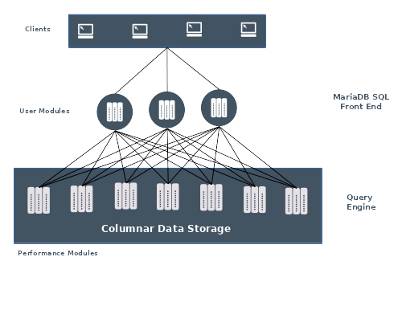

# ColumnStore Architectural Overview

MariaDB ColumnStore is a columnar storage engine designed for distributed massively parallel processing (MPP), such as for big data analysis. Deployments are composed of several MariaDB servers, operating as modules, working together to provide linear scalability and exceptional performance with real-time response to analytical queries. These modules include [User](#user-module), [Performance](#performance-module) and [Storage](#storage).

### User Module

[User Modules](columnstore-user-module.md) are MariaDB Server instances configured to operate as a front-ends to ColumnStore.

The server runs a number of additional processes to handle concurrency scaling. When a client queries the server, the storage engine passes the query to one of these processes, which then break down the SQL request and distributed the various parts to one or more [Performance Modules](#performance-module) to process the query and read from storage. The User module then collects the query results and assembles them into the result-set to return to the client.

For more information, see the [ColumnStore User Module](columnstore-user-module.md).

### Performance Module

[Performance Modules](columnstore-performance-module.md) are responsible for storing, retrieving and managing data, processing block requests for query operations, and for passing it back to the User module or modules to finalize the query requests.

The module selects data from disk and caches it in a shared-nothing buffer that is part of the server on which it runs. You can configure as many Performance modules as you want. Each additional module increases the size of the cache of the overall database as well as the amount of processing power available to you.

For more information, see [ColumnStore Performance Module](columnstore-performance-module.md).

### Storage

MariaDB ColumnStore is extremely flexible with the storage system. When running on premise, you can use either local storage (that is, the [Performance Modules](#performance-module)), or shared storage, (for instance, SAN), to store data. With Amazon EC2 environments, you can use ephemeral or Elastic Block Store (EBS) volumes. In situations where data redundancy is required for shared-nothing deployments, you can integrate it with GlusterFS.

For more information, see [Storage Architecture](columnstore-storage-architecture.md).

