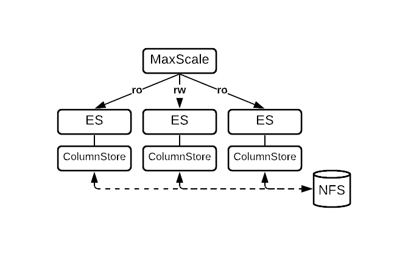

# Backup and Restore Overview

## Overview

MariaDB Enterprise ColumnStore supports backup and restore.

## System of Record

Before you determine a backup strategy for your Enterprise ColumnStore deployment, it is a good idea to determine the **system of record** for your Enterprise ColumnStore data.

A system of record is the authoritative data source for a given piece of information. Organizations often store duplicate information in several systems, but only a single system can be the authoritative data source.

Enterprise ColumnStore is designed to handle analytical processing for OLAP, data warehousing, DSS, and hybrid workloads on very large data sets. Analytical processing does not generally happen on the system of record. Instead, analytical processing generally occurs on a specialized database that is loaded with data from the separate system of record. Additionally, very large data sets can be difficult to back up. Therefore, it may be beneficial to only backup the system of record.

If Enterprise ColumnStore is not acting as the system of record for your data, you should determine how the system of record affects your backup plan:

* If your system of record is another database server, you should ensure that the other database server is properly backed up and that your organization has procedures to reload Enterprise ColumnStore from the other database server.
* If your system of record is a set of data files, you should ensure that the set of data files is properly backed up and that your organization has procedures to reload Enterprise ColumnStore from the set of data files.

## Full Backup and Restore

MariaDB Enterprise ColumnStore supports full backup and restore for all storage types. A full backup includes:

* Enterprise ColumnStore's data and metadata

**With S3: an S3 snapshot of the** [**S3-compatible object storage**](https://mariadb.com/kb/en/mariadb-enterprise-columnstore-storage-architecture/#s3-compatible-object-storage) **and a file system snapshot or copy of the** [**Storage Manager directory**](https://mariadb.com/kb/en/mariadb-enterprise-columnstore-storage-architecture/#storage-manager-directory) Without S3: a file system snapshot or copy of the [DB Root directories](https://mariadb.com/kb/en/mariadb-enterprise-columnstore-storage-architecture/#db-root-directories).

* The MariaDB data directory from the primary node

To see the procedure to perform a full backup and restore, choose the storage type:

| Storage Type                                                                                                                                            | Diagram                                                                                                                                     |
| ------------------------------------------------------------------------------------------------------------------------------------------------------- | ------------------------------------------------------------------------------------------------------------------------------------------- |
| Storage Type                                                                                                                                            | Diagram                                                                                                                                     |
| [Enterprise ColumnStore with Object Storage](mariadb-enterprise-columnstore-backup-and-restore-with-object-storage.md)                                  |  |
| [Enterprise ColumnStore with Shared Local Storage](https://mariadb.com/kb/en/mariadb-enterprise-columnstore-storage-architecture/#shared-local-storage) |        |

Copyright © 2025 MariaDB


