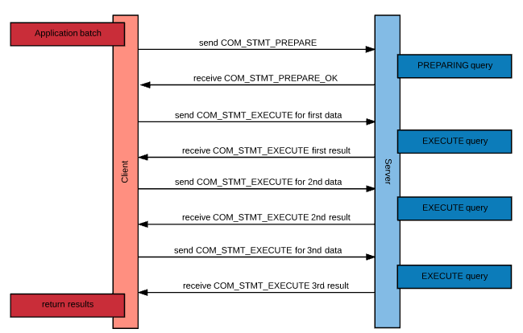
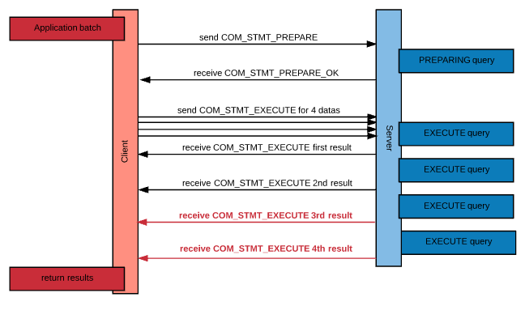

# option-batchmultisend-description

## Option batchMultiSend Description

## Option "useBatchMultiSend"

### Definition

Since 1.5.0, the "useBatchMultiSend" option permits sending queries by batch.\
If disabled, queries are sent one by one, waiting for the result before sending thenext one.\
If enabled, queries will be sent by batch corresponding to the value of the useBatchMultiSendNumber option (default 100).\
Results will be read after a while, avoiding a lot of network latency when the client and the server aren't on the same host.\
This option is only used for JDBC executeBatch(). This option is particularly efficient when the client is distant from the server.

Here is a benchmark using a client and server on 2 different hosts (ping of 0.350ms between 2 hosts):

### Standard client-server protocol

By default, the driver communicates with the server following a request–response messaging pattern:


As soon as the driver sends data, the driver will block until data is available from the input socket.

### Batch multi send communication

JDBC permit batching.\
Example :

```java
PreparedStatement preparedStatement = connection.prepareStatement("INSERT INTO test(data1, data2) VALUES (?, ?)");
    for (int i = 0; i < 3; i++) {
        preparedStatement.setInt(1, i);
        preparedStatement.setString(2, "value" + i);
        preparedStatement.addBatch();
    }
    preparedStatement.executeBatch();
```

When the "useBatchMultiSend" option is disabled, batches like this will send data one by one following the traditional request-response messaging pattern.\
Here is an example using a prepare query ("useServerPrepStmts" is enabled) :



Same example with "useBatchMultiSend" enabled. Requests are sent by bulk, saving network latency:

Advantages :

* a lot more efficient.

Inconvenient:

* if an error occurs, and "continueBatchOnError" is disabled (default enable), some other data may have been already sent and executed.

**Bulk split**

All data is not sent at once, but by batch corresponding to the useBatchMultiSendNumber value.\
Reads begin asynchronously after the first send command. The driver will then wait until it has read all results corresponding to the sent data before sending new data.



