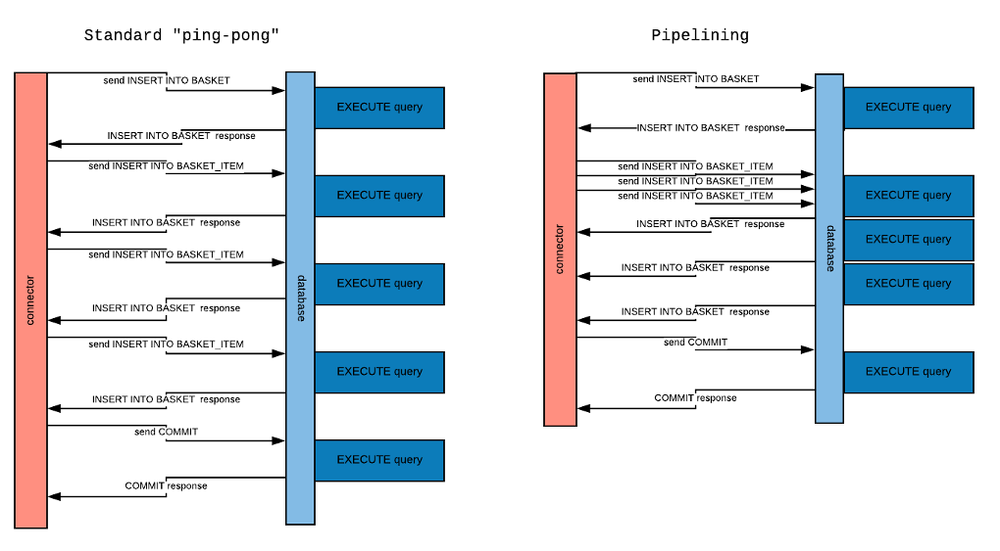

# Connector/Node.js Pipelining

With traditional database drivers, queries issued from the application are sent one by one to the server, waiting on the results of the first query before sending the next. Communication with the server follows this synchronous request-response messaging pattern. While this may be sufficient for some applications, it isn't very efficient when you need to process a large volume of queries at the same time.

Node.js provides good support for asynchronous processing, which you can utilize with the MariaDB Connector using the Pipelining option.

## Using Pipelining

When Pipelining, the Connector uses an optimistic send, sending queries one after another, preserving the FIFO order. This is particularly efficient when the client is some distance from the server.

For instance, say you want to create a basket with three items.

```hs
connection.beginTransaction();
connection.query("INSERT INTO BASKET(customerId) values (?)", [1], (err, res) => {
  //must handle error if any
  const basketId = res.insertId;
  try {
    connection.query("INSERT INTO basket_item(basketId, itemId) VALUES (?, ?)", [basketId, 100]);
    connection.query("INSERT INTO basket_item(basketId, itemId) VALUES (?, ?)", [basketId, 101]);
    connection.query("INSERT INTO basket_item(basketId, itemId) VALUES (?, ?)", [basketId, 102], (err) => {
      //must handle error if any
      connection.commit();
    });
  } catch (err) {
    connection.rollback();
    //handle error
  }
});
```

## Network Exchanges

\
Using the standard client-server protocol, the Connector communicates with the database following a request-response messaging pattern. The Connector sends a command, then doesn't send another until it receives a response from the input socket.

When using Pipelining, the Connector sends commands in bulk, reducing network latency. The catch is that the process is optimistic, meaning that if an error occurs on the first or second command, the following commands have already been sent to the database.


