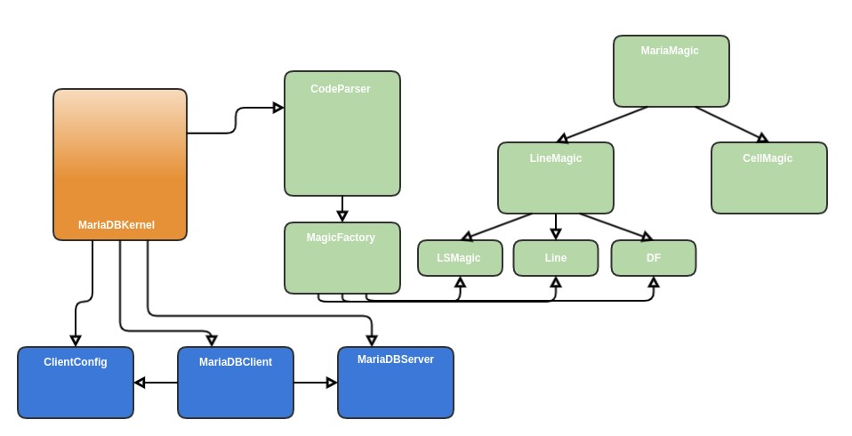
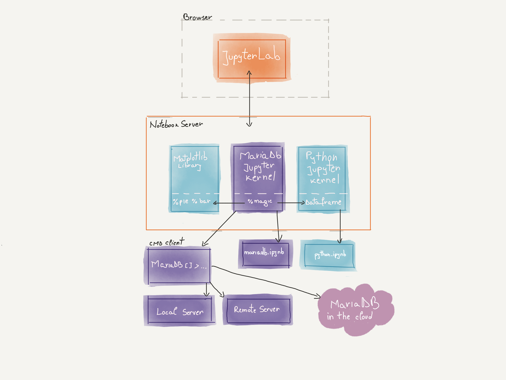

# The MariaDB Jupyter Kernel - Main Components and Architecture

## Architecture

The [mariadb\_kernel](https://github.com/MariaDB/mariadb_kernel) project is made out of several components. These components were created to perform various functions such as: interfacing with the [Jupyter protocol API](https://jupyter-client.readthedocs.io/en/stable/messaging.html), parsing the input texts that the user writes in the notebook cells, magic commands execution or even just abstracting away certain interactions that we suspect might change in the future.

Here’s a diagram displaying the relationship between all the main components of the kernel.



When you start a notebook in [JupyterLab](https://jupyterlab.readthedocs.io/en/stable/), Jupyter spawns an instance of [MariaDBKernel](the-mariadb-jupyter-kernel-main-components-and-architecture.md).\
The kernel then creates a [ClientConfig](the-mariadb-jupyter-kernel-main-components-and-architecture.md) object to read `mariadb_config.json`. If the kernel detects based on the configuration settings that a MariaDB server is up and running, it creates a [MariaDBClient](the-mariadb-jupyter-kernel-main-components-and-architecture.md) object that is responsible for talking to the server.&#x20;

\
If no server is detected, based on the config options, the kernel might start a MariaDB Server instance for you. This server instance is abstracted via the [MariaDBServer](the-mariadb-jupyter-kernel-main-components-and-architecture.md) type.

Now the startup stage is done, the kernel is idle and waiting for the user to start writing code and executing the Notebook cells.

For each notebook that the user creates, Jupyter spawns a new instance of the MariaDB kernel.

When the user executes a code cell, [MariaDBKernel](the-mariadb-jupyter-kernel-main-components-and-architecture.md) receives a message from Jupyter. This message contains, along with other options, the code that the user wrote in the cell.\
The kernel then creates a [CodeParser](the-mariadb-jupyter-kernel-main-components-and-architecture.md) object and it gets from the parser the SQL statements found in the code text and a list of magic objects that the user tries to execute.

The kernel uses [MariaDBClient](the-mariadb-jupyter-kernel-main-components-and-architecture.md) to execute the SQL statements, get the results and display back in the notebook the output and then it executes the magic commands in the order they were found in the code.

The [CodeParser](the-mariadb-jupyter-kernel-main-components-and-architecture.md) object basically parses the code and puts all the SQL statements in a list. When the parser encounters a magic command, it uses a [MagicFactory](the-mariadb-jupyter-kernel-main-components-and-architecture.md) object to create the right magic object based on the name of the magic, the arguments passed to that magic and the current state saved in the kernel that can potentially be used by the magic when it is executed.

Now that you have the bottom-up picture of how the components of the kernel interact with each other internally, here's a diagram showing how the kernel fits within the entire picture:



## Components

#### MariaDBKernel

This class inherits from the [ipykernel.kernelbase.Kernel](https://github.com/ipython/ipykernel/blob/master/ipykernel/kernelbase.py) type which implements the [Jupyter client protocol](https://jupyter-client.readthedocs.io/en/stable/messaging.html) and all the machinery that makes things move in the big picture.

#### ClientConfig

ClientConfig stores the default configuration of the kernel and it parses and loads the options passed by the user in `mariadb_config.json`, if one is found. ClientConfig looks for `mariadb_config.json` in `~/.jupyter/` by default or in the path provided by the user in the [JUPYTER\_CONFIG\_DIR](https://jupyter.readthedocs.io/en/latest/use/jupyter-directories.html#envvar-JUPYTER_CONFIG_DIR) environment variable.

[MariaDBKernel](the-mariadb-jupyter-kernel-main-components-and-architecture.md) and other kernel components use this class for getting the arguments to pass to the MariaDB client or to alter some internal behaviors of the kernel.

#### MariaDBClient

This class is an abstraction of the MariaDB command line client. MariaDBClient is capable of controlling a sub-process running the [mariadb](https://app.gitbook.com/s/SsmexDFPv2xG2OTyO5yV/clients-and-utilities/mariadb-client/mysql-command-line-client) client binary and it does so using the [Pexpect](https://pexpect.readthedocs.io/en/stable/) package.

The kernel uses this class to start/stop MariaDB clients or to run SQL statements written by the users in notebooks. Basically any communication with the MariaDB database itself is handled via this class.

#### MariaDBServer

This component abstracts away a MariaDB Server instance. It provides mechanisms for starting or stopping a server instance and for synchronizing the kernel with a server instance that is either ready to receive client connections or is safely stopped.

This class is used by the kernel when the kernel is loaded and it doesn’t detect a running instance of MariaDB Server based on the default or custom configuration. In this case, depending on whether the user chose this behavior, the kernel will start a server to be used for quick testing scenarios when the user wants to rapidly try some statements in a notebook.

#### CodeParser

This class parses the code of one notebook cell and derives two types of data from it: a list of strings containing the SQL statements found in the code and a list of magic objects created based on the names and arguments of the magic commands written by the user in that cell.

CodeParser uses the [MagicFactory](the-mariadb-jupyter-kernel-main-components-and-architecture.md) component to create the right magic objects, be it `line magics`, `cell magics`, `%line`, `%lsmagic`, etc.

#### MagicFactory

This class creates the right magic objects based on the name and arguments of a magic command and a name:type mapping stored internally. This class also creates objects of type `ErrorMagic` when the user writes magic commands that are not supported by the kernel. The execution of such `ErrorMagic` objects in the kernel results in an error being displayed in the notebook.

#### MariaMagic

The parent class of all the magic commands. It is an interface that defines the API all magic commands should implement to be compatible with the kernel.

#### CellMagic

This class inherits from [MariaMagic](the-mariadb-jupyter-kernel-main-components-and-architecture.md). It is an abstract class that is supposed to provide basic functionalities to all magic commands of type `cell`.

A cell magic is a shortcut a user can write into a notebook cell. The cell magic is written under the form `%%magic` and in principle it operates over the entire code of the cell it is written in, e.g:

```python
------cell
%%magic_python
from matplotlib import pyplot
x = [1,2,3]
print(x)
pyplot.plot(x)
------end of cell
```

#### Delimiter

This component implements the `%%delimiter` cell magic command. Its purpose is to run an SQL statement using a different delimiter than the default ";". The main use case is [stored procedures](https://app.gitbook.com/s/SsmexDFPv2xG2OTyO5yV/server-usage/stored-routines/stored-procedures) and [stored functions](https://app.gitbook.com/s/SsmexDFPv2xG2OTyO5yV/server-usage/stored-routines/stored-functions), e.g.:

```python
--------cell
%%delimiter //
CREATE PROCEDURE proc ()
 BEGIN
  select 1;
 END;
//
--------end-of-cell
```

Note that the SQL statement needs to end with the delimiter specified by the magic command.

#### LineMagic

This class inherits from [MariaMagic](the-mariadb-jupyter-kernel-main-components-and-architecture.md). It is an abstract class that is supposed to provide basic functionality to all magic commands of type `line`.

A line magic is a shortcut a user can write into a notebook cell. The line magic is written under the form `%magic` and in principle, it only sees what is passed as arguments by the user, e.g. `%magic arg1 arg2`

#### LSMagic

This magic command prints the list of magics supported by the kernel along with a help text guiding the user on how to use them.

#### Line

The whole purpose of this magic command is to allow the user to display the result of the last query (e.g. `SELECT`, `SHOW`,...) in a nice and simple [matplotlib](https://matplotlib.org/) plot. Internally, the Line class receives the data of the last query from the kernel as a [Pandas DataFrame](https://pandas.pydata.org/pandas-docs/stable/reference/api/pandas.DataFrame.html), it generates a plot `PNG` image, wraps the image into\
a nice [display\_data](https://jupyter-client.readthedocs.io/en/stable/messaging.html#display-data) Jupyter message and then sends it further.

#### DF

The `%df` magic writes the result of the last query executed in the notebook into an external `CSV` formatted file.

The purpose of this magic command is to allow users to export query data from their MariaDB databases and then quickly import it into a Python Notebook where more complex analytics can be performed.&#x20;

If no arguments are specified, the kernel writes the data into a`CSV` file named `last_query.csv`.

#### Bar

The purpose of this magic command is to allow the user to display the result of the last query (e.g. `SELECT`, `SHOW`,...) in a nice and simple [matplotlib](https://matplotlib.org/) plot.

Internally, the Bar class receives the data of the last query from the kernel as a [Pandas DataFrame](https://pandas.pydata.org/pandas-docs/stable/reference/api/pandas.DataFrame.html), it generates a plot `PNG` image, wraps the image into a nice [display\_data](https://jupyter-client.readthedocs.io/en/stable/messaging.html#display-data) Jupyter message and then sends it further.

#### Pie

The purpose of this magic command is to allow the user to display the result of the last query (e.g. `SELECT`, `SHOW`,...) in a nice and simple [matplotlib](https://matplotlib.org/) plot. Internally, the Pie class receives the data of the last query from the kernel as a [Pandas DataFrame](https://pandas.pydata.org/pandas-docs/stable/reference/api/pandas.DataFrame.html), it generates a plot `PNG` image, wraps the image into\
a nice [display\_data](https://jupyter-client.readthedocs.io/en/stable/messaging.html#display-data) Jupyter message and then sends it further.


