# SQL Autocompletion and Introspection

These features are the result of Xing-Zhi Jiang's work during [Google Summer of Code 2021](https://summerofcode.withgoogle.com/archive/2021/projects/6374646231859200/) and they are being fine-tuned and improved constantly to get a decent code completion and introspection experience in the MariaDB Jupyter Kernel.

## Autocompletion

The MariaDB Jupyter kernel is able to provide SQL autocompletion with a basic internal understanding of the context within your statements. We are trying to make the suggestions as precise as possible, but any SQL autocompletion is imperfect unless you either duplicate the entire grammar logic of MariaDB Server or the MariaDB Server itself develops mechanisms for external tools to poke into its parsing logic.

Autocompletion in Jupyter can be triggered with the key `TAB`. In the classic Juptyter Notebook interface, it's possible to install some extensions to enable continuous hinting, but at the time this article is written there is no mechanism to enable continuous hinting in the new JupyterLab interface.

Here's a summary of our autocompletion capabilities, but we strongly recommend you play with the feature yourself and discover what it can do.

**SQL keywords and functions completion**

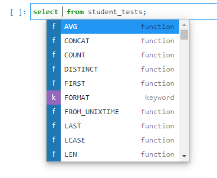

**Completion of database names in `USE` statements**

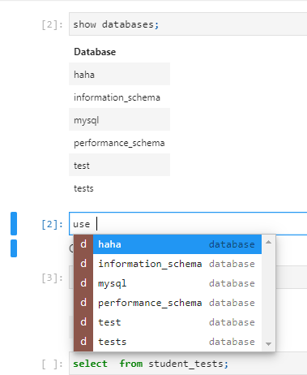

**Completion of database names in constructs like `database_to_autocomplete.table_name`**

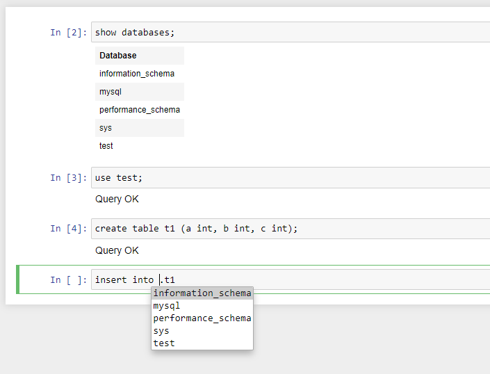

**Completion of table names in constructs like `db.table_name_to_autocomplete`**

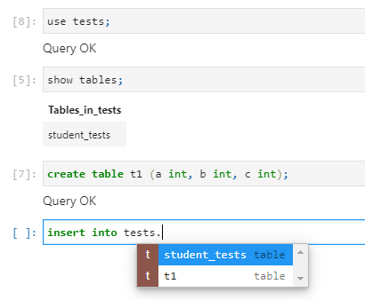

**Completion of column names in the `WHERE` clause**

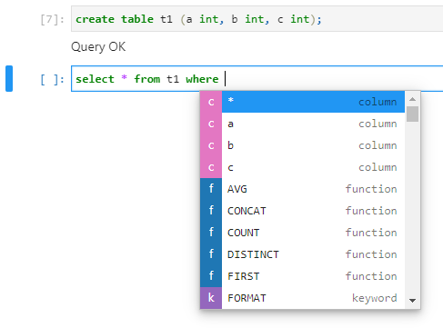

**Completion of column names in `SELECT` queries**

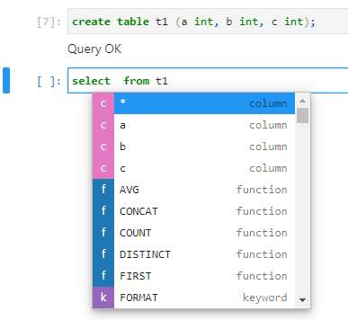

**Completion of column names in `INSERT` statements**

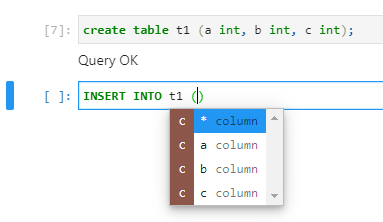

**Resolving aliases and completion of column names in constructs like `alias.column_to_autocomplete`**

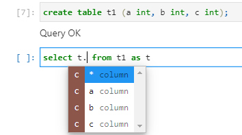

**Completion of `SHOW` statments**

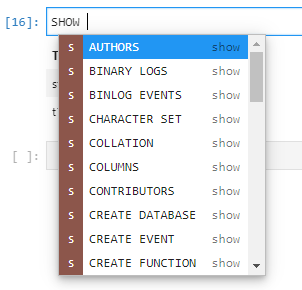

**Completion of user accounts**

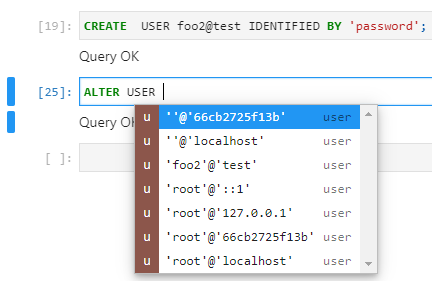

**Completion of global and session variables**

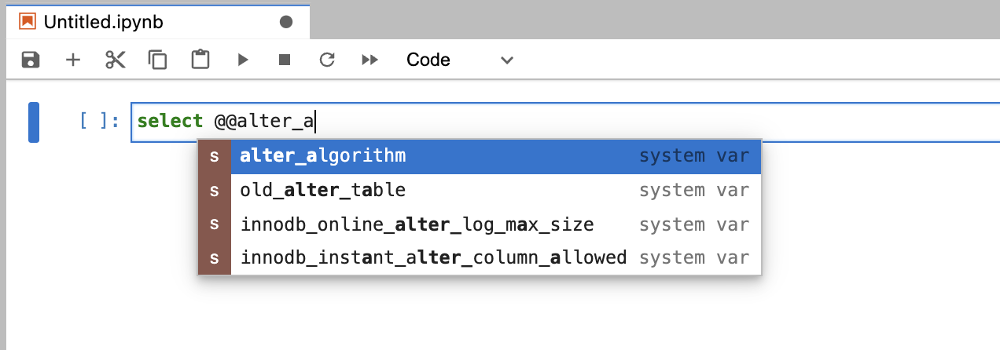

## Introspection

Code introspection in Jupyter can be triggered with the `SHIFT-TAB` combination.\
This feature was designed to help you understand your database environment faster whilst typing SQL statements, for instance checking the table schema by inspecting on the table name before selecting a bunch of columns, or even checking the documentation of a SQL function to see the function signature and some practical examples and spare you an extra search on [MariaDB Documentation](https://app.gitbook.com/o/diTpXxF5WsbHqTReoBsS/s/ZwAYnCtVK0MxixSYOjtH/).

Although we tried to make introspection look exactly the same in both classic Jupyter Notebook and Jupyterlab interfaces, it wasn't possible due to some fundamental difference in how Notebook renders the introspection tooltip in comparison to the newer JupyterLab interface.\
For the moment, to see the full introspection information in Notebook that the MariaDB kernel sends to the frontend, you'll need to hit `shift-tab` then click on the expand button from the tooltip to get the `HTML` representation of the introspection information.

Here's a visual summary of our currently supported introspection capabilities.

**Database introspection**

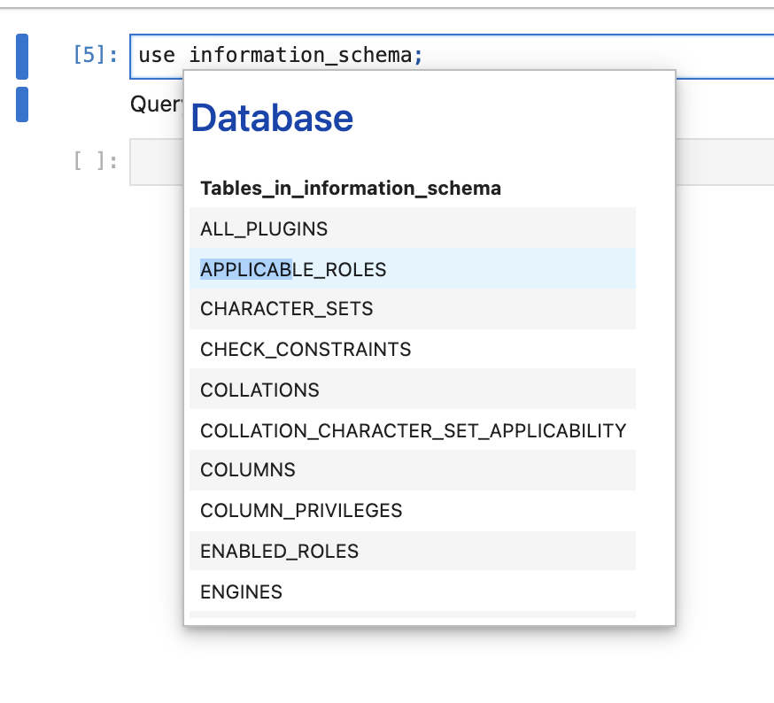

**Table schema and data summary**

**Column datatype and sample data**

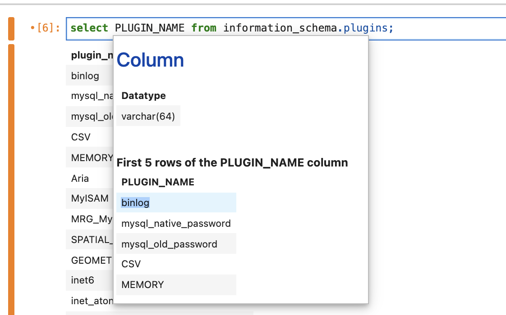

**SQL function documentation and examples**

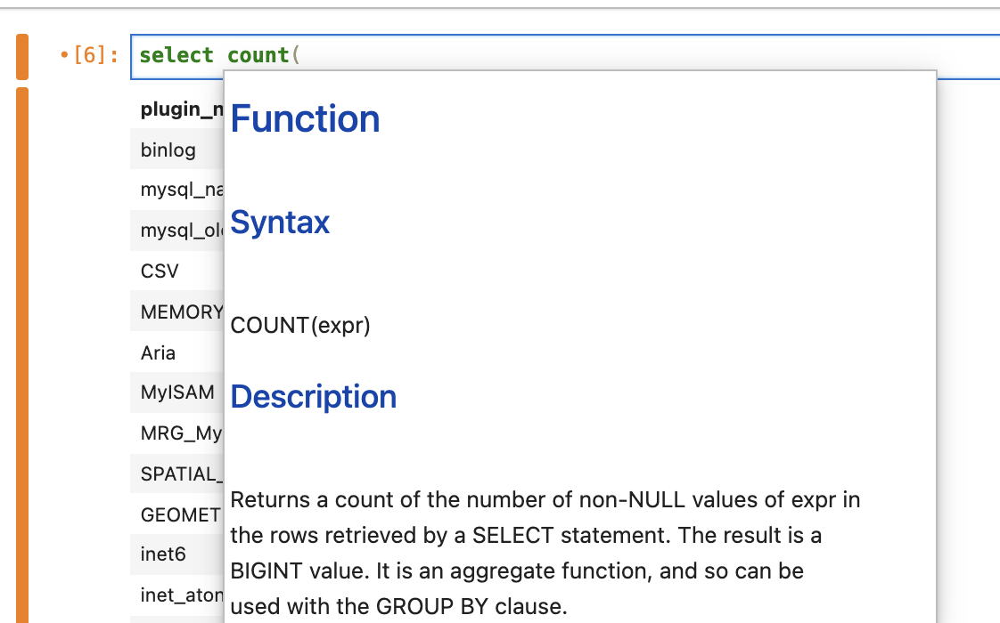

**User accounts introspection**

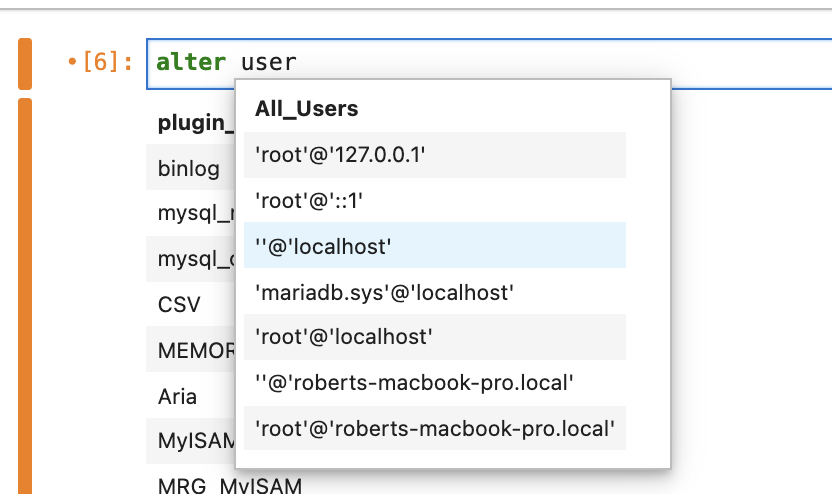


