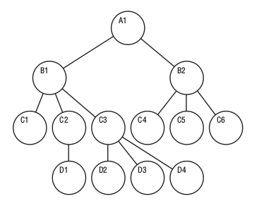

# Understanding the Hierarchical Database Model

The earliest model was the hierarchical database model, resembling an upside-down tree. Files are related in a parent-child manner, with each parent capable of relating to more than one child, but each child only being related to one parent. Most of you will be familiar with this kind of structure—it’s the way most file systems work. There is usually a root, or top-level, directory that contains various other directories and files. Each subdirectory can then contain more files and directories, and so on. Each file or directory can only exist in one directory itself—it only has one parent. As you can see in the image below _A1_ is the root directory, and its children are _B1_ and _B2_. _B1_ is a parent to _C1_, _C2_, and _C3_, which in turn has children of its own.

This model, although being a vast improvement on dealing with unrelated files, has some serious disadvantages. It represents one-to-many relationships well (one parent has many children; for example, one company branch has many employees), but it has problems with many-to-many relationships. Relationships such as that between a product file and an orders file are difficult to implement in a hierarchical model. Specifically, an order can contain many products, and a product can appear in many orders. Also, the hierarchical model is not flexible because adding new relationships can result in wholesale changes to the existing structure, which in turn means all existing applications need to change as well. This is not fun when someone has forgotten a table and wants it added to the system shortly before the project is due to launch! And developing the applications is complex because the programmer needs to know the data structure well in order to traverse the model to access the needed data. As you’ve seen in the earlier chapters, when accessing data from two related tables, you only need to know the fields you require from those two tables. In the hierarchical model, you’d need to know the entire chain between the two. For example, to relate data from _A1_ and _D4_, you’d need to take the route: _A1_, _B1_, _C3_ and _D4_.

_This page is licensed: CC BY-SA / Gnu FDL_


