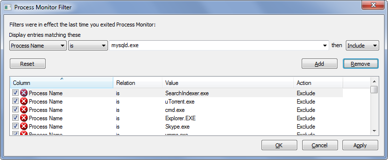
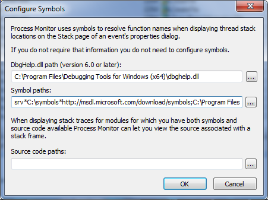

# How to Use procmon to Trace mysqld.exe Filesystem Access

This article provides a walkthrough on using the Process Monitor on Windows, tracing file system access by mysqld.exe during the "install plugin" call.

## Download

Process Monitor is an advanced monitoring tool for Windows that shows real-time file system, registry and process/thread activity. It is a part of sysinternals suite developed by Mark Russinovich and Bryce Cogswell. Process Monitor can be directly downloaded from [ProcessMonitor.zip](https://download.sysinternals.com/files/ProcessMonitor.zip) . More description can be found at [https://learn.microsoft.com/en-us/sysinternals/downloads/procmon](https://learn.microsoft.com/en-us/sysinternals/downloads/procmon)

## Installation

There is no installation necessary; the single executable can be used after unpacking. I suggest putting procmon into some directory in the PATH [environment variable](https://app.gitbook.com/s/SsmexDFPv2xG2OTyO5yV/server-management/install-and-upgrade-mariadb/mariadb-environment-variables).

## Example of taking a mysqld.exe trace

The purpose of the following exercise is to learn how to use procmon to trace mysqld.exe calls to the filesystem.

We assume that mysqld.exe is already started.

1. Start procmon.exe . Dialog will pop up that offers to set filter. Use this dialog to set filter to "Process name" "is" "mysqld.exe", as shown in the screenshot below.



Click on "Add" button to mysqld.exe to include it in the filter, "Apply" and "OK".

2. Capture events (Menu File=>Capture Events (Ctrl+E)
3. Start mysql command line client and connect to the server.\
   Execute

```
mysql> install plugin blackhole soname 'ha_blackhole.dll';
Query OK, 0 rows affected (0.03 sec)
```

4. Saving the trace

Back to Process Monitor Windows, you should see the filesystem events initiated by the "INSTALL PLUGIN" operation


To save it, choose File/Save.

## (Advanced) Seeing stack traces corresponding to events

It is also possible to see stacktraces corresponding to the events. For this to work , symbols support needs to be configured. This needs to be only done once.

1. Install Debugging Tools for Windows (google on how to do that).
2. Switch to Process Monitor's menu Options => Configure symbols.
3. Add dbghelp.dll from your installation of Debugging Tools into "dbghelp.dll path" input field . On my system it is\
   C:\Program Files\Debugging Tools for Windows (x64)\dbghelp.dll
4. In "symbol path" input field, add\
   sr&#x76;_&#x43;:\symbols_[symbols;\<path\to\your\installation\bin](https://msdl.microsoft.com/download/symbols;%3Cpath/to/your/installation/bin)>\
   (substitute last path element with real path to your installation)

This is how it looks on my machine:



Once symbols are configured, you'll get a stack trace corresponding to a filesystem event by simply doubleclicking on the line corresponding to the event. This is what I see after clicking on the first event of my tracing session (corresponds to opening my.ini file)


It is also possible to save the whole trace with callstacks as text (File/Save, choose XML, include callstack + resolve callstack).

<sub>_This page is licensed: CC BY-SA / Gnu FDL_</sub>


