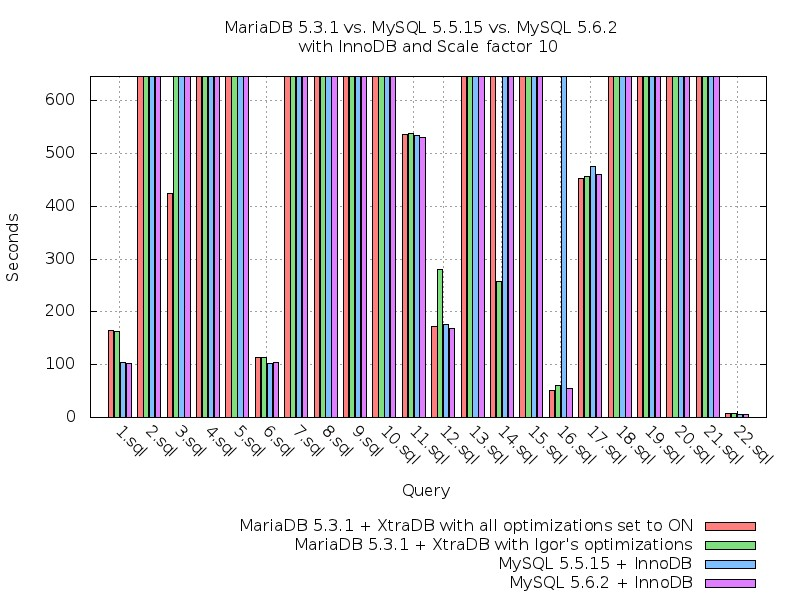

# DBT3 Benchmark Results InnoDB

## Introduction

This page shows the results for benchmarking the following configuration:

* [MariaDB 5.3.1](https://app.gitbook.com/s/aEnK0ZXmUbJzqQrTjFyb/mariadb-community-server-release-notes/old-releases/release-notes-mariadb-5-3-series/mariadb-531-release-notes) Beta + XtraDB with all optimizations (optimizater\_switch) set to `ON`
* [MariaDB 5.3.1](https://app.gitbook.com/s/aEnK0ZXmUbJzqQrTjFyb/mariadb-community-server-release-notes/old-releases/release-notes-mariadb-5-3-series/mariadb-531-release-notes) Beta + XtraDB with Igor's suggested optimizations
* MySQL 5.5.13 + InnoDB
* MySQL 5.6.2 + InnoDB

The test is performed using the automation script under`/mariadb-tools/dbt3_benchmark`.

Details about this automation script could be found in[DBT3 automation scripts](dbt3-automation-scripts.md)

## Hardware

The tests were performed on pitbull.askmonty.org. It has the following\
parameters:

* CPU: Two socket X hexacore Intel Xeon X5660 = 12 CPUs with hyperthreading\
  on: 24 virtual CPUs
* Memory: 23GB
* Logical disk: HDD 500.1 GB as software RAID1
  * device size with M = 1000\*1000: 500107 MBytes (500 GB)
  * cache/buffer size = 16384 KBytes
  * Nominal Media Rotation Rate: 7200
* Operating System: Ubuntu 10.10 (x86\_64)

## Scale factor 10

This test is performed with the following parameters:

* Scale factor: 10
* Query timeout: 600 sec.
* Cluster size: 3
* Total DB size on disk: about 24GB

### Steps to reproduce

Follow the instructions in [DBT3 automation scripts](dbt3-automation-scripts.md)\
to prepare the environment for the test.

Before you run the test, reassure that the settings into the test configuration\
files match your prepared environment. For more details on the test\
configuration, please, refer to the[test configuration parameters](dbt3-automation-scripts.md#test-configuration).

For that test you should set the SCALE\_FACTOR parameter to 10 for the following\
files before the test:

* mariadb\_innodb\_igor\_s1.pm
* mariadb\_innodb\_s1.pm
* mysql\_5\_5\_15\_innodb\_s1.pm
* mysql\_5\_6\_2\_innodb\_s1.pm

**NOTE:** In future versions the scale factor will be passed in as an input\
parameter to `launcher.pl` instead of being test configuration parameter.

After the environment is prepared, the following command should be executed in\
the shell:

```
perl launcher.pl --test={PROJECT_HOME}/mariadb-tools/dbt3_benchmark/tests/mariadb_myisam_s1.pm \
 --test={PROJECT_HOME}/mariadb-tools/dbt3_benchmark/tests/mysql_5_5_15_myisam_s1.pm \
 --test={PROJECT_HOME}/mariadb-tools/dbt3_benchmark/tests/mysql_5_6_2_myisam_s1.pm
 --results-output-dir=path/to/results/output/dir
```

### Results

Here is the graphics of the results:



**NOTE:** Queries that are cut off by the graphics have timed out the period of\
600 seconds for that test.

Here are the actual results:

| Configuration                                                                                                                                                                                                                    | 1.sql   | 2.sql | 3.sql   | 4.sql | 5.sql | 6.sql   | 7.sql | 8.sql | 9.sql | 10.sql | 11.sql  | 12.sql  | 13.sql | 14.sql | 15.sql | 16.sql | 17.sql  | 18.sql | 19.sql | 20.sql | 21.sql | 22.sql |
| -------------------------------------------------------------------------------------------------------------------------------------------------------------------------------------------------------------------------------- | ------- | ----- | ------- | ----- | ----- | ------- | ----- | ----- | ----- | ------ | ------- | ------- | ------ | ------ | ------ | ------ | ------- | ------ | ------ | ------ | ------ | ------ |
| Configuration                                                                                                                                                                                                                    | 1.sql   | 2.sql | 3.sql   | 4.sql | 5.sql | 6.sql   | 7.sql | 8.sql | 9.sql | 10.sql | 11.sql  | 12.sql  | 13.sql | 14.sql | 15.sql | 16.sql | 17.sql  | 18.sql | 19.sql | 20.sql | 21.sql | 22.sql |
| [MariaDB 5.3.1](https://app.gitbook.com/s/aEnK0ZXmUbJzqQrTjFyb/mariadb-community-server-release-notes/old-releases/release-notes-mariadb-5-3-series/mariadb-531-release-notes) + XtraDB with all optimizations to ON             | 165     | n/a   | 424.333 | n/a   | n/a   | 114.333 | n/a   | n/a   | n/a   | n/a    | 536     | 173     | n/a    | n/a    | n/a    | 52     | 452     | n/a    | n/a    | n/a    | n/a    | 8      |
| [MariaDB 5.3.1](https://app.gitbook.com/s/aEnK0ZXmUbJzqQrTjFyb/mariadb-community-server-release-notes/old-releases/release-notes-mariadb-5-3-series/mariadb-531-release-notes) + XtraDB with Igor's suggestions for optimization | 163.667 | n/a   | n/a     | n/a   | n/a   | 114     | n/a   | n/a   | n/a   | n/a    | 538     | 280.667 | n/a    | 257    | n/a    | 60     | 456     | n/a    | n/a    | n/a    | n/a    | 8      |
| MySQL 5.5.15 + InnoDB                                                                                                                                                                                                            | 104     | n/a   | n/a     | n/a   | n/a   | 103     | n/a   | n/a   | n/a   | n/a    | 534.667 | 177     | n/a    | n/a    | n/a    | n/a    | 476     | n/a    | n/a    | n/a    | n/a    | 6      |
| MySQL 5.6.2 + InnoDB                                                                                                                                                                                                             | 103     | n/a   | n/a     | n/a   | n/a   | 104     | n/a   | n/a   | n/a   | n/a    | 531     | 168     | n/a    | n/a    | n/a    | 55     | 460.667 | n/a    | n/a    | n/a    | n/a    | 6      |

The archived folder with all the results and details for that benchmark can be\
downloaded from:[Image:Res\_myisam\_timeout\_120\_s10\_2011-09-15\_190613.zip](https://askmonty.org/wiki/Image:Res_myisam_timeout_120_s10_2011-09-15_190613.zip)

### Comments

From the graphics we can see that for the first query MySQL has performed\
better than MariaDB with about 37%.

For the third query on the other hand MariaDB with all optimizations set to ON\
is the only one query that returned results before the timeout exceeded. This\
means that it has at least 30% better performance. Also there is some option\
that could optimize Igor's set of settings even more for that query. For the\
particular numbers, the same test should be performed with longer timeouts.

For query #6 it turns out that both MySQL 5.5.15 and 5.6.2 are faster than\
MariaDB with about 10%.

For query #12 Igor's settings could be readjusted, so that the query execution\
time could fall with 38%.

Igor's settings turned out to be the only one that could finish query #14\
before the timeout exceeded.

From query #16 we can see that MySQL have made a great performance improvement\
from version 5.5.15 to 5.6.2 to make the query finish at least ten times\
faster.

For all the other queries the results are either statistically the same, or the\
queries have timed out for all configurations and the test should be repeated\
with longer timeout limit.

## Summary

Most of the queries have timed out for the given period of 10 minutes per query\
and until a new test with longer timeout is performed, no correct comparison\
summary could be made.

<sub>_This page is licensed: CC BY-SA / Gnu FDL_</sub>


