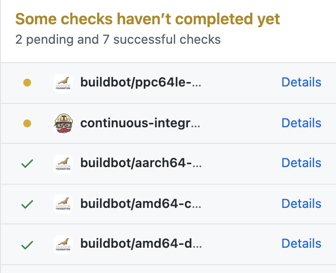
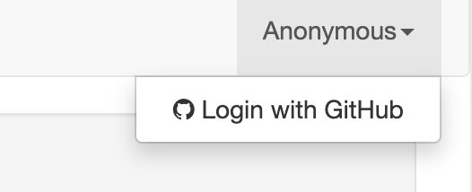

# Branch Protection Using Buildbot

MariaDB uses branch protection to ensure that pushes to the MariaDB Server git repository cannot be made without first passing a series of tests. This page aims to describe what a developer should do in order to ensure that their changes get pushed to the main repository.

The current protected branches are the main branches **10.X**/**11.X** and release branches **bb-10.X-release**/**bb-11.X-release**\*

### Protected Branches Flow

1. Rebase your work on top of the latest main branch. `git rebase 10.11`
2. Push to bb-\* branch
3. Wait for all the checks to run
4. If all checks are successful you can push to the main branch to be the same as bb-\* branch
5. If not (failed checks), check the build status, make changes accordingly and repeat this flow

### Protected Branches Builders

The following are the **only** required builders at this point:

1. amd64-debian-11-debug-ps-embedded
2. amd64-debian-12
3. amd64-debian-12-debug-embedded
4. amd64-debian-11-msan
5. amd64-fedora-40
6. amd64-last-N-failed
7. amd64-ubuntu-2004-clang
8. amd64-ubuntu-2004-debug
9. amd64-ubuntu-2204-debug-ps
10. amd64-windows (?)

The protected branches builders run a subset of tests in order to avoid sporadic failures. The list is defined by:

```
--suite=main,spider,spider/bg,spider/bugfix,spider/feature,spider/regression/e1121,spider/regression/e112122 --skip-test="^stack_crash$|^float$|^derived_split_innodb$|^mysql_client_test$|^kill$|^processlist_not_embedded$|^sp-big$
```

From [github protected\_branches\_mtr\_additional\_args](https://github.com/MariaDB/buildbot/blob/main/master-protected-branches/master.cfg#L379).

All other checks are not required in order to make the push. However, please take a look at all the builders and look for failures.

#### Disabled Protected Branches

### Viewing Build Status

The build status can be seen directly from GitHub near the commit message. Below, you can find an example (please note the **yellow dot** near the commit message):


If you click on the **yellow dot**, you can find the list of checks performed and their status, as shown below:



By clicking on **Details** you will be redirected to the buildbot page showing all the build details.

Alternatively, you can look for the builds on the [buildbot Grid View](https://buildbot.mariadb.org/#/grid). This allows filtering by branch, so to only see changes for one particular branch you can use [grid?branch=10.5](https://buildbot.mariadb.org/#/grid?branch=10.5).

### Status and Action Items

* Yellow dot - specifies that one or more of checks are not yet completed.
  * Action item: Wait for all the checks to finish
* Green tick - all checks were successful
  * Action item: No specific action is needed. The push can go through!
* Red X - one or more checks have failed
  * Action item: Look at the status of failing builds and fix potential issues

Note: Only buildbot and not external CI tests (Travis, AppVeyor, etc) are currently in the protected branches criteria. Please take note of other failures, and if they are acceptable and explainable, then merge.

### Re-trigger Checks

In some cases it might be useful to re-trigger one or more checks. This can easily be done from the [buildbot.mariadb.org](https://buildbot.mariadb.org) interface. The steps are:

1. Login to [buildbot.mariadb.org](https://buildbot.mariadb.org) using the GitHub credentials: Hit the "Anonymous" button from the upper right corner and then "Login with GitHub" as shown below:

* 

1. Open the build details of the build you want to re-trigger
2. Hit the "Rebuild" button from the upper right corner

**Note**: If you want to re-trigger all checks, the easiest approach is to make a new push. Alternatively, you can follow the above steps for all the checks

<sub>_This page is licensed: CC BY-SA / Gnu FDL_</sub>


