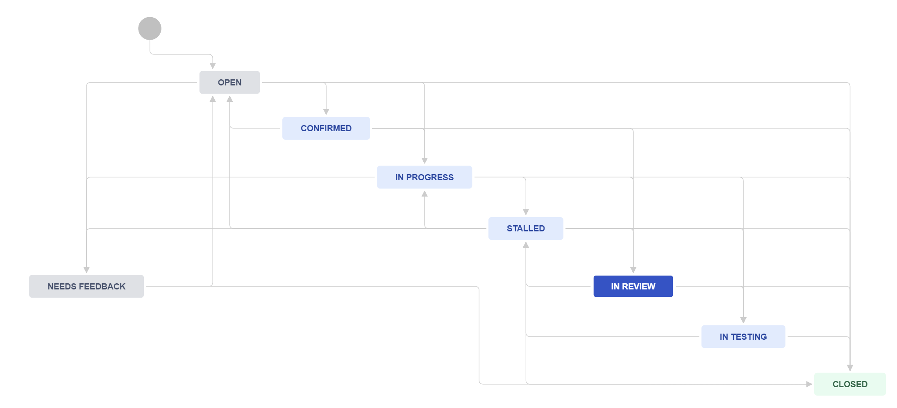

# Jira - Status and Transition Definitions

Here is the MariaDB Server (MDEV) [Jira](jira.md) project workflow.

**OPEN**

* Status assigned to newly created Jira issues
* Indicates that the issue has been reported and awaits further action
* Transitions

  * Needs feedback → NEEDS FEEDBACK
  * Start progress → IN PROGRESS
  * Close Issue → CLOSED

**CONFIRMED**

* Status applied to validate the existence of a bug type of issue
* Implies that the bug can be consistently reproduced and is scheduled for development
* Transitions

  * Stop Progress → STALLED
  * Request testing → IN TESTING
  * Needs feedback → NEEDS FEEDBACK
  * Close Issue → CLOSED
  * Request Review → IN REVIEW

**NEEDS FEEDBACK**

* Status utilised when progress is contingent on receiving essential feedback
* Feedback requests should be clearly communicated to the designated individual
* Issue can be closed after staying in a month in NEED FEEDBACK with no activity
* Transitions

  * Provide feedback → OPEN
  * No Feedback → CLOSED

**IN PROGRESS**

* Status employed when the assignee is actively working on the issue
* Denotes that the issue is being actively addressed and moving forward
* Transitions

  * Stop Progress → STALLED

    * From the end of 2023, we are moving the issues “IN PROGRESS”, which didn’t get any time to get meaningful updates from the assignee for 6 weeks in this status, to STALLED.
  * Request testing → IN TESTING
  * Needs feedback → NEEDS FEEDBACK
  * Close Issue → CLOSED
  * Request Review → IN REVIEW

**IN REVIEW**

* Status used to request a peer review of an issue, typically involving code evaluation
* Seeking input from another assignee to ensure quality and adherence to standards
* Transitions

  * Review done → STALLED
  * Request testing → IN TESTING
  * Close Issue → CLOSED

**IN TESTING**

* Status employed to initiate testing of completed work, often involving a quality engineer
* Ensuring that the implemented solution meets functional and performance requirements
* Transitions

  * Stop Testing → STALLED
  * Close Issue → CLOSED

**STALLED**

* Status indicating that progress on the issue has been temporarily halted
* Distinguished from the Open status by the presence of prior work on the stalled issue
* Transitions

  * Unconfirm issue → OPEN
  * Request testing → IN TESTING
  * Needs Feedback → NEEDS FEEDBACK
  * Start Progress → IN PROGRESS
  * Close Issue → CLOSED
  * Request Review → IN REVIEW

**CLOSED**

* Status assigned when work on the issue has been finalized
* Signifies that the issue has been successfully resolved and no further action is expected
* In the event that the issue requires reopening, it will revert to the Stalled status
* The resolution is another field that will explain how it has been resolved.
* Transitions

  * Reopen Issue → STALLED

