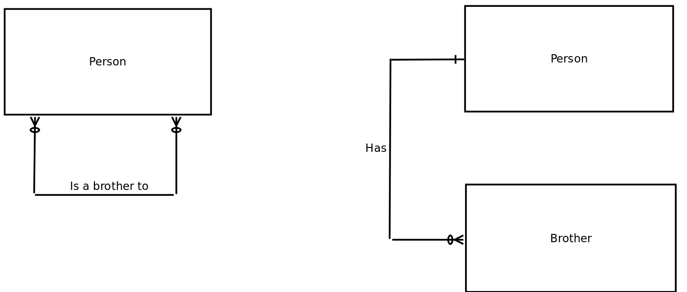

# Database Design Phase 2: Conceptual Design

This article follows on from [Database Design Phase 1: Analysis](database-design-phase-1-analysis.md).

The design phase is where the requirements identified in the previous phase are used as the basis to develop the new system. Another way of putting it is that the business understanding of the data structures is converted to a technical understanding. The *what* questions ("What data are required? What are the problems to be solved?") are replaced by the *how* questions ("How will the data be structured? How is the data to be accessed?")

This phase consists of three parts: the conceptual design, the logical design and the physical design. Some methodologies merge the logical design phase into the other two phases. This section is not aimed at being a definitive discussion of database design methodologies (there are whole books written on that!); rather it aims to introduce you to the topic.

## Conceptual design

The purpose of the conceptual design phase is to build a conceptual model based upon the previously identified requirements, but closer to the final physical model. A commonly-used conceptual model is called an *entity-relationship* model.

### Entities and attributes

*Entities* are basically people, places, or things you want to keep information about. For example, a library system may have the *book*, *library* and *borrower* entities. Learning to identify what should be an entity, what should be a number of entities, and what should be an *attribute* of an entity takes practice, but there are some good rules of thumb. The following questions can help to identify whether something is an entity:

* Can it vary in number independently of other entities? For example, person height is probably not an entity, as it cannot vary in number independently of person. It is not fundamental, so it cannot be an entity in this case.
* Is it important enough to warrant the effort of maintaining. For example customer may not be important for a small grocery store and will not be an entity in that case, but it will be important for a video store, and will be an entity in that case.
* Is it its own thing that cannot be separated into subcategories? For example, a car-rental agency may have different criteria and storage requirements for different kinds of vehicles. Vehicle may not be an entity, as it can be broken up into car and boat, which are the entities.
* Does it list a type of thing, not an instance? The video game blow-em-up 6 is not an entity, rather an instance of the game entity.
* Does it have many associated facts? If it only contains one attribute, it is unlikely to be an entity. For example, city may be an entity in some cases, but if it contains only one attribute, city name, it is more likely to be an attribute of another entity, such as customer.

The following are examples of entities involving a university with possible attributes in parentheses.

* Course (name, code, course prerequisites)
* Student (first_name, surname, address, age)
* Book (title, ISBN, price, quantity in stock)

An instance of an entity is one particular occurrence of that entity. For example, the student Rudolf Sono is one instance of the student entity. There will probably be many instances. If there is only one instance, consider whether the entity is warranted. The top level usually does not warrant an entity. For example, if the system is being developed for a particular university, *university* will not be an entity because the whole system is for that one university. However, if the system was developed to track legislation at all universities in the country, then *university* would be a valid entity.

### Relationships

Entities are related in certain ways. For example, a borrower may belong to a library and can take out books. A book can be found in a particular library. Understanding what you are storing data about, and how the data relate, leads you a large part of the way to a physical implementation in the database.

There are a number of possible relationships:

#### Mandatory

For each instance of entity A, there must exist one or more instances of entity B. This does not necessarily mean that for each instance of entity B, there must exist one or more instances of entity A. Relationships are optional or mandatory in one direction only, so the A-to-B relationship can be optional, while the B-to-A relationship is mandatory.

#### Optional

For each instance of entity A, there may or may not exist instances of entity B.

#### One-to-one (1:1)

This is where for each instance of entity A, there exists one instance of entity B, and vice-versa. If the relationship is optional, there can exist zero or one instances, and if the relationship is mandatory, there exists one and only one instance of the associated entity.

#### One-to-many (1:M)

For each instance of entity A, many instances of entity B can exist, which for each instance of entity B, only one instance of entity A exists. Again, these can be optional or mandatory relationships.

#### Many-to-many (M:N)

For each instance of entity A, many instances of entity B can exist, and vice versa. These can be optional or mandatory relationships.

There are numerous ways of showing these relationships. The image below shows *student* and *course* entities. In this case, each student must have registered for at least one course, but a course does not necessarily have to have students registered. The student-to-course relationship is mandatory, and the course-to-student relationship is optional.

The image below shows *invoice_line* and *product* entities. Each invoice line must have at least one product (but no more than one); however each product can appear on many invoice lines, or none at all. The *invoice_line-to-product* relationship is mandatory, while the *product-to-invoice_line* relationship is optional.

The figure below shows husband and wife entities. In this system (others are of course possible), each husband must have one and only one wife, and each wife must have one, and only one, husband. Both relationships are mandatory.

An entity can also have a relationship with itself. Such an entity is called a *recursive entity*. Take a *person* entity. If you're interested in storing data about which people are brothers, you wlll have an "is brother to" relationship. In this case, the relationship is an M:N relationship.

Conversely, a *weak entity* is an entity that cannot exist without another entity. For example, in a school, the *scholar* entity is related to the weak entity *parent/guardian*. Without the scholar, the parent or guardian cannot exist in the system. Weak entities usually derive their primary key, in part or in totality, from the associated entity. *parent/guardian* could take the primary key from the scholar table as part of its primary key (or the entire key if the system only stored one parent/guardian per scholar).

The term *connectivity* refers to the relationship classification.

The term *cardinality* refers to the specific number of instances possible for a relationship. *Cardinality limits* list the minimum and maximum possible occurrences of the associated entity. In the husband and wife example, the cardinality limit is (1,1), and in the case of a student who can take between one and eight courses, the cardinality limits would be represented as (1,8).

### Developing an entity-relationship diagram

An entity-relationship diagram models how the entities relate to each other. It's made up of multiple relationships, the kind shown in the examples above. In general, these entities go on to become the database tables.

The first step in developing the diagram is to identify all the entities in the system. In the initial stage, it is not necessary to identify the attributes, but this may help to clarify matters if the designer is unsure about some of the entities. Once the entities are listed, relationships between these entities are identified and modeled according to their type: one-to-many, optional and so on. There are many software packages that can assist in drawing an entity-relationship diagram, but any graphical package should suffice.

Once the initial entity-relationship diagram has been drawn, it is often shown to the stakeholders. Entity-relationship diagrams are easy for non-technical people to understand, especially when guided through the process. This can help identify any errors that have crept in. Part of the reason for modeling is that models are much easier to understand than pages of text, and they are much more likely to be viewed by stakeholders, which reduces the chances of errors slipping through to the next stage, when they may be more difficult to fix.

It is important to remember that there is no one right or wrong answer. The more complex the situation, the more possible designs that will work. Database design is an acquired skill, though, and more experienced designers will have a good idea of what works and of possible problems at a later stage, having gone through the process before.

Once the diagram has been approved, the next stage is to replace many-to-many relationships with two one-to-many relationships. A DBMS cannot directly implement many-to-many relationships, so they are decomposed into two smaller relationships. To achieve this, you have to create an *intersection*, or *composite* entity type. Because intersection entities are less "real-world" than ordinary entities, they are sometimes difficult to name. In this case, you can name them according to the two entities being intersected. For example, you can intersect the many-to-many relationship between *student* and *course* by a *student-course* entity.

The same applies even if the entity is recursive. The person entity that has an M:N relationship "is brother to" also needs an intersection entity. You can come up with a good name for the intersection entity in this case: *brother*. This entity would contain two fields, one for each person of the brother relationship — in other words, the primary key of the first brother and the primary key of the other brother.

