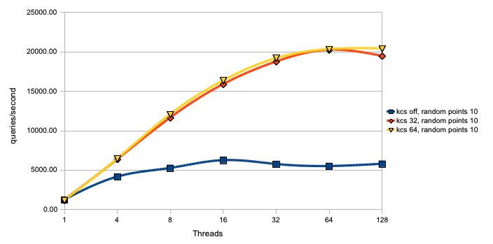
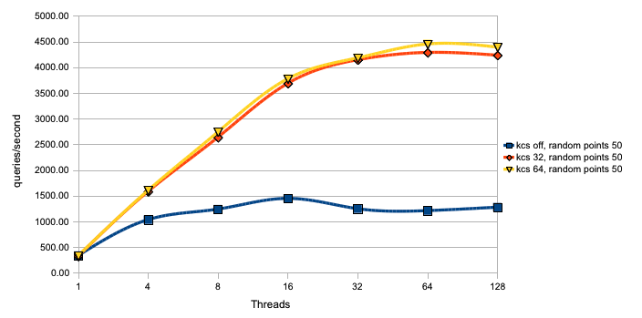
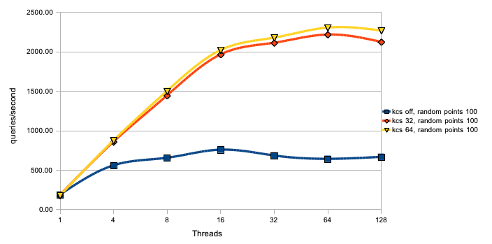
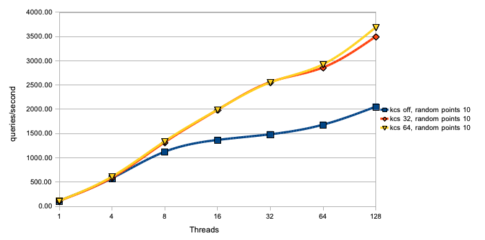
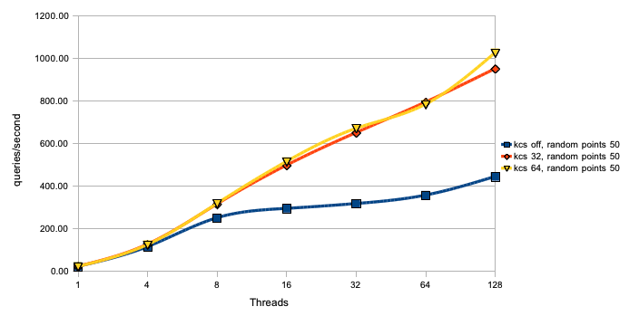
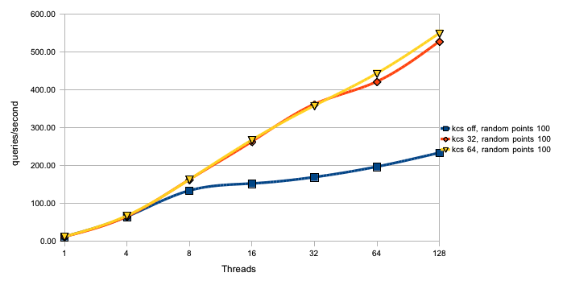

# Segmented Key Cache Performance

## Testing method for segmented key cache performance

We used [SysBench v0.5](https://launchpad.net/sysbench) from Launchpad to test the [segmented key cache](https://app.gitbook.com/s/SsmexDFPv2xG2OTyO5yV/ha-and-performance/optimization-and-tuning/system-variables/segmented-key-cache) performance for the MyISAM storage engine of [MariaDB 5.2.2](https://app.gitbook.com/s/aEnK0ZXmUbJzqQrTjFyb/mariadb-community-server-release-notes/old-releases/release-notes-mariadb-5-2-series/mariadb-522-release-notes)-gamma.

As wrapper scripts for automated running of SysBench we used the `sysbench/` directory from [MariaDB Tools](https://launchpad.net/mariadb-tools).

To test that splitting the key cache's global mutex into several mutex helps under multi user load, we wrote a new SysBench test called `select_random_points.lua`. We used one big table and selected random points with increasing number of concurrent users.

## Main testing outcomes

We see up to 250% performance gain depending on the amount of concurrent users.

## Detailed testing outcomes

### On our machine pitbull

#### On pitbull with --random-points=10



In relative numbers:

```
Threads	               1      4      8      16      32      64      128
(32/off)             -3%    53%    122%    155%    226%    269%    237%
(64/off)             -6%    55%    130%    162%    234%    270%    253%

select_random_points.lua --random-points=10
```

#### On pitbull with --random-points=50



In relative numbers:

```
Threads	               1      4      8      16      32      64      128
(32/off)             -3%    53%    113%    154%    232%    254%    231%
(64/off)             -1%    55%    121%    161%    235%    268%    244%

select_random_points.lua --random-points=50
```

#### On pitbull with --random-points=100



In relative numbers:

```
Threads	               1      4      8      16      32      64      128
(32/off)             -3%    54%    121%    160%    209%    246%    219%
(64/off)             -6%    56%    129%    167%    219%    260%    241%

select_random_points.lua --random-points=100
```

#### Detailed numbers of all runs on pitbull

You can find the absolute and relative numbers in our OpenOffice.org spread sheet here: [SysBench v0.5 select\_random\_points on pitbull](https://askmonty.org/w/images/4/47/Sysbench_v0.5_select_random_points_10_50_100_pitbull.ods)

### On our machine perro

#### On perro with --random-points=10



In relative numbers:

```
Threads	               1      4      8      16      32      64      128
(32/off)              1%     2%     17%     45%     73%     70%     71%
(64/off)             -0.3%   6%     19%     46%     72%     74%     80%

select_random_points.lua --random-points=10
```

#### On perro with --random-points=50



In relative numbers:

```
Threads	               1      4      8      16      32      64      128
(32/off)              1%    10%     26%     69%    105%    122%    114%
(64/off)             -1%     8%     27%     75%    111%    120%    131%

select_random_points.lua --random-points=50
```

#### On perro with --random-points=100



In relative numbers:

```
Threads	               1      4      8      16      32      64      128
(32/off)            -0.2%    1%     22%	    73%    114%    114%    126%
(64/off)            -0.1%    4%     22%     75%    112%    125%    135%

select_random_points.lua --random-points=100
```

#### Detailed numbers of all runs on perro

You can find the absolute and relative numbers in our OpenOffice.org spread sheet here: [SysBench v0.5 select\_random\_points on perro](https://askmonty.org/w/images/f/fb/Sysbench_v0.5_select_random_points_10_50_100_perro.ods)

## Table and query used

Table definition:

```
CREATE TABLE sbtest (
  id  int unsigned NOT NULL AUTO_INCREMENT,
  k   int unsigned NOT NULL DEFAULT '0',
  c   char(120) NOT NULL DEFAULT '',
  pad char(60) NOT NULL DEFAULT '',
  PRIMARY KEY (id),
  KEY k (k)
) ENGINE=MyISAM
```

Query used:

```
SELECT id, k, c, pad
    FROM sbtest
    WHERE k IN (?, ?, ?, ?, ?, ?, ?, ?, ?, ?)
```

The `?` parameters were replaced by random numbers when running the SysBench test. We used 10, 50, and 100 random points in our tests.

We inserted 20 million rows using random data, which gave us a data and index file size of:

```
3.6G    sbtest.MYD
313M    sbtest.MYI
```

We chose our key buffer size to be big enough to hold the index file.

## Testing environment

### MariaDB sources

We used [MariaDB 5.2.2](https://app.gitbook.com/s/aEnK0ZXmUbJzqQrTjFyb/mariadb-community-server-release-notes/old-releases/release-notes-mariadb-5-2-series/mariadb-522-release-notes)-gamma with following revision from our launchpad repository [Revision #2878](https://bazaar.launchpad.net/~maria-captains/maria/5.2/revision/2878)

```
revno: 2878
committer: Sergei Golubchik <sergii@pisem.net>
branch nick: 5.2
timestamp: Tue 2010-10-26 07:37:44 +0200
message:
  fixes for windows
```

### Compiling MariaDB

We compiled MariaDB using this line:

```
BUILD/compile-amd64-max
```

### MariaDB runtime options

We used following configuration for running MariaDB

```
MYSQLD_OPTIONS="--no-defaults \
  --datadir=$DATA_DIR \
  --language=./sql/share/english \
  --log-error \
  --key_buffer_size=512M \
  --max_connections=256 \
  --query_cache_size=0 \
  --query_cache_type=0 \
  --skip-grant-tables \
  --socket=$MY_SOCKET \
  --table_open_cache=512 \
  --thread_cache=512 \
  --key_cache_segments=0 \ # 0 | 32 | 64
  --tmpdir=$TEMP_DIR"
```

### SysBench v0.5 select\_random\_points.lua options

We run the SysBench v0.5 select\_random\_points.lua test with following options:

```
# 20 million rows.
TABLE_SIZE=20000000

SYSBENCH_OPTIONS="--oltp-table-size=$TABLE_SIZE \
  --max-requests=0 \
  --mysql-table-engine=MyISAM \
  --mysql-user=root \
  --mysql-engine-trx=no \
  --myisam-max-rows=50000000 \
  --rand-seed=303"
```

We tested with increasing number of concurrent users with a warm up time of 8 minutes and a run time of 20 minutes:

```
NUM_THREADS="1 4 8 16 32 64 128"
...
  --num-threads=$THREADS
```

We also tested an increasing number of random points:

```
# Default option is --random-points=10.
SYSBENCH_TESTS[0]="select_random_points.lua"
SYSBENCH_TESTS[1]="select_random_points.lua --random-points=50"
SYSBENCH_TESTS[2]="select_random_points.lua --random-points=100"
```

### Kernel parameters

#### IO scheduler

For optimal IO performance running a database we are using the noop scheduler. You can check your scheduler setting with:

```
cat /sys/block/${DEVICE}/queue/scheduler
```

For instance, it should look like this output:

```
cat /sys/block/sda/queue/scheduler
[noop] deadline cfq
```

You can find detailed notes about Linux schedulers here: [Linux schedulers in TPCC like benchmark](https://www.mysqlperformanceblog.com/2009/01/30/linux-schedulers-in-tpcc-like-benchmark/).

#### Open file limits

Having a lot of concurrent connections can hit the open file limit on your system. On most Linux systems the open file limit is at 1024, which can be not enough. Please set your open file limit higher by editing

```
$EDITOR /etc/security/limits.conf
```

and adding a line like

```
#ftp             hard    nproc           0
#@student        -       maxlogins       4
*                -       nofile          16384

# End of file
```

Your `ulimit -a` output should look like this afterwards:

```
ulimit -a
core file size          (blocks, -c) 0
data seg size           (kbytes, -d) unlimited
scheduling priority             (-e) 0
file size               (blocks, -f) unlimited
pending signals                 (-i) 15975
max locked memory       (kbytes, -l) 64
max memory size         (kbytes, -m) 1744200
open files                      (-n) 16384
```

### Machines used for testing

#### perro

```
# OS: openSUSE 11.1 (x86_64)
# Platform: x86_64
# CPU: Quad-core Intel @ 3.20GHz: 4 CPUs
# RAM: 2GB
# Disk(s): 2 x ST31000528AS S-ATA as software RAID 0
```

#### pitbull

```
# OS: Ubuntu 10.10
# Platform: x86_64
# CPU: Two-socket x hexa-core Intel Xeon X5660 @ 2.80GHz. With hyperthreading: 24CPUs
# RAM: 28GB
# Disk(s): 1 x ST3500320NS S-ATA
```

CC BY-SA / Gnu FDL
