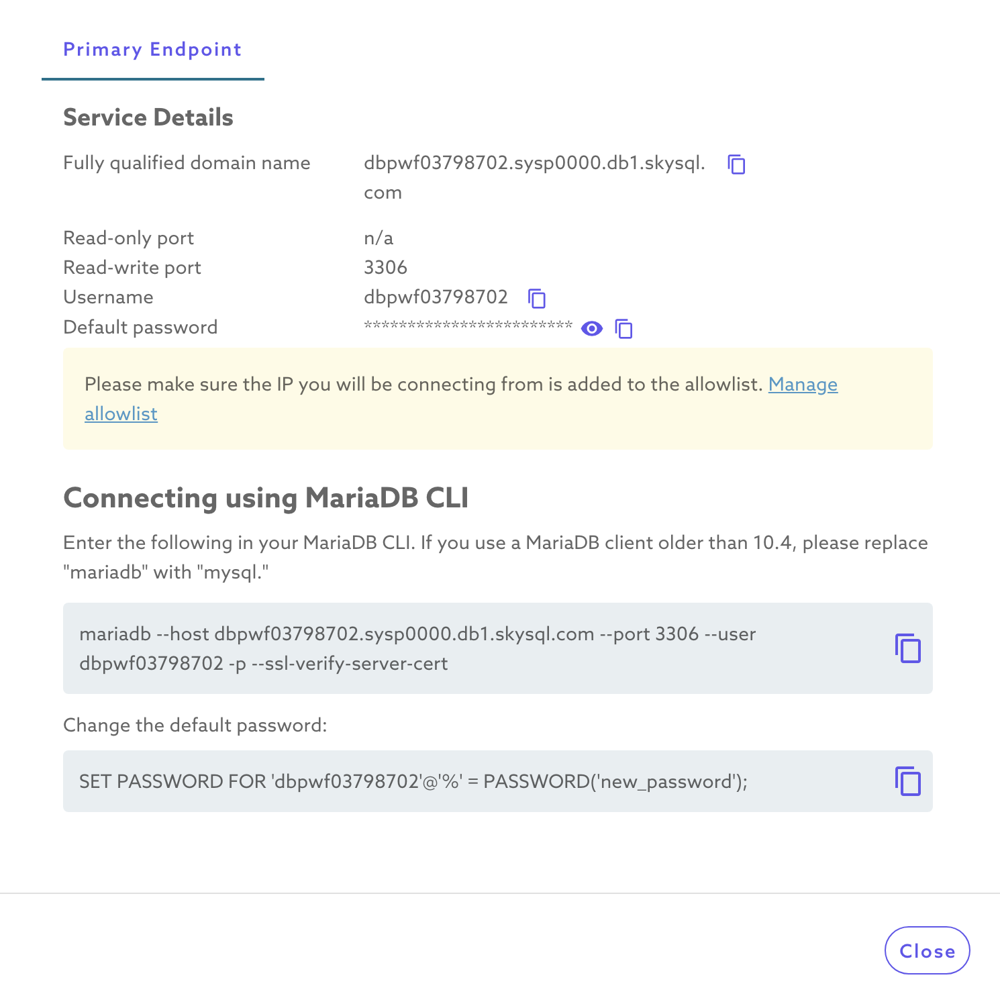

---
layout:
  width: default
  title:
    visible: true
  description:
    visible: true
  tableOfContents:
    visible: true
  outline:
    visible: true
  pagination:
    visible: false
  metadata:
    visible: true
---

# Connecting to MariaDB Cloud DBs

This page describes how to connect to a MariaDB Cloud database using a MariaDB-compatible client.

### **Important - Whitelist your IP address first**

!!! Note 💡 **Access to all services are protected by a firewall, by default. You need to IP whitelist your client’s (your desktop, laptop or server) IP. Just select ‘Manage —> Security Access’ and then click ‘Add my current IP’ to add the IP of your current workstation (laptop, desktop).**

!!! Note 💡 **If you are not sure or unable to obtain the IP address, you can use 0.0.0.0/0 to effectively disable the firewall. Goes without saying — don’t do this for your production DBs.**

For more details go to the [Firewall](<../Security/Configuring Firewall.md>) settings page.

## Connecting using the MariaDB Client CLI

Once your DB service is launched, click on the ‘Connect’ option for your service on the dashboard. This pops up all the required attributes to connect from any SQL client.

Connection parameters include:

* Default username
* Default password
* Hostname (Fully Qualified Domain Name)
* TCP port (3306 or 3307)
* ssl-verify-server-cert (if SSL is ON)

!!! Note 💡 Unlike previous MariaDB Cloud versions, the current version no longer requires clients to supply the Server SSL Certificate for SSL connections. Customers who migrated from MariaDB corporation to MariaDB Cloud Inc can continue to use provided certificates (when using the previous MariaDB Cloud method for connecting). But, we strongly recommend moving to the connection properties as shown in the Connect window for your service.

!!! Note 💡 **There is a default config change in the 11.4.2 MariaDB client that requires SSL. This needs to be disabled by setting `--ssl-verify-server-cert=0`.**

### Install and Connect using the MariaDB client

After [installing the MariaDB client](<Connect using MariaDB CLI.md>) according to your operating system, simply copy/paste the MariaDB CLI command as displayed in the Connect window.

## Connecting from your Application

Applications can connect to MariaDB Cloud using any of the below MariaDB supported connectors. There are several other connectors from the community too.

* [C](<Connect from ‘C’ App.md>)
* [C++](<Connect from ‘C++’ App.md>)
* [Java](<Connect from Java App.md>)
* [Java R2DBC](<Connect using Connector R2DBC.md>)
* [Node.js (JavaScript)](<Connect from Node js App.md>)
* [ODBC API](<Connect using ODBC.md>)
* [Python](<Connect from Python App.md>)
* [MongoDB Client](<Connect from MongoDB clients.md>)

!!! Note 💡 For Server With Replica(s), you can also use any MongoDB client and use the [NoSQL Interface](<Connect from MongoDB clients.md>)

## Connecting from SQL tools

Clients listed here have been tested to properly connect with MariaDB Cloud and execute queries.

Most of the SQL clients and editors natively support MariaDB. Most often you can also just select 'MySQL' and connect to your MariaDB Cloud DB service.

* [Connecting using Java clients like Squirrel SQL](https://squirrel-sql.sourceforge.io/)
  * All you need to do is to make sure the "useSsl" property is set to 'true' if SSL is ON.
* MariaDB CLI
* [Sequel Ace](https://sequel-ace.com/) - Connect to MariaDB from MacOS
  * In the connection window, you should select 'Require SSL' if your MariaDB Cloud database has SSL turned ON (the default).

### Graphical User Interfaces (GUIs)

The following GUI clients have been tested to properly connect with MariaDB Cloud and execute queries. Most SQL clients and editors natively support MariaDB. You can often select 'MySQL' as the connection type to connect to your MariaDB Cloud DB service.

* [Connect using DBeaver](../Connecting%20to%20SkySQL%20DBs/Connect%20using%20DBeaver.md) CloudDBA Recommended
* [Connect using DBGate](../Connecting%20to%20SkySQL%20DBs/Connect%20using%20DBGate.md)
* [Connect using HeidiSQL](../Connecting%20to%20SkySQL%20DBs/Connect%20using%20HeidiSQL.md)
* [Connect using TablePlus](../Connecting%20to%20SkySQL%20DBs/Connect%20using%20TablePlus.md)
