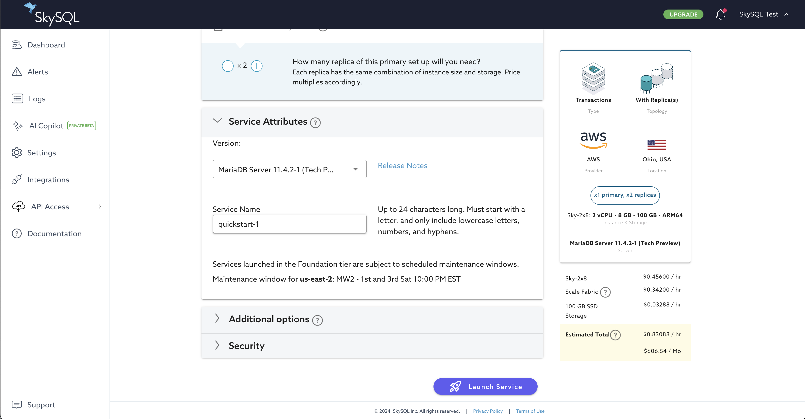
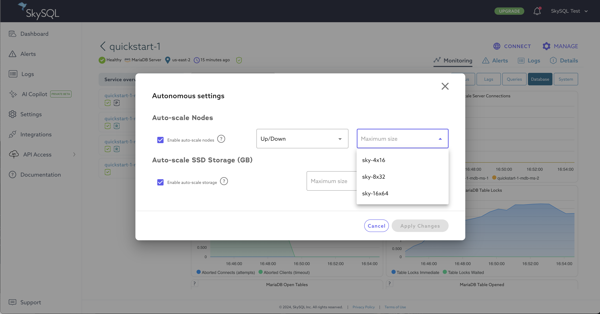

# Quickstart

The MariaDB Cloud database deployment time varies based on your preferences: a Serverless standalone instance can be ready in a few seconds, whereas a Provisioned standalone or clustered database may take a few minutes. Users can select from approximately 50 global regions and deploy on either AWS, GCP and Azure.

You have three choices to provision a DB on MariaDB Cloud :

This Quickstart explains how to launch database services and manage the lifecycle of database services using the [Portal](<../Portal features>) in a web browser.

For users who prefer other interfaces, MariaDB Cloud offers the following alternatives:

- Use the MariaDB Cloud web [Portal](<../Portal features>). Make your choices with a few clicks and hit Launch.
- Use the DBaaS API with a REST client
- Use the [Terraform provider](<Launch DB using the Terraform Provider>)

## Step 1: Register for SkySQL

Goto [app.skysql.com](https://app.skysql.com) to sign up. You can sign up using your Google, Github or LinkedIn credentials. Or, just use your Email address to sign up. 

## Step 2: Launch a Service

1. [Log in to the MariaDB Cloud Portal](https://app.skysql.com/) and from the Dashboard, click the [+ Launch New Service](https://app.skysql.com/launch-service) button.

2. From the launch interface, select the choices detailed below.
        
   - Choose between `Provisioned` or `Serverless`: Options include `MariaDB Server with Replicas`, `MariaDB Server Single Node`, or `MariaDB Serverless Single Node`.

   - Select your cloud provider and region:
     - `AWS` with `Ohio, USA (us-east-2)`
     - `Google Cloud` with `Iowa, USA (us-central1)`
     - Or choose a region of your preference.

   - Service Naming: Name the service "`quickstart-1`" or retain the suggested service name.

   - Click the `Launch Service` button.

    
        
    For additional information on available selections, see "[Service Launch](<../Portal features/Launch page.md>)".
        
3. You will then be redirected to the Dashboard. If you choose a Serverless deployment, your service will be in a 'Healthy' state and ready for use. For other deployment types, the service will initially be in a 'Creating' state. Please wait until it transitions to a 'Healthy' state before proceeding to the next step. Typically, launching a new Provisioned database takes about 5 minutes or less.

## Step 3: Observe, Scale

### Monitoring

You can monitor all the important database and OS metrics from the dashboard. The monitoring UI also allows you to view,download any/all logs - error, info or Audit logs. 

Basic status is shown on the Dashboard.

To see expanded status and metrics information:

1. From the Dashboard, click on the service name. (This is "quickstart-1" if you used the suggested name.)
2. From the Monitoring Dashboard, you can choose to view service (`Service Overview`) or server details from the navigation tabs.
3. Specific views are provided for different sets of metrics. These views can be accessed using the buttons in the upper-right corner. From the service overview, views include `Status`, `Lags`, `Queries`, `Database` and `System`.
    
    
    
    *Monitoring Dashboard*
    
### Scaling

SkySQL features automatic rule-based scaling (Autonomous) and manual on-demand scaling.

**Note:** Scaling is not applicable to Serverless deployments.

With automatic scaling, node count (horizontal) and node size (vertical) changes can be triggered based on load. Additionally, storage capacity expansion can be triggered based on usage. These Autonomous features are opt-in. For additional information, see "[Autonomous](<../Autonomously scale Compute, Storage/>)".

*Autonomous*

With manual scaling, you can perform horizontal scaling (In/Out), vertical scaling (Up/Down), and storage expansion on-demand using Self-Service Operations. For additional information, see "[Self-Service Operations](<../Portal features/Manage your Service.md>)".

*Self-Service Scaling of Nodes*

## Step 4: Tear-down

When you are done with your testing session, you can stop the service. When a service is stopped, storage charges continue to accrue, but compute charges pause until the service is started again.

When you are done with testing, you can delete the service.

Stopping, starting, and deleting a service are examples of Self-Service Operations that you can perform through the Portal.

For additional information, see "[Self-Service Operations](<../Portal features/Manage your Service.md>)".

[Launch DB using the REST API](<Launch DB using the REST API>)

[Launch DB using the Terraform Provider](<Launch DB using the Terraform Provider>)
