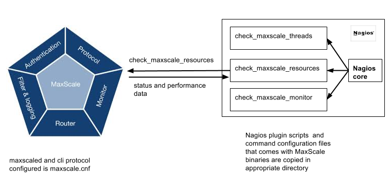

# MaxScale Nagios plugins, for Nagios 3.5.1

Massimiliano Pinto

Last Updated: 12th March 2015

### Document History

|                 |                 |                    |
| --------------- | --------------- | ------------------ |
| Date            | Change          | Who                |
| 10th March 2015 | Initial version | Massimiliano Pinto |

## Introduction

Nagios® Core™ is an Open Source system and network monitoring application. It watches hosts and services that you specify, alerting you when things go bad and when they get better.\
Nagios plugins are compiled executables or scripts (Perl scripts, shell scripts, etc.) that can be run from a command line to check the status or a host or service. Nagios uses the results from plugins to determine the current status of hosts and services on your network.\
Nagios core executes a plugin whenever there is a need to check the status of a service or host.

While MaxScale resources and status can be monitored via CLI using maxadmin commands, Nagios Plugin provides an automated way for system administration and database administrators to monitor MaxScale. The diagram below provides view of how Nagios and MaxScale interact.

There are three Nagios plugin scripts that MaxScale provides.

1. check\_maxscale\_threads.pl: This command provides you the status of current running threads and events in the queue on MaxScale Server. The Performance data associated with this command current and historic wait time for threads and events
2. check\_maxscale\_resources.pl: This command provides you status of various resources on MaxScale server. The Performance data associated provides details on respective resources.\
   Current resources are: modules, services, listeners, servers, sessions, filters.
3. check\_maxscale\_monitor.pl: This command provides you status of the configured monitor modules on MaxScale server.

In order to use these scripts on your Nagios Server, you need to copy them from the MaxScale binary package or download them from source tree on GitHub.

## MaxScale Nagios Plugin Requirements

MaxScale must be configured with 'maxscaled' protocol for the administration interface:

Example of maxscale.cnf file:

```
[AdminInterface]
type=service
router=cli

[AdminListener]
type=listener
service=AdminInterface
protocol=maxscaled
port=6603
```

### Prepare Nagios configuration files.

Assuming Nagios installed on a separated server and the plugins are in /usr/lib64/nagios/plugins and configuration files are in /etc/nagios:

* Copy MaxScale plugin scripts (./nagios/plugins/check\_maxscale\_\*.pl) to /usr/lib64/nagios/plugins on Nagios Server
* Copy New commands and server1 definition (./nagios/plugins/maxscale\_commands.cfg, server1.cfg) to /etc/nagios/objects/ on Nagios Server
* Edit /etc/nagios/nagios.cfg on Nagios Server

and add (just after localhost.cfg or commands.cfg)

```
cfg_file=/etc/nagios/objects/maxscale_commands.cfg
cfg_file=/etc/nagios/objects/server1.cfg
```

#### Please note:

* modify server IP address in server1.cfg, pointing to MaxScale server
* maxadmin executable must be in the nagios server
* default MaxScale AdminInterface port is 6603
* default maxadmin executable path is /usr/bin/maxadmin\
  It can be changed by -m option
* maxadmin executable could be copied from an existing maxscale installation (default location is /usr/bin/maxadmin)

This example shows configuration that needs to be done on Nagios server in order to communicate to MaxScale server that is running on host server1.\
In this example we are using the check\_maxscale\_resource as the check command

```
#Check MaxScale sessions, on the remote machine.
    define service{
        use         local-service
        host_name       server1
        service_description MaxScale_sessions
        check_command       check_maxscale_resource!6603!admin!mariadb!sessions!/path_to/maxadmin
        notifications_enabled   0
    }
```

#### Check new running monitors

* Restart Nagios and check new monitors are running in HTTP Interface "Current Status -> Services" on Nagios Server
* Look for any errors in /var/log/nagios/nagios.log or nagios.debug on Nagios Server

## Nagios Plugin command line usage

```
(1) ./check_maxscale_threads.pl -h

MaxScale monitor checker plugin for Nagios

Usage: check_maxscale_threads.pl [-r <resource>] [-H <host>] [-P <port>] [-u <user>] [-p <pass>] [-m <maxadmin>] [-h]

Options:
    -r <resource>   = threads
    -h      = provide this usage message
    -H <host>   = which host to connect to
    -P <port>   = port to use
    -u <user>   = username to connect as
    -p <pass>   = password to use for <user> at <host>
    -m <maxadmin>   = /path/to/maxadmin

(2) ./check_maxscale_resources.pl -h

MaxScale monitor checker plugin for Nagios

Usage: check_maxscale_resources.pl [-r <resource>] [-H <host>] [-P <port>] [-u <user>] [-p <pass>] [-m <maxadmin>] [-h]

Options:
    -r <resource>   = modules|services|filters|listeners|servers|sessions
    -h      = provide this usage message
    -H <host>   = which host to connect to
    -P <port>   = port to use
    -u <user>   = username to connect as
    -p <pass>   = password to use for <user> at <host>
    -m <maxadmin>   = /path/to/maxadmin

(3) ./check_maxscale_monitor.pl -h

MaxScale monitor checker plugin for Nagios

Usage: check_maxscale_monitor.pl [-r <resource>] [-H <host>] [-P <port>] [-u <user>] [-p <pass>] [-m <maxadmin>] [-h]

Options:
    -r <resource>   = monitors
    -h      = provide this usage message
    -H <host>   = which host to connect to
    -P <port>   = port to use
    -u <user>   = username to connect as
    -p <pass>   = password to use for <user> at <host>
    -m <maxadmin>   = /path/to/maxadmin
```

## Output description:

Example for 'services'

```
#./check_maxscale_resources.pl -r resources

OK: 7 services found | services1=RW_Router;readwritesplit;1;1 services2=RW_Split;readwritesplit;1;1 services3=Test Service;readconnroute;1;1 services4=Master Service;readconnroute;2;2 services5=Debug Service;debugcli;1;1 services6=CLI;cli;2;145 services7=MaxInfo;maxinfo;2;2
```

Returns OK and the number of services

Returns CRITICAL if no services are found

The data after | char are so called performance data and may be collected by Nagios\
output format is:

```
servicex=Name;router_module;NumUsers;TotalSessions
```

CC BY-SA / Gnu FDL


