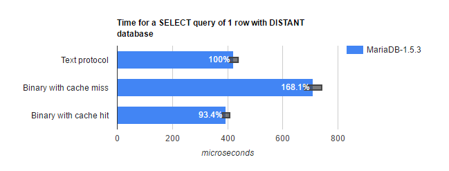

# MariaDB Connector/J 2.0.1 Release Notes



[Download](https://downloads.mariadb.org/connector-java/2.0.1/)[Release Notes](mariadb-connector-j-201-release-notes.md)[Changelog](../changelogs/2.0/mariadb-connector-j-201-changelog.md)[Connector/J Overview](https://github.com/mariadb-corporation/docs-release-notes/blob/test/kb/en/about-mariadb-connector-j/README.md)

**Release date:** 11 May 2017

MariaDB Connector/J 2.0.1 is a [_**Stable**_](../../../mariadb-release-criteria.md) _**(GA)**_\
release.

**For an overview of MariaDB Connector/J see the**[**About MariaDB Connector/J**](https://github.com/mariadb-corporation/docs-release-notes/blob/test/kb/en/about-mariadb-connector-j/README.md) **page**

## Notable Changes

**Java 8 is the minimum required version**\
The last release with Java 7 compatibility is [MariaDB Connector/J 1.6.0](../1.6/mariadb-connector-j-160-release-notes.md)

## Change from 2.0.1

The "useServerPrepStmts" option now defaults to false.

Benchmarks show that if the query has already been used (then prepared), there is a significant performance increase. On the other hand, when the command is not already prepared, the additional exchange for preparing this command will slightly slow down the overall execution of the command



The applications that repeatedly use the same queries have the ability to activate this option, but the general case is to use the direct command (text protocol).

Binary protocol is permissive and did permit using character for LIMIT that accept only integer :

```java
try (PreparedStatement p = connection.prepareStatement("SELECT * from mysql.user LIMIT ?")) {
    p.setString(1, "10");
    p.executeQuery();
}
```

With the "useServerPrepStmts" set to false, LIMIT parameter must be set to numeric field:

```java
try (PreparedStatement p = connection.prepareStatement("SELECT * from mysql.user LIMIT ?")) {
    p.setInt(1, 10);
    p.executeQuery();
}
```

* [CONJ-467](https://jira.mariadb.org/browse/CONJ-467) - changing database metadata compability to 4.2
* [CONJ-460](https://jira.mariadb.org/browse/CONJ-460) - Query that contain multiqueries with fetch and EOF deprecation failed
* [CONJ-464](https://jira.mariadb.org/browse/CONJ-464) - Using of "slowQueryThresholdNanos" option with value > Integer.MAX\_VALUE results in class cast exception
* [CONJ-452](https://jira.mariadb.org/browse/CONJ-452) - correcting inline ssl server certificate parsing
* [CONJ-461](https://jira.mariadb.org/browse/CONJ-461) - LAST\_INSERT\_ID() validation check correction for rewrite statement
* [CONJ-468](https://jira.mariadb.org/browse/CONJ-468) - autoIncrementIncrement value loaded during connection, avoiding a query for first statement for rewrite

New Option :[CONJ-465](https://jira.mariadb.org/browse/CONJ-465) - new option "enablePacketDebug"

| enablePacketDebug |
| ----------------- |
| enablePacketDebug |

## Change version 2.0.0 release candidate

### Handle CLIENT\_DEPRECATE\_EOF flag

[CONJ-318](https://jira.mariadb.org/browse/CONJ-318)\
Implement some protocol changes that permit saving some bytes.\
(part of [MDEV-8931](https://jira.mariadb.org/browse/MDEV-8931)).

### Handle SERVER\_SESSION\_STATE\_CHANGE status flag

[CONJ-341](https://jira.mariadb.org/browse/CONJ-341)\
With a [MariaDB 10.2](../../../mariadb-community-server-release-notes/old-releases/release-notes-mariadb-10-2-series/what-is-mariadb-102.md) or MySQL 5.7 server, ensure driver state:

* driver now always gets the current database, even when the database is changed by a query.
* when using rewriteBatchedStatements, return the correct autoincrement ids even when the session variable @auto\_increment\_increment has changed during the session.

### Improve setQueryTimeout to use SET STATEMENT max\_statement\_time

[CONJ-393](https://jira.mariadb.org/browse/CONJ-393)\
The previous implementation of query timeout handling (using Statement.setQueryTimeout) will create an additional thread with a scheduler.\
When timeout is reached, a temporary connection will be created to permit executing "KILL QUERY ", then closing the temporary connection.\
When the query ends before timeout, the scheduled task will be canceled.

For servers > [MariaDB 10.1.2](../../../mariadb-community-server-release-notes/old-releases/release-notes-mariadb-10-1-series/mariadb-10-1-2-release-notes.md), the query timeout will be handled server side using the "SET MAX\_STATEMENT\_TIME FOR" command.

### Real cancelling streaming result sets

[CONJ-315](https://jira.mariadb.org/browse/CONJ-315)\
When closing a statement that was fetching a result-set (using Statement.setFetchSize) and all rows were not read at the time of closing, a kill query command will be executed on close, to avoid having to parse all remaining results.

### Memory optimization: streaming query

[CONJ-442](https://jira.mariadb.org/browse/CONJ-442)\
Very large commands now don't use an intermediate buffer. Commands are sent directly to socket avoiding using memory. This permits sending very large objects (1G) without using any additional memory.

### Faster connection

[CONJ-366](https://jira.mariadb.org/browse/CONJ-366)\
Faster connection: bundle first commands in authentication packet\
The driver executes different commands on connection. Those queries are now sent using pipeline (all queries are sent, only then are all results read).

New Options:

| usePipelineAuth |
| --------------- |
| usePipelineAuth |

### Performance improvement storing data in resultset

[CONJ-368](https://jira.mariadb.org/browse/CONJ-368)\
Parsing row result optimisation to avoid creating byte array to the maximum for faster results and less memory use.

### Remaining JDBC 4.2 missing implementation :

* [CONJ-414](https://jira.mariadb.org/browse/CONJ-414) - support for large update count \[[CONJ-414](https://jira.mariadb.org/browse/CONJ-414)]
* [CONJ-409](https://jira.mariadb.org/browse/CONJ-409) - PrepareStatement.setObject(...) support for with java 8 temporal temporal object.
* [CONJ-411](https://jira.mariadb.org/browse/CONJ-411) - support for Statement maxFieldSize

### Misc

* [CONJ-443](https://jira.mariadb.org/browse/CONJ-443) - NullpointerException when making concurrent procedure calls
* [CONJ-391](https://jira.mariadb.org/browse/CONJ-391) - Improve connection using SELECT in place of SHOW to avoid creating a mutex server side.
* [CONJ-402](https://jira.mariadb.org/browse/CONJ-402) - tcpKeepAlive option now default to true.
* [CONJ-448](https://jira.mariadb.org/browse/CONJ-448) - QueryException: Incorrect arguments to mysqld\_stmt\_execute on inserting an "emptyString"-Lob with JPA
* [CONJ-451](https://jira.mariadb.org/browse/CONJ-451) - Respect type parameter of ResultSet.getObject with type
* [CONJ-455](https://jira.mariadb.org/browse/CONJ-455) - MetaData : tinyInt1isBit doesn't work properly in TINYINT(1) column that is marked as UNSIGNED
* [CONJ-450](https://jira.mariadb.org/browse/CONJ-450) - NPE on setClientInfo if value is an empty string
* [CONJ-457](https://jira.mariadb.org/browse/CONJ-457) - trustStore : Retain leading slash when trust store beings with 'file:/'
* [CONJ-160](https://jira.mariadb.org/browse/CONJ-160) - ConnectionPool test using hikariCP
* [CONJ-307](https://jira.mariadb.org/browse/CONJ-307) - valid connector java 9 early access
* [CONJ-402](https://jira.mariadb.org/browse/CONJ-402) - make tcpKeepAlive option default to true
* [CONJ-411](https://jira.mariadb.org/browse/CONJ-411) - Implement Statement maxFieldSize
* [CONJ-449](https://jira.mariadb.org/browse/CONJ-449) - Permit CallableStatement streaming




