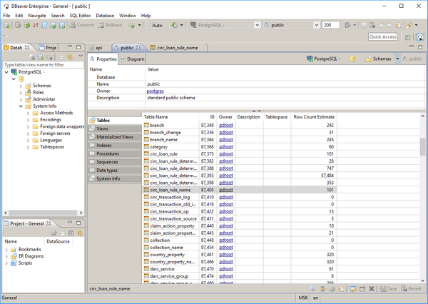

# DBeaver

[DBeaver](https://dbeaver.jkiss.org/) is a free multi-platform database tool for developers, SQL programmers, database administrators and analysts. 
It supports all popular relational databases: MySQL, MariaDB, PostgreSQL, SQLite, Oracle, DB2, SQL Server, Sybase, Teradata, Netezza, etc. Also, it supports NoSQL databases: MongoDB, Cassandra, Redis, Apache Hive, etc. in the Enterprise Edition version.

A brief list of basic features can be found below:

* Data viewer and editor: sorting, filtering, image displaying, export of selected data and much more.
* Metadata browser: possibility to view and edit existing tables, views, columns, indexes, procedures, triggers, storage entities (tablespaces, partitions, etc), security entities (users, roles, etc).
* Data transfer: export and import for files in various formats (CSV, HTML, XML, XLS, XLSX).
* ER diagrams: possibility to automatically generate ER diagrams for a database/schema (diagram will contain all schema tables) or for a single table and export the diagram in a suitable format.
* SQL editor: possibility to organize all your scripts in folders, reassign database connections for particular scripts.
* Data and metadata search: full-text data search using against all chosen tables/views.
* Database structure comparing: possibility to perform objects structure compare.

DBeaver is actively developed and maintained. Usability is the main goal of this project, so program UI is carefully designed and implemented. Every user can send bug report and feature request on the [GitHub page](https://github.com/serge-rider/dbeaver).

