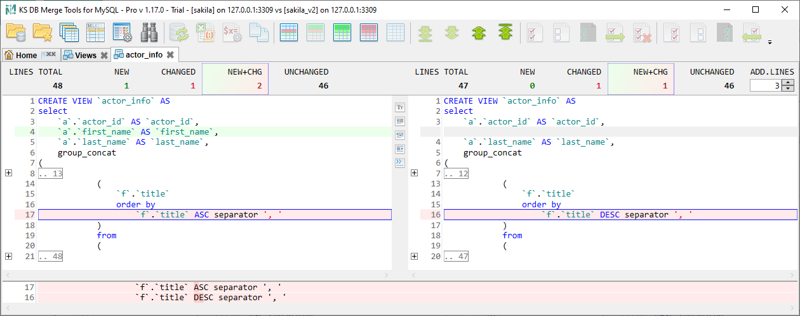
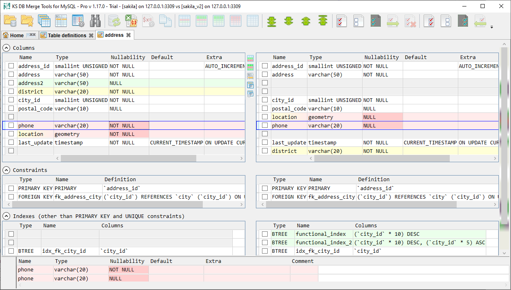
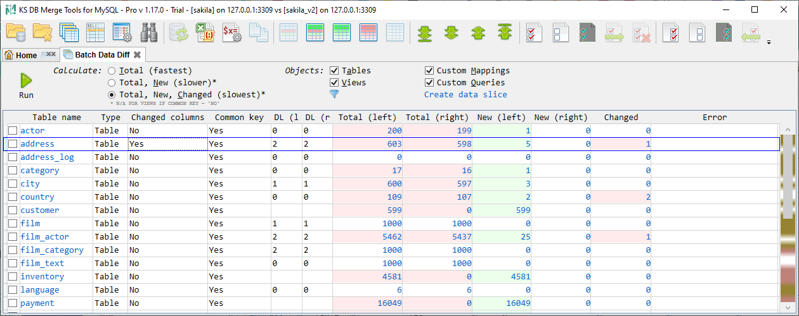
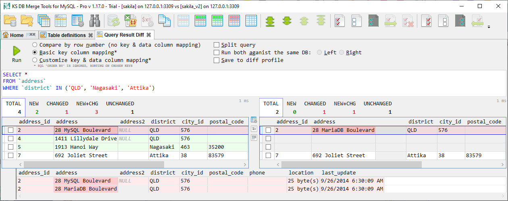

# KS DB Merge Tools

## Overview

KS DB Merge Tools for MySQL and MariaDB is a diff & merge tool for MySQL and MariaDB, allowing to compare and sync both schema and data. It is a Freemium application - many features are exposed in the Free version (available for commercial use), some extended features are available only in the paid Standard version (in many cases can be provided at no cost for open source developers).

[Product home page](https://ksdbmerge.tools/for-mysql)

[Download](https://ksdbmerge.tools/mysql-diff-merge-download.html)

[Use cases](https://ksdbmerge.tools/mysql-diff-merge-use-cases-1-schema-summary.html)

[Documentation](https://ksdbmerge.tools/docs/for-mysql/overview.html)

Application has tabbed UI, there are several types of tabs responsible for particular application features and scope of tasks. Here are the primary application tabs:

## Home Tab

It is a starting point to open databases. Shows summary about all database objects. Note that it does not provide information about data/content changes, only about object definitions.

This tab is also used as a starting point to manage diff profiles, making it easy to customize the tool for your specific database project. Here, you can save and reuse custom queries, mappings, and data slices, allowing you to create tailored data diff summaries.

## Object List

Lists all objects of some particular type - tables, views, etc. Allows to identify whether some object is new, changed or unchanged (note that for tables and views it does not provide information about data/content changes, only about object definitions). Quick filters available to show only new/changed/new+changed objects. Here we can select required objects on one side and generate a synchronization script to merge these changes to the other side.

## Table Data Diff

Compares data for particular table or view. Quick filters available to show only new, changed, or new and changed rows. We can select required rows on one side and generate synchronization script to merge these changes to the other side.

## Text Diff

Compares definition of some particular database programming object like view or stored procedure.

## Table Structure Diff

Compares definition of particular table. Here we can select required changes and generate synchronization script for them. This tab is available only in the Standard version, the Free version is using Text diff tab to compare table definitions.

## Batch Data Diff

Allows to compare data for multiple tables and views, providing summary of data changes for the whole database. This tab is available only in the Standard version.

## Query Result Diff

Compares arbitrary query results, it can be the same query running on both databases or different queries running on the same or different databases. This tab is available only in the Standard version.

## Automation and Scripting

The Standard version has support of own domain-specific scripting language designed to automate diff and merge tasks provided by GUI. In addition to the primary GUI, there is a Script Editor application designed to help in writing and troubleshooting scripts and a separate command line utility that is used to run these scripts without user interaction. For the most typical tasks the scripts can be generated just with a single button click on GUI which produces a script relevant for the data or objects you currently observe on UI.

_This page is licensed: CC BY-SA / Gnu FDL_


