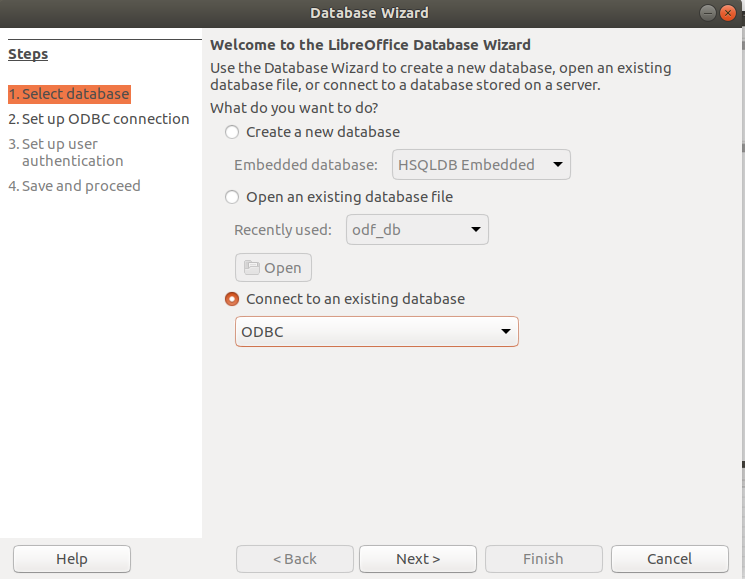
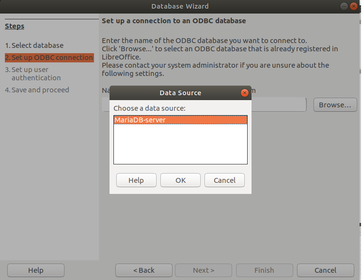
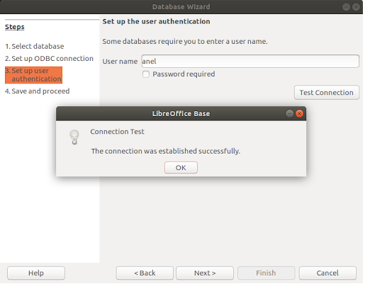
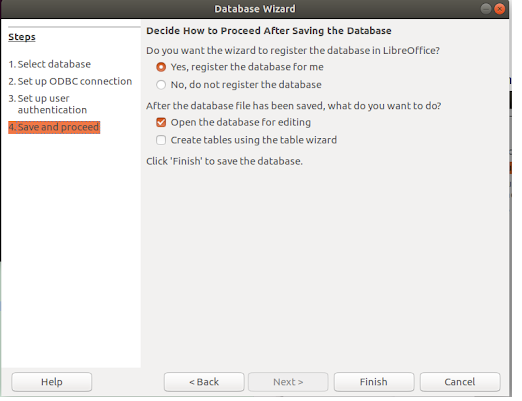
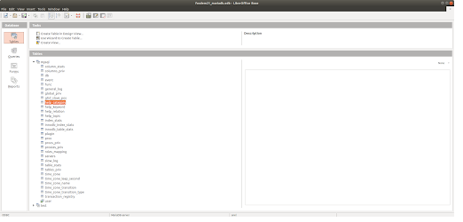
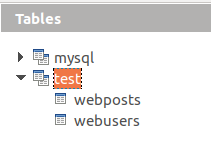
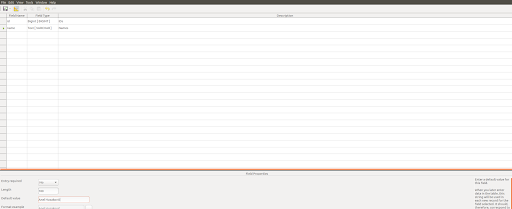

# LibreOffice Base

[LibreOffice Base](https://www.libreoffice.org/discover/base/) is an open source RDBMS (relational database management system) front-end tool to create and manage various databases.

## Preparing the ODBC Connection

First, make sure to prepare MariaDB Connector/ODBC as explained in [MariaDB Connector/ODBC](https://mariadb.com/kb/en/about-mariadb-connector-odbc/).

That includes:

* Download [the latest MariaDB Connector/ODBC](https://mariadb.com/downloads/#connectors)
* Copy the shared library libmaodbc.so to /usr/lib/\[multi-arch]
* Install the unixodbc, unixodbc-dev, openssh-client, odbcinst packages
* Create a template file for the [ODBC driver](https://app.gitbook.com/s/CjGYMsT2MVP4nd3IyW2L/mariadb-connector-odbc/creating-a-data-source-with-mariadb-connectorodbc#configuring-mariadb-connectorodbc-as-a-unixodbc-driver-on-linux). A sample “MariaDB\_odbc\_driver\_template.ini” could be:

|                                                  |
| ------------------------------------------------ |
| \[MariaDB ODBC 3.1 Driver]                       |
| Description = MariaDB Connector/ODBC v.3.1       |
| Driver = /usr/lib/x86\_64-linux-gnu/libmaodbc.so |

* Install the ODBC driver from the template file by running:

```
$ sudo odbcinst -i -d -f MariaDB_odbc_driver_template.ini
odbcinst: Driver installed. Usage count increased to 1. 
    Target directory is /etc
```

Verify successful installation in _/etc/odbcinst.ini_ file (this path is obtained by the config info _/-j_/ option, where drivers are installed in that predefined location).

```
$ odbcinst -j
unixODBC 2.3.6
DRIVERS............: /etc/odbcinst.ini
SYSTEM DATA SOURCES: /etc/odbc.ini
FILE DATA SOURCES..: /etc/ODBCDataSources
USER DATA SOURCES..: /home/anel/.odbc.ini
SQLULEN Size.......: 8
SQLLEN Size........: 8
SQLSETPOSIROW Size.: 8

$ cat /etc/odbcinst.ini 
[MariaDB ODBC 3.1 Driver]
Description=MariaDB Connector/ODBC v.3.1
Driver=/usr/lib/x86_64-linux-gnu/libmaodbc.so
UsageCount=1
```

* Create a template file for the [Data Source Name (DSN)](https://app.gitbook.com/s/CjGYMsT2MVP4nd3IyW2L/mariadb-connector-odbc/creating-a-data-source-with-mariadb-connectorodbc#configuring-a-dsn-with-unixodbc-on-linux). A sample “MariaDB\_odbc\_data\_source\_template.ini” could be:

|                                |
| ------------------------------ |
| \[MariaDB-server]              |
| Description=MariaDB server     |
| Driver=MariaDB ODBC 3.1 Driver |
| SERVER=localhost               |
| USER=anel                      |
| PASSWORD=                      |
| DATABASE=test                  |
| PORT=3306                      |

* Install data source:

```
odbcinst -i -s -h -f MariaDB_odbc_data_source_template.ini
```

* Verify successful installation in the /.odbc.ini file

```
$ cat ~/.odbc.ini 
[MariaDB-server]
Description=MariaDB server
Driver=MariaDB ODBC 3.1 Driver
SERVER=MariaDB
USER=anel
PASSWORD=
DATABASE=test
PORT=3306
```

* Verify successful installation also using the [isql](https://app.gitbook.com/s/CjGYMsT2MVP4nd3IyW2L/mariadb-connector-odbc/creating-a-data-source-with-mariadb-connectorodbc#verifying-a-dsn-configuration-with-unixodbc-on-linux) utility, for example:

```
$ isql MariaDB-server
+---------------------------------------+
| Connected!                            |
|                                       |
| sql-statement                         |
| help [tablename]                      |
| quit                                  |
|                                       |
+---------------------------------------+
SQL> show tables;
+--------------------------------------------------------------------------+
| Tables_in_test                                                           |
+--------------------------------------------------------------------------+
| Authors                                                                  |
| tbl_names                                                                |
| webposts                                                                 |
| webusers                                                                 |
+--------------------------------------------------------------------------+
SQLRowCount returns 4
4 rows fetched
```

## Start with LibreOffice Base

Start Libreoffice Base from the terminal by running _lobase_ (make sure to install the _libreoffice-base_ package if needed). The default option is to create a new database, which is _HSQLDB_. In order to connect to a running MariaDB server, choose _“Connect to an existing database”_ and choose _“ODBC”_ driver as shown below:



After that, choose DSN (the one that we created in the previous step) and click _“Next”_:



Provide a user name (and password if needed) and again check the connection (with the _“Test Connection”_ button) and click _“Next”_:



After that, we have options to register the database. Registration in this sense means that the database is viewable by other LibreOffice modules (like _LibreOffice Calc_ and _LibreOffice Writer_). So this step is optional. In this example, we will save as _“fosdem21\_mariadb.odb”_. See [Using a Registered Database](libreoffice-base.md#using-a-registered-database).



It opens the following window:



It consists of three windows/panels:

1. “Database” window with the options
2. "Tables",
3. "Queries",
4. "Forms",
5. "Reports".
6. "Tasks window (dependent on what is selected in the “Database” window). When “Tables” is selected, the options are:
7. "Create Table in Design View",
8. "Use Wizard to Create Table" and
9. "Create View".
10. "Tables" window - shows list of tables that are created.

As we can see, there are system tables in the _“mysql”_ database as well as _“test”_ database.

Let’s say we create a table using the REST API from JSON data from [posts](https://jsonplaceholder.typicode.com/posts), and another table using the same mechanism from [users](https://jsonplaceholder.typicode.com/users), and let’s call them _webposts_ and _webusers_. In order to do so, we have to enable the **CONNECT** storage engine plugin and start with REST\_API. See more in the [CONNECT - Files Retrieved Using Rest Queries](../../server-usage/storage-engines/connect/connect-table-types/connect-files-retrieved-using-rest-queries.md) article.

The queries we need to run in MariaDB are:

```
CREATE TABLE webusers ENGINE=CONNECT TABLE_TYPE=JSON
  HTTP='http://jsonplaceholder.typicode.com/users';

CREATE TABLE webposts ENGINE=CONNECT TABLE_TYPE=JSON
  HTTP='http://jsonplaceholder.typicode.com/posts';
```

The result in LibreOffice Base is as shown below:



Double clicking on the table opens a new window with the data displayed to inspect:


To create the table from the _“Tasks”_ window, use the option _“Create Table in Design View”_, where one can specify specific field names and types as shown:



From the “Tasks” window one can create a table using the option _“Use Wizard to Create Table”_ to create some sample tables.

One can fill the data in the existing table, or create and define the new table from the _LibreOffice Calc_ module with simple copy-paste (in the _"Tasks"_ window).

## Using a Registered Database

Other modules can use the registered database, for example, open _"LibreOffice Calc"_ and go to _"Tools"_, _"Options"_ and you will see the _"odb"_ file we registered when starting _"LibreOffice Base"_.

<sub>_This page is licensed: CC BY-SA / Gnu FDL_</sub>


