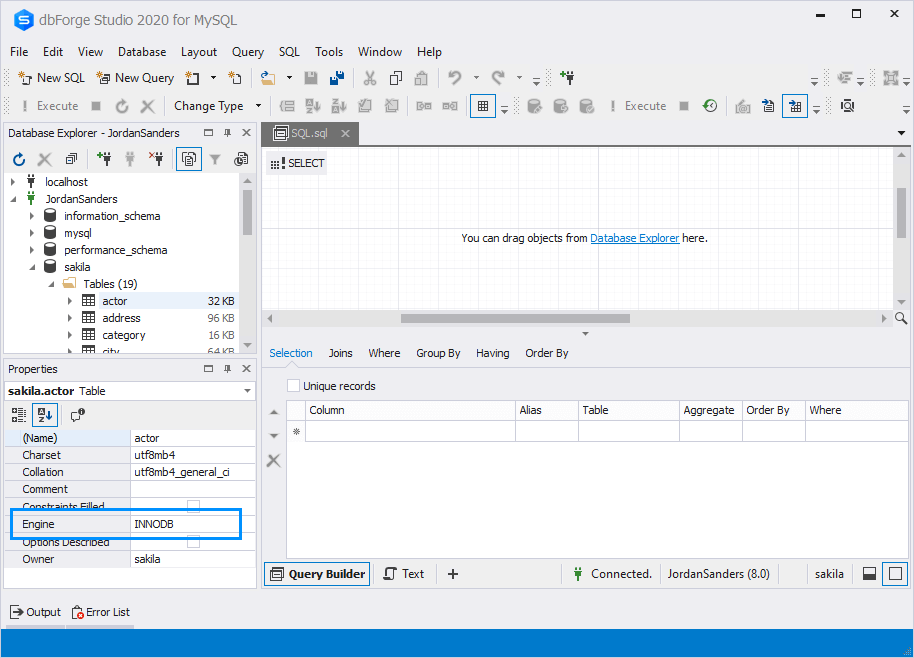
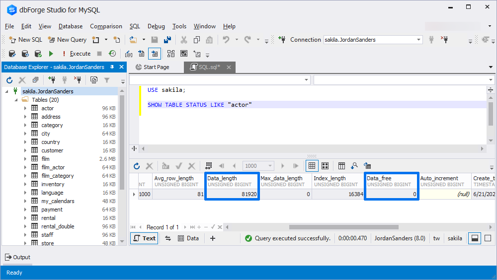
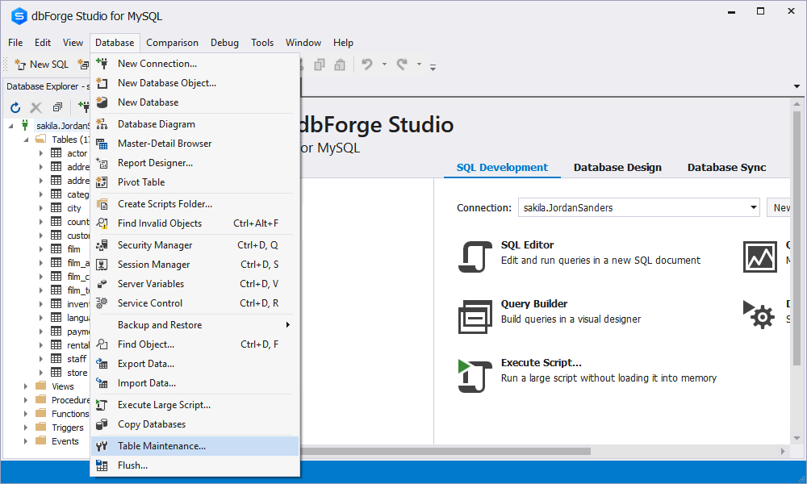
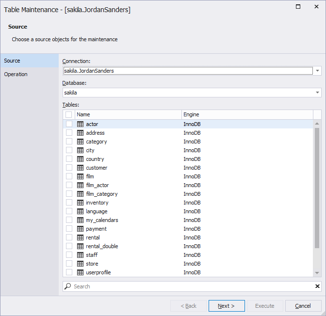

# MyISAM Database Management using GUI Client

Navigating the complexities of database management requires the right tools and know-how, especially when dealing with specialized storage engines like MyISAM in MySQL and MariaDB environments. This comprehensive guide demystifies the role and functionality of MyISAM clients, offering you a deep dive into their essential features and operations. From initiating CRUD operations to optimizing table performance, we cover it all. We also spotlight dbForge Studio for MySQL, a feature-rich IDE that simplifies your interactions with MyISAM tables and databases. Whether you're a seasoned DBA or a developer looking to sharpen your database skills, this article serves as your go-to resource for understanding MyISAM clients and maximizing their capabilities.

### What is a MyISAM client?

A MyISAM client refers to a specialized application or module designed to interact with the MyISAM database storage engine. Its primary function is to facilitate essential database operations such as creating, reading, updating, and deleting data (commonly referred to as CRUD operations) through specific protocols, APIs, or query languages.

In the context of MyISAM, it's important to note that we are essentially referring to a [MySQL/MariaDB client](https://www.devart.com/dbforge/mysql/studio/), as the MyISAM storage engine is an integral part of these database management systems. A MyISAM client plays a pivotal role in initiating database management processes, sending queries to databases, and handling subsequent responses.

In simpler terms, any MyISAM client serves as the interface that allows users to interact with MySQL/MariaDB. There is a wide range of available solutions catering to different needs, including lightweight command-line utilities like **myisamchk**, versatile options like the MySQL Command-Line Client, and feature-rich IDEs based on graphical user interfaces, such as MySQL Workbench or dbForge Studio for MySQL.

The choice of the right client largely depends on user preferences, the specific work environment, and the tasks they need to accomplish.

### How it works: a MyISAM client in action

To better understand the functionality of a MyISAM client, let's delve into a practical scenario where a user needs to compose and execute a query against the database and subsequently retrieve the results. Whether you opt for a command-line or GUI client, the process unfolds as follows:

**Step 1: Connection Setup**

The client [initiates a connection to a MySQL/MariaDB server](https://www.devart.com/dbforge/mysql/studio/database-connections.html) using the necessary library or connector. During this setup, it provides authentication credentials and specifies the database to be accessed.

**Step 2: Query Submission**

The client sends SQL queries to the MySQL/MariaDB server, utilizing the appropriate database engine—in our case, MyISAM.

*Note: Modern GUI-based database clients, like dbForge Studio for MySQL and MariaDB, enhance query writing by offering essential features such as code auto-completion, formatting, debugging, code snippet libraries, and visual query builders for constructing intricate queries through diagrams.*

**Step 3: Query Execution**

The database system takes charge of parsing and executing the SQL query. When the query involves a table managed by the MyISAM storage engine, MyISAM handles the data and its storage particulars.

**Step 4: Result Retrieval**

Upon completing query processing, the results are transmitted back to the client. The client then handles these results as needed—whether it's displaying them to the user or employing them for further operations.

**Step 5: Connection Closure**

Once the interaction is finished, the client responsibly closes the connection.

Throughout this process, it's essential to note that the client does not directly engage with MyISAM or any other storage engines. Instead, it interacts with the MySQL/MariaDB server, which, in turn, utilizes MyISAM to manage data at its level.

### dbForge Studio for MySQL and MariaDB as the MyISAM client

dbForge Studio for MySQL that is also a viable [MariaDB tool](https://www.devart.com/dbforge/mysql/studio/mariadb-gui-client.html) offers full support for all MySQL storage engines, including MyISAM, and a user-friendly graphical interface that simplifies interactions with MyISAM tables. The functionality of the Studio makes it the common choice for professionals who prefer GUI tools over command-line utilities.

It includes options available in the **myisamchk** utility and [provides many more features to cover all database-related tasks on MySQL and MariaDB](https://www.devart.com/dbforge/mysql/studio/features.html), no matter which storage engine those databases use.

Speaking of MyISAM tables, it is worth mentioning some basic operations.

#### Check what storage engine is used in the database

In dbForge Studio for MySQL, you can check the storage engine of the current database in a couple of clicks. Select the database in Database Explorer, right-click the necessary table, and select **Properties** from the shortcut menu. The output will present the information of the database engine among other data.

#### Convert a table from InnoDB to MyISAM (and vice versa)

If you need to switch between database engines for some tables, you can use the standard ALTER TABLE command. dbForge Studio for MySQL allows executing SQL queries directly against the database.

To convert an InnoDB table to MyISAM, use the following command:

ALTER TABLE database_name.table_name ENGINE=MyISAM;

*Img 1 – InnoDB, img 2 – MyISAM*

The same ALTER TABLE command serves in the opposite situation where you want to convert MyISAM tables to InnoDB. You will need to specify ENGINE=InnoDB in that case.

MyISAM does not support foreign key constraints that are supported by InnoDB. In case you want to convert an InnoDB table having foreign keys into MyISAM, you will encounter an error. Make sure to drop those constraints before converting. There are more [differences between MyISAM and InnoDB](https://blog.devart.com/myisam-vs-innodb.html) that should be considered when you deal with these two storage engines.

#### Optimize MyISAM tables

The primary function of myisamchk is to check, optimize, and repair MyISAM tables. This is crucial because frequent CRUD operations (CREATE, READ, DELETE, UPDATE) can lead to table corruption and a gradual decline in performance over time. dbForge Studio for MySQL includes [a table maintenance tool](https://www.devart.com/dbforge/mysql/studio/optimize-mysql-table.html) that simplifies the process of identifying, analyzing, optimizing, and repairing tables.

To locate tables that require the administrator's attention, you can run the standard command in dbForge Studio for MySQL:

SHOW TABLE STATUS LIKE table_name;

This command provides detailed information about the table properties, including the total space occupied by the table and the total unused space (Data_length and Data_free columns, respectively). This helps users pinpoint tables that may be consuming excessive space and may be corrupted.

This way, users can identify those tables that may take up too much space and be corrupted.

After detecting the MyISAM tables that require maintenance, you can apply the Studio’s integrated table maintenance tool to those tables to fix the issues. To launch it, right-click the necessary table in Database Explorer and select **Table Maintenance**.

The table maintenance module offers the following options:

* Analyze the table: This tool examines the key statistics of the table, helping to create more efficient query plans for optimal performance.
* Optimize the table: This option allows optimizing MyISAM tables for defragmentation, improving their performance.
* Check table errors: With this option, you can run diagnostic tests on tables, identifying and reporting all errors and corruption. It's worth noting that dbForge Studio provides flexible configuration for error checking, allowing users to determine the level of detail required. While a thorough scan for all possible errors may take time, it ensures that every issue is detected and reports 100% consistency.
* Checksum the table: This feature checks if the table has been modified, helping to maintain data integrity.
* Repair the table: This command is used to fix corrupted MyISAM tables. Applying this option may also recommend upgrading tables if necessary to rectify errors.

dbForge Studio streamlines all of these tasks with a single click. Users only need to specify the desired option and click **Execute**. This simplifies the process of maintaining MyISAM tables in MySQL databases.

#### More features of dbForge Studio for MySQL that can be applied to MyISAM tables and databases

The functionality of myisamchk is covered by one of many features available in dbForge Studio for MySQL. This multi-featured IDE offers a comprehensive toolset with flexible configuration and robust customization capacities to perform all database-related tasks in MySQL and MariaDB, no matter which database storage engine is used there. The following aspects are just several examples of the Studio's work:

* SQL Development: The functionality of this software client allows the users to construct and execute SQL queries and scripts, no matter the complexity, on databases using the MyISAM storage engine.

* Database Design: Users can both build database structures from scratch and modify existing ones, including creating and managing MyISAM tables and their respective indexes and keys.

* Database Administration: DBAs have access to essential tools for server connection management, performance monitoring, user account and privilege administration, and optimization and repair of tables using various storage engines.

* Data Management: Beyond basic data export and import tasks, dbForge Studio allows users to browse and edit data directly in the grid. You can also sort and filter data according to your specific needs.

* Backup and Restore: With support for MyISAM point-in-time backup and restore, the Studio can create backups of all types and restore them as needed. This ensures the safety, consistency, and stable performance of your databases.

#### Conclusion

Navigating the complexities of MyISAM storage engines doesn't have to be a daunting task. This article has provided you with an in-depth understanding of MyISAM clients and their integral role in MySQL and MariaDB database management. We've also showcased the unparalleled utility of dbForge Studio for MySQL, a one-stop IDE that simplifies everything from CRUD operations to advanced table maintenance. If you're keen on optimizing your database management processes, there's no better time to act.

Download a [30-day free trial](https://www.devart.com/dbforge/mysql/studio/download.html) of dbForge Studio to experience firsthand how this comprehensive tool can elevate your database operations to new heights.

CC BY-SA / Gnu FDL

