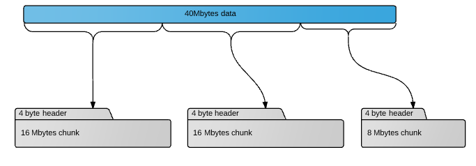
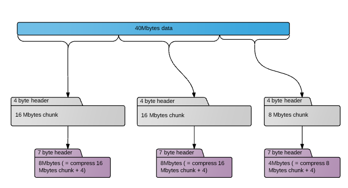

# 0 - Packet

Client - server exchanges are done using the following format:

## Standard packet

The standard MySQL/MariaDB packet has a 4 bytes header + packet body.

* [int<3>](protocol-data-types.md#fixed-length-integers) packet length
* [int<1>](protocol-data-types.md#fixed-length-integers) sequence number
* [byte](protocol-data-types.md#fixed-length-bytes) packet body

Packet length is the length of the packet body.\
Packet length size cannot be more than 3 bytes length value. The actual length of the packet is calculated as from the 3 bytes as length = byte\[0] + (byte\[1]<<8) + (byte\[2]<<16). The maximum size of a packet (with all 3 bytes 0xff) is 16777215 , or 2^24-1 or 0xffffff, or 16MB-1byte.

The sequence number indicates the exchange number when an exchange demands different exchanges. Whenever the client sends a query, the sequence number is set to 0 initially, and is incremented if clients need to split packets.\
In more complex situations, when the client and server exchange several packets, e.g authentication handshake, the rule of thumb for clients is to set sequence nr = (last seq.nr from received server packet + 1)

Example: Sending a [COM\_PING](2-text-protocol/com_ping.md) packet COM\_PING body has only one byte (0x10):

```
01 00 00 00 10
```

The server will then return an [OK\_Packet](4-server-response-packets/ok_packet.md) response with a sequence number of 1.

### Packet splitting

As mentioned, the packet length is 3 bytes making a maximum size of (2^24 -1) bytes or 16Mbytes-1byte. But the protocol allows sending and receiving larger data. For those cases, the client can send many packets for the same data, incrementing the sequence number for each packet.

The principle is to split data by chunks of 16MBytes. When the server receives a packet with 0xffffff length, it will continue to read the next packet. In case of a length of exactly 16MBytes, an empty packet must terminate the sequence.

Example max\_allowed\_packet is set to a value > to 40 Mbytes\
Sending a 40M bytes packet body :\
First packet will be :

```
ff ff ff 00 ...
```

second packet will be

```
ff ff ff 01 ...
```

third packet will be

```
02 00 80 02 ...
```

The client must be aware of the [max\_allowed\_packet](../../../../ha-and-performance/optimization-and-tuning/system-variables/server-system-variables.md#max_allowed_packet) variable value. The server will have a buffer to store the body with a maximum size corresponding to this max\_allowed\_packet value. If the client sends more data than max\_allowed\_packet size, the socket will be closed.

Note that data of exact size size 2^24 -1 byte must be sent in 2 packets, the first one with length prefix 0xffffff, and the second one with length 0 (length byte 0x000000, seqno incremented). Generally, if data length is an exact multiple of 2^24-1, it must always be followed by an empty packet.

## Compressed packet

For slow connections, the packet can be compressed.\
This is activated after the [handshake-response-packet](1-connecting/connection.md) when the client indicates \[\[1-connecting-connecting#capabilities|COMPRESS] capability with the server having this functionality too.

When activated, packets will be composed of 7 bytes a compress header + data. The compression algorithm used is is ZLIB, widely available and supported by many languages and runtimes.

* [int<3>](protocol-data-types.md#fixed-length-integers) compressed packet length
* [int<1>](protocol-data-types.md#fixed-length-integers) compression protocol sequence number
* [int<3>](protocol-data-types.md#fixed-length-integers) uncompress body length
* [byte](protocol-data-types.md#fixed-length-bytes) compressed body
  * compressed body contains one or many standard packets but partial packets can also be sent:
    * one or many standard packets :
      * [int<3>](protocol-data-types.md#fixed-length-integers) packet length
      * [int<1>](protocol-data-types.md#fixed-length-integers) sequence number
      * [byte](protocol-data-types.md#fixed-length-bytes) packet body

Since compress body can contain many "standard packets", compress sequence number is incremented separately from sequence number. If the length of the uncompressed payload exceeds 0xffffff bytes, the uncompressed payload must be sent in several compressed protocol packets.

For small packets, using compression won't be efficient, so the client can choose to send uncompressed data.\
That is done by setting the compressed packet length to the real length and the uncompressed packet length to 0. (Data must then be uncompressed).

Example: Sending a [COM\_PING](2-text-protocol/com_ping.md) packet COM\_PING body when COMPRESS is enabled. This is 1 byte of data that has then no reason to be compressed, so:

```
01 00 00 00 00 00 00 01 00 00 00 10
```

The server will then return an [OK\_Packet](4-server-response-packets/ok_packet.md) response with a compress sequence number of 1, and a sequence number of 1.

### Compression packet splitting

The server will uncompress data and then must have the same packet than if there was no compression.\
If data size needs splitting, it's better to separate compress packet.



<sub>_This page is licensed: CC BY-SA / Gnu FDL_</sub>


