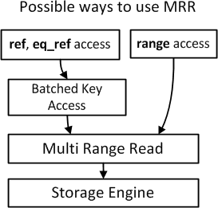
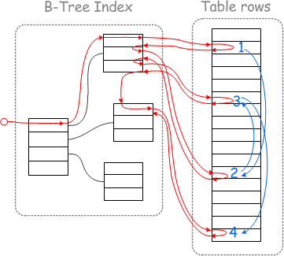
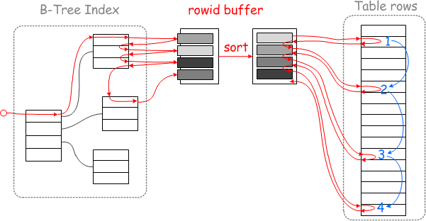
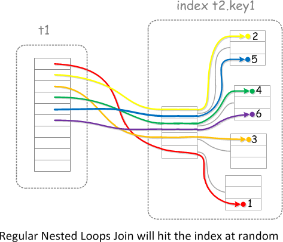
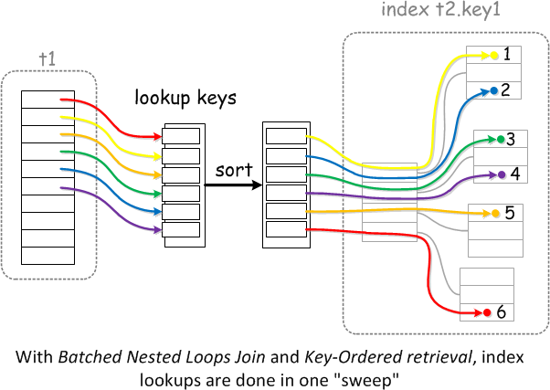

# Multi Range Read Optimization

Multi Range Read is an optimization aimed at improving performance for IO-bound queries that need to scan lots of rows.

Multi Range Read can be used with

* `range` access
* `ref` and `eq_ref` access, when they are using [Batched Key Access](../../../server-usage/mariadb-internals/mariadb-internals-documentation-query-optimizer/block-based-join-algorithms.md#batch-key-access-join)

as shown in this diagram:



## The Idea

### Case 1: Rowid Sorting for Range Access

Consider a range query:

```
explain select * from tbl where tbl.key1 between 1000 and 2000;
+----+-------------+-------+-------+---------------+------+---------+------+------+-----------------------+
| id | select_type | table | type  | possible_keys | key  | key_len | ref  | rows | Extra                 |
+----+-------------+-------+-------+---------------+------+---------+------+------+-----------------------+
|  1 | SIMPLE      | tbl   | range | key1          | key1 | 5       | NULL |  960 | Using index condition |
+----+-------------+-------+-------+---------------+------+---------+------+------+-----------------------+
```

When this query is executed, disk IO access pattern will follow the red line in this figure:



Execution will hit the table rows in random places, as marked with the blue line/numbers in the figure.

When the table is sufficiently big, each table record read will need to actually go to disk (and be served from buffer pool or OS cache), and query execution will be too slow to be practical. For example, a 10,000 RPM disk drive is able to make 167 seeks per second, so in the worst case, query execution will be capped at reading about 167 records per second.

SSD drives do not need to do disk seeks, so they will not be hurt as badly, however the performance will still be poor in many cases.

Multi-Range-Read optimization aims to make disk access faster by sorting record read requests and then doing one ordered disk sweep. If one enables Multi Range Read, `EXPLAIN` will show that a "`Rowid-ordered scan`" is used:

```
set optimizer_switch='mrr=on';
Query OK, 0 rows affected (0.06 sec)

explain select * from tbl where tbl.key1 between 1000 and 2000;
+----+-------------+-------+-------+---------------+------+---------+------+------+-------------------------------------------+
| id | select_type | table | type  | possible_keys | key  | key_len | ref  | rows | Extra                                     |
+----+-------------+-------+-------+---------------+------+---------+------+------+-------------------------------------------+
|  1 | SIMPLE      | tbl   | range | key1          | key1 | 5       | NULL |  960 | Using index condition; Rowid-ordered scan |
+----+-------------+-------+-------+---------------+------+---------+------+------+-------------------------------------------+
1 row in set (0.03 sec)
```

and the execution will proceed as follows:



Reading disk data sequentially is generally faster, because

* Rotating drives do not have to move the head back and forth
* One can take advantage of IO-prefetching done at various levels
* Each disk page will be read exactly once, which means we won't rely on disk cache (or buffer pool) to save us from reading the same page multiple times.

The above can make a huge difference on performance. There is also a catch, though:

* If you're scanning small data ranges in a table that is sufficiently small so that it completely fits into the OS disk cache, then you may observe that the only effect of MRR is that extra buffering/sorting adds some CPU overhead.
* `LIMIT n` and `ORDER BY ... LIMIT n` queries with small values of `n` may become slower. The reason is that MRR reads data in disk order, while `ORDER BY ... LIMIT n` wants first `n` records in index order.

### Case 2: Rowid Sorting for Batched Key Access

Batched Key Access can benefit from rowid sorting in the same way as range access does. If one has a join that uses index lookups:

```
explain select * from t1,t2 where t2.key1=t1.col1;
+----+-------------+-------+------+---------------+------+---------+--------------+------+-------------+
| id | select_type | table | type | possible_keys | key  | key_len | ref          | rows | Extra       |
+----+-------------+-------+------+---------------+------+---------+--------------+------+-------------+
|  1 | SIMPLE      | t1    | ALL  | NULL          | NULL | NULL    | NULL         | 1000 | Using where |
|  1 | SIMPLE      | t2    | ref  | key1          | key1 | 5       | test.t1.col1 |    1 |             |
+----+-------------+-------+------+---------------+------+---------+--------------+------+-------------+
2 rows in set (0.00 sec)
```

Execution of this query will cause table `t2` to be hit in random locations by lookups made through `t2.key1=t1.col`. If you enable Multi Range and and Batched Key Access, you will get table `t2` to be accessed using a `Rowid-ordered scan`:

```
set optimizer_switch='mrr=on';
Query OK, 0 rows affected (0.06 sec)

set join_cache_level=6;
Query OK, 0 rows affected (0.00 sec)

explain select * from t1,t2 where t2.key1=t1.col1;
+----+-------------+-------+------+---------------+------+---------+--------------+------+--------------------------------------------------------+
| id | select_type | table | type | possible_keys | key  | key_len | ref          | rows | Extra                                                  |
+----+-------------+-------+------+---------------+------+---------+--------------+------+--------------------------------------------------------+
|  1 | SIMPLE      | t1    | ALL  | NULL          | NULL | NULL    | NULL         | 1000 | Using where                                            |
|  1 | SIMPLE      | t2    | ref  | key1          | key1 | 5       | test.t1.col1 |    1 | Using join buffer (flat, BKA join); Rowid-ordered scan |
+----+-------------+-------+------+---------------+------+---------+--------------+------+--------------------------------------------------------+
2 rows in set (0.00 sec)
```

The benefits will be similar to those listed for `range` access.

An additional source of speedup is this property: if there are multiple records in `t1` that have the same value of `t1.col1`, then regular Nested-Loops join will make multiple index lookups for the same value of `t2.key1=t1.col1`. The lookups may or may not hit the cache, depending on how big the join is. With Batched Key Access and Multi-Range Read, no duplicate index lookups will be made.

### Case 3: Key Sorting for Batched Key Access

Let us consider again the nested loop join example, with `ref` access on the second table:

```
explain select * from t1,t2 where t2.key1=t1.col1;
+----+-------------+-------+------+---------------+------+---------+--------------+------+-------------+
| id | select_type | table | type | possible_keys | key  | key_len | ref          | rows | Extra       |
+----+-------------+-------+------+---------------+------+---------+--------------+------+-------------+
|  1 | SIMPLE      | t1    | ALL  | NULL          | NULL | NULL    | NULL         | 1000 | Using where |
|  1 | SIMPLE      | t2    | ref  | key1          | key1 | 5       | test.t1.col1 |    1 |             |
+----+-------------+-------+------+---------------+------+---------+--------------+------+-------------+
```

Execution of this query plan will cause random hits to be made into the index `t2.key1`, as shown in this picture:



In particular, on step #5 we'll read the same index page that we've read on step #2, and the page we've read on step #4 will be re-read on step#6. If all pages you're accessing are in the cache (in the buffer pool, if you're using InnoDB, and in the key cache, if you're using MyISAM), this is not a problem. However, if your hit ratio is poor and you're going to hit the disk, it makes sense to sort the lookup keys, like shown in this figure:



This is roughly what `Key-ordered scan` optimization does. In EXPLAIN, it looks as follows:

```
set optimizer_switch='mrr=on,mrr_sort_keys=on';
Query OK, 0 rows affected (0.00 sec)

set join_cache_level=6;
Query OK, 0 rows affected (0.02 sec)
explain select * from t1,t2 where t2.key1=t1.col1\G
*************************** 1. row ***************************
           id: 1
  select_type: SIMPLE
        table: t1
         type: ALL
possible_keys: a
          key: NULL
      key_len: NULL
          ref: NULL
         rows: 1000
        Extra: Using where
*************************** 2. row ***************************
           id: 1
  select_type: SIMPLE
        table: t2
         type: ref
possible_keys: key1
          key: key1
      key_len: 5
          ref: test.t1.col1
         rows: 1
        Extra: Using join buffer (flat, BKA join); Key-ordered Rowid-ordered scan
2 rows in set (0.00 sec)
```

((TODO: a note about why sweep-read over InnoDB's clustered primary index scan (which is, actually the whole InnoDB table itself) will use `Key-ordered scan` algorithm, but not `Rowid-ordered scan` algorithm, even though conceptually they are the same thing in this case))

## Buffer Space Management

As was shown above, Multi Range Read requires sort buffers to operate. The size of the buffers is limited by system variables. If MRR has to process more data than it can fit into its buffer, it will break the scan into multiple passes. The more passes are made, the less is the speedup though, so one needs to balance between having too big buffers (which consume lots of memory) and too small buffers (which limit the possible speedup).

### Range Access

When MRR is used for `range` access, the size of its buffer is controlled by the [mrr\_buffer\_size](../system-variables/server-system-variables.md#mrr_buffer_size) system variable. Its value specifies how much space can be used for each table. For example, if there is a query which is a 10-way join and MRR is used for each table, `10*@@mrr_buffer_size` bytes may be used.

### Batched Key Access

When Multi Range Read is used by Batched Key Access, then buffer space is managed by BKA code, which will automatically provide a part of its buffer space to MRR. You can control the amount of space used by BKA by setting

* [join\_buffer\_size](../system-variables/server-system-variables.md#join_buffer_size) to limit how much memory BKA uses for each table, and
* [join\_buffer\_space\_limit](../system-variables/server-system-variables.md#join_buffer_space_limit) to limit the total amount of memory used by BKA in the join.

## Status Variables

There are three status variables related to Multi Range Read:

| Variable name                                                                                            | Meaning                                                                   |
| -------------------------------------------------------------------------------------------------------- | ------------------------------------------------------------------------- |
| Variable name                                                                                            | Meaning                                                                   |
| [Handler\_mrr\_init](../system-variables/server-status-variables.md#handler_mrr_init)                    | Counts how many Multi Range Read scans were performed                     |
| [Handler\_mrr\_key\_refills](../system-variables/server-status-variables.md#handler_mrr_key_refills)     | Number of times key buffer was refilled (not counting the initial fill)   |
| [Handler\_mrr\_rowid\_refills](../system-variables/server-status-variables.md#handler_mrr_rowid_refills) | Number of times rowid buffer was refilled (not counting the initial fill) |

Non-zero values of `Handler_mrr_key_refills` and/or `Handler_mrr_rowid_refills` mean that Multi Range Read scan did not have enough memory and had to do multiple key/rowid sort-and-sweep passes. The greatest speedup is achieved when Multi Range Read runs everything in one pass, if you see lots of refills it may be beneficial to increase sizes of relevant buffers [mrr\_buffer\_size](../system-variables/server-system-variables.md#mrr_buffer_size) [join\_buffer\_size](../system-variables/server-system-variables.md#join_buffer_size) and [join\_buffer\_space\_limit](../system-variables/server-system-variables.md#join_buffer_space_limit)

### Effect on Other Status Variables

When a Multi Range Read scan makes an index lookup (or some other "basic" operation), the counter of the "basic" operation, e.g. [Handler\_read\_key](../system-variables/server-status-variables.md#handler_read_key), will also be incremented. This way, you can still see total number of index accesses, including those made by MRR. [Per-user/table/index statistics](../query-optimizations/statistics-for-optimizing-queries/user-statistics.md) counters also include the row reads made by Multi Range Read scans.

### Why Using Multi Range Read Can Cause Higher Values in Status Variables

Multi Range Read is used for scans that do full record reads (i.e., they are not "Index only" scans). A regular non-index-only scan will read

1. an index record, to get a rowid of the table record
2. a table record\
   Both actions will be done by making one call to the storage engine, so the effect of the call will be that the relevan `Handler_read_XXX` counter will be incremented BY ONE, and [Innodb\_rows\_read](../system-variables/innodb-status-variables.md) will be incremented BY ONE.

Multi Range Read will make separate calls for steps #1 and #2, causing TWO increments to `Handler_read_XXX` counters and TWO increments to `Innodb_rows_read` counter. To the uninformed, this looks as if Multi Range Read was making things worse. Actually, it doesn't - the query will still read the same index/table records, and actually Multi Range Read may give speedups because it reads data in disk order.

## Multi Range Read Factsheet

* Multi Range Read is used by
  * `range` access method for range scans.
  * [Batched Key Access](https://mariadb.com/kb/en/Batched_Key_Access) for joins
* Multi Range Read can cause slowdowns for small queries over small tables, so it is disabled by default.
* There are two strategies:
  * Rowid-ordered scan
  * Key-ordered scan
* : and you can tell if either of them is used by checking the `Extra` column in `EXPLAIN` output.
* There are three [optimizer\_switch](../system-variables/server-system-variables.md#optimizer_switch) flags you can switch ON:
  * `mrr=on` - enable MRR and rowid ordered scans
  * `mrr_sort_keys=on` - enable Key-ordered scans (you must also set `mrr=on` for this to have any effect)
  * `mrr_cost_based=on` - enable cost-based choice whether to use MRR. Currently not recommended, because cost model is not sufficiently tuned yet.

## Differences from MySQL

* MySQL supports only `Rowid ordered scan` strategy, which it shows in `EXPLAIN` as `Using MRR`.
* EXPLAIN in MySQL shows `Using MRR`, while in MariaDB it may show
  * `Rowid-ordered scan`
  * `Key-ordered scan`
  * `Key-ordered Rowid-ordered scan`
* MariaDB uses [mrr\_buffer\_size](../system-variables/server-system-variables.md#mrr_buffer_size) as a limit of MRR buffer size for `range` access, while MySQL uses [read\_rnd\_buffer\_size](../system-variables/server-system-variables.md#read_rnd_buffer_size).
* MariaDB has three MRR counters: [Handler\_mrr\_init](../system-variables/server-status-variables.md#handler_mrr_init), `Handler_mrr_extra_rowid_sorts`, `Handler_mrr_extra_key_sorts`, while MySQL has only `Handler_mrr_init`, and it will only count MRR scans that were used by BKA. MRR scans used by range access are not counted.

## See Also

* [What is MariaDB 5.3](https://app.gitbook.com/s/aEnK0ZXmUbJzqQrTjFyb/community-server/old-releases/release-notes-mariadb-5-3-series/changes-improvements-in-mariadb-5-3)
* [Multi-Range Read Optimization](https://dev.mysql.com/doc/refman/5.6/en/mrr-optimization.html) page in MySQL manual

CC BY-SA / Gnu FDL
