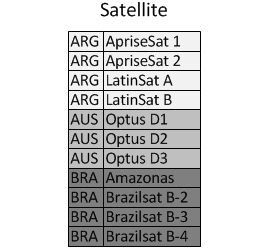

# LooseScan Strategy

LooseScan is an execution strategy for [Semi-join subqueries](../subquery-optimizations/semi-join-subquery-optimizations.md).

## The idea

We will demonstrate the `LooseScan` strategy by example. Suppose, we're looking for countries that have satellites. We can get them using the following query (for the sake of simplicity we ignore satellites that are owned by consortiums of multiple countries):

```sql
SELECT * FROM Country  
WHERE 
  Country.code IN (SELECT country_code FROM Satellite)
```

Suppose, there is an index on `Satellite.country_code`. If we use that index, we will get satellites in the order of their owner country:



The `LooseScan` strategy doesn't really need ordering, what it needs is grouping. In the above figure, satellites are grouped by country. For instance, all satellites owned by Australia come together, without being mixed with satellites of other countries. This makes it easy to select just one satellite from each group, which you can join with its country and get a list of countries without duplicates:


## LooseScan in action

The `EXPLAIN` output for the above query looks as follows:

```sql
MariaDB [world]> EXPLAIN SELECT * FROM Country WHERE Country.code IN 
  (select country_code from Satellite);
+----+-------------+-----------+--------+---------------+--------------+---------+------------------------------+------+-------------------------------------+
| id | select_type | table     | type   | possible_keys | key          | key_len | ref                          | rows | Extra                               |
+----+-------------+-----------+--------+---------------+--------------+---------+------------------------------+------+-------------------------------------+
|  1 | PRIMARY     | Satellite | index  | country_code  | country_code | 9       | NULL                         |  932 | Using where; Using index; LooseScan |
|  1 | PRIMARY     | Country   | eq_ref | PRIMARY       | PRIMARY      | 3       | world.Satellite.country_code |    1 | Using index condition               |
+----+-------------+-----------+--------+---------------+--------------+---------+------------------------------+------+-------------------------------------+
```

## Factsheet

* LooseScan avoids the production of duplicate record combinations by putting the subquery table first and using its index to select one record from multiple duplicates
* Hence, in order for LooseScan to be applicable, the subquery should look like:

```sql
expr IN (SELECT tbl.keypart1 FROM tbl ...)
```

or

```sql
expr IN (SELECT tbl.keypart2 FROM tbl WHERE tbl.keypart1=const AND ...)
```

* LooseScan can handle correlated subqueries
* LooseScan can be switched off by setting the `loosescan=off` flag in the [optimizer\_switch](../../system-variables/server-system-variables.md#optimizer_switch) variable.

<sub>_This page is licensed: CC BY-SA / Gnu FDL_</sub>


