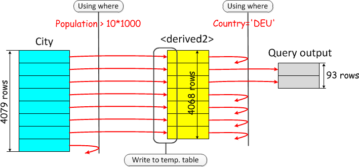

# Derived Table Merge Optimization

## Background

Users of "big" database systems are used to using `FROM` subqueries as a way\
to structure their queries. For example, if one's first thought was to select cities with population greater than 10,000 people, and then that\
from these cities to select those that are located in Germany, one\
could write this SQL:

```sql
SELECT * 
FROM 
  (SELECT * FROM City WHERE Population > 10*1000) AS big_city
WHERE 
  big_city.Country='DEU'
```

For MySQL, using such syntax was taboo. If you run [EXPLAIN](../../../../reference/sql-statements/administrative-sql-statements/analyze-and-explain-statements/explain.md) for\
this query, you can see why:

```sql
mysql> EXPLAIN SELECT * FROM (SELECT * FROM City WHERE Population > 1*1000) 
  AS big_city WHERE big_city.Country='DEU' ;
+----+-------------+------------+------+---------------+------+---------+------+------+-------------+
| id | select_type | table      | type | possible_keys | key  | key_len | ref  | rows | Extra       |
+----+-------------+------------+------+---------------+------+---------+------+------+-------------+
|  1 | PRIMARY     | <derived2> | ALL  | NULL          | NULL | NULL    | NULL | 4068 | Using where |
|  2 | DERIVED     | City       | ALL  | Population    | NULL | NULL    | NULL | 4079 | Using where |
+----+-------------+------------+------+---------------+------+---------+------+------+-------------+
2 rows in set (0.60 sec)
```

It plans to do the following actions:



From left to right:

1. Execute the subquery: `(SELECT * FROM City WHERE Population > 1*1000)`,\
   exactly as it was written in the query.
2. Put result of the subquery into a temporary table.
3. Read back, and apply a `WHERE` condition from the upper\
   select, `big_city.Country='DEU'`

Executing a subquery like this is very inefficient, because the\
highly-selective condition from the parent select, (`Country='DEU'`) is not\
used when scanning the base table `City`. We read too many records from the`City` table, and then we have to write them into a temporary table and read\
them back again, before finally filtering them out.

## Derived table merge in action

If one runs this query in MariaDB/MySQL 5.6, they get this:

```sql
MariaDB [world]> EXPLAIN SELECT * FROM (SELECT * FROM City WHERE Population > 1*1000) 
  AS big_city WHERE big_city.Country='DEU';
+----+-------------+-------+------+--------------------+---------+---------+-------+------+------------------------------------+
| id | select_type | table | type | possible_keys      | key     | key_len | ref   | rows | Extra                              |
+----+-------------+-------+------+--------------------+---------+---------+-------+------+------------------------------------+
|  1 | SIMPLE      | City  | ref  | Population,Country | Country | 3       | const |   90 | Using index condition; Using where |
+----+-------------+-------+------+--------------------+---------+---------+-------+------+------------------------------------+
1 row in set (0.00 sec)
```

From the above, one can see that:

1. The output has only one line. This means that the subquery has been merged\
   into the top-level `SELECT`.
2. Table `City` is accessed through an index on the `Country` column.\
   Apparently, the `Country='DEU'` condition was used to construct `ref`\
   access on the table.
3. The query will read about 90 rows, which is a big improvement over the 4079\
   row reads plus 4068 temporary table reads/writes we had before.

## Factsheet

* Derived tables (subqueries in the `FROM` clause) can be merged into their\
  parent select when they have no grouping, aggregates,\
  or `ORDER BY ... LIMIT` clauses. These requirements are the same as\
  requirements for `VIEW`s to allow `algorithm=merge`.
* The optimization is enabled by default. It can be disabled\
  with:

```sql
set @@optimizer_switch='derived_merge=OFF'
```

* Versions of MySQL and MariaDB which do not have support for this optimization\
  will execute subqueries even when running `EXPLAIN`. This can result in a\
  well-known problem (see e.g. [MySQL Bug #44802](https://bugs.mysql.com/bug.php?id=44802)) of `EXPLAIN` statements taking a\
  very long time. Starting from [MariaDB 5.3](broken-reference)+ and MySQL 5.6+ `EXPLAIN`\
  commands execute instantly, regardless of the `derived_merge` setting.

## See Also

* FAQ entry: [Why is ORDER BY in a FROM subquery ignored?](broken-reference)

CC BY-SA / Gnu FDL
