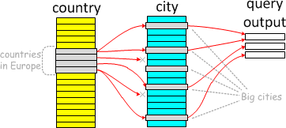
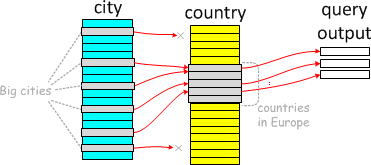
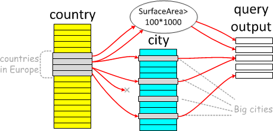

# Semi-join Subquery Optimizations

MariaDB has a set of optimizations specifically targeted at _semi-join subqueries_.

## What is a Semi-Join Subquery

A semi-join subquery has a form of

```
SELECT ... FROM outer_tables WHERE expr IN (SELECT ... FROM inner_tables ...) AND ...
```

that is, the subquery is an IN-subquery and it is located in the WHERE clause. The most important part here is

_with semi-join subquery, we're only interested in records of outer\_tables that have matches in the subquery_

Let's see why this is important. Consider a semi-join subquery:

```
select * from Country 
where 
  Continent='Europe' and 
  Country.Code in (select City.country 
                   from City 
                   where City.Population>1*1000*1000);
```

One can execute it "naturally", by starting from countries in Europe and checking if they have populous Cities:



The semi-join property also allows "backwards" execution: we can start from big cities, and check which countries they are in:



To contrast, let's change the subquery to be non-semi-join:

```
select * from Country 
where 
   Country.Continent='Europe' and 
   (Country.Code in (select City.country 
                   from City where City.Population>1*1000*1000) 
    or Country.SurfaceArea > 100*1000  -- Added this part
   );
```

It is still possible to start from countries, and then check

* if a country has any big cities
* if it has a large surface area:



The opposite, city-to-country way is not possible. This is not a semi-join.

### Difference from Inner Joins

Semi-join operations are similar to regular relational joins. There is a difference though: with semi-joins, you don't care how many matches an inner table has for an outer row. In the above countries-with-big-cities example, Germany will be returned once, even if it has three cities with populations of more than one million each.

## Semi-Join Optimizations in MariaDB

MariaDB uses semi-join optimizations to run IN subqueries.The optimizations are enabled by default. You can disable them by turning off their [optimizer\_switch](../../system-variables/server-system-variables.md#optimizer_switch) like so:

```
SET optimizer_switch='semijoin=off'
```

MariaDB has five different semi-join execution strategies:

* [Table pullout optimization](table-pullout-optimization.md)
* [FirstMatch execution strategy](../optimization-strategies/firstmatch-strategy.md)
* [Semi-join Materialization execution strategy](../optimization-strategies/semi-join-materialization-strategy.md)
* [LooseScan execution strategy](../optimization-strategies/loosescan-strategy.md)
* [DuplicateWeedout execution strategy](../optimization-strategies/duplicateweedout-strategy.md)

## See Also

* [What is MariaDB 5.3](https://app.gitbook.com/s/aEnK0ZXmUbJzqQrTjFyb/community-server/old-releases/release-notes-mariadb-5-3-series/changes-improvements-in-mariadb-5-3)
* [Subquery Optimizations Map](subquery-optimizations-map.md)
* ["Observations about subquery use cases"](https://s.petrunia.net/blog/?p=35) blog post
* [http:en.wikipedia.org/wiki/Semijoin](https://en.wikipedia.org/wiki/Semijoin)

CC BY-SA / Gnu FDL
