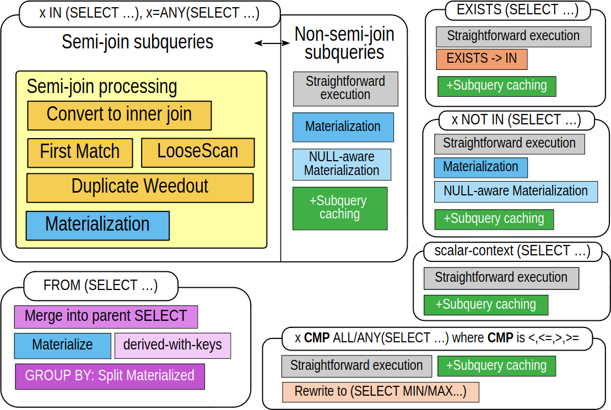

# Subquery Optimizations Map

Below is a map showing all types of subqueries allowed in the SQL language, and\
the optimizer strategies available to handle them.

* Uncolored areas represent different kinds of subqueries, for example:
  * Subqueries that have form `x IN (SELECT ...)`
  * Subqueries that are in the `FROM` clause
  * .. and so forth
* The size of each uncolored area roughly corresponds to how important (i.e.\
  frequently used) that kind of subquery is. For\
  example, `x IN (SELECT ...)` queries are the most important,\
  and `EXISTS (SELECT ...)` are relatively unimportant.
* Colored areas represent optimizations/execution strategies that are applied\
  to handle various kinds of subqueries.
* The color of optimization indicates which version of MySQL/MariaDB it was\
  available in (see legend below)

Some things are not on the map:

* MariaDB doesn't evaluate expensive subqueries when doing optimization\
  (this means, EXPLAIN is always fast). MySQL 5.6 has made a progress in this regard but its optimizer will still evaluate certain kinds of subqueries (for example, scalar-context subqueries used in range predicates)

## Links to pages about individual optimizations:

* [IN->EXISTS](non-semi-join-subquery-optimizations.md#the-in-to-exists-transformation)
* [Subquery Caching](subquery-cache.md)
* [Semi-join optimizations](semi-join-subquery-optimizations.md)
  * [Table pullout](table-pullout-optimization.md)
  * [FirstMatch](../optimization-strategies/firstmatch-strategy.md)
  * [Materialization, +scan, +lookup](../optimization-strategies/semi-join-materialization-strategy.md)
  * [LooseScan](../optimization-strategies/loosescan-strategy.md)
  * [DuplicateWeedout execution strategy](../optimization-strategies/duplicateweedout-strategy.md)
* Non-semi-join [Materialization](non-semi-join-subquery-optimizations.md#materialization-for-non-correlated-in-subqueries) (including NULL-aware and partial matching)
* Derived table optimizations
  * [Derived table merge](../optimizations-for-derived-tables/derived-table-merge-optimization.md)
  * [Derived table with keys](../optimizations-for-derived-tables/derived-table-with-key-optimization.md)

## See also

* [Subquery optimizations in MariaDB 5.3](https://github.com/mariadb-corporation/docs-server/blob/test/server/ha-and-performance/optimization-and-tuning/query-optimizations/subquery-optimizations/broken-reference/README.md)

_This page is licensed: CC BY-SA / Gnu FDL_


