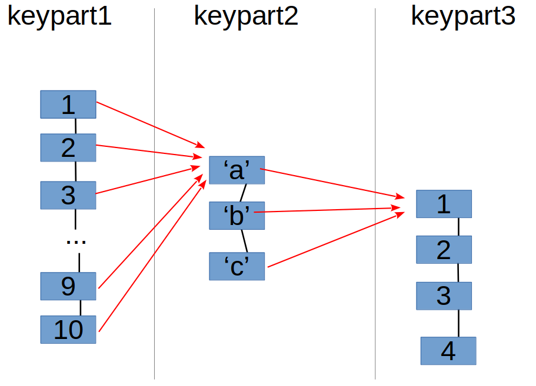

# optimizer_max_sel_arg_weight


## Basics


As mentioned in the [Range Optimizer](range-optimizer.md), ranges on multiple key parts can create a combinatorial amount of ranges.


`optimizer_max_sel_arg_weight` setting is a limit to reduce the number of ranges generated by 
dropping restrictions on higher key parts if the number of ranges becomes too high.


(Note that there is also `optimizer_max_sel_args` which limits the number of intermediary 
SEL_ARG objects that can be created. This is a different limitation)


## Combinatorial number of ranges


Let's reuse the example from the [Range Optimizer](range-optimizer.md) page.


```
create table t2 (
  keypart1 int,
  keypart2 varchar(100),
  keypart3 int,
  index idx(keypart1, keypart2, keypart3)
);
```

```
select * from t2 
where
  keypart1 in (1,2,3,4,5,6,7,8,9,10) and keypart2 in ('a','b', 'c') and keypart3 in (1,2,3,4);
```

Range optimizer will produce 10 * 3 * 4 = 120 ranges.


```
select * from information_schema.optimizer_trace\G
```

```
//...
                    "range_scan_alternatives": [
                      {
                        "index": "idx",
                        "ranges": [
                          "(1,a,1) <= (keypart1,keypart2,keypart3) <= (1,a,1)",
                          "(1,a,2) <= (keypart1,keypart2,keypart3) <= (1,a,2)",
                          "(1,a,3) <= (keypart1,keypart2,keypart3) <= (1,a,3)",
                          "(1,a,4) <= (keypart1,keypart2,keypart3) <= (1,a,4)",
                          "(1,b,1) <= (keypart1,keypart2,keypart3) <= (1,b,1)",
                          //... # 114 lines omitted ...
                           "(3,b,3) <= (keypart1,keypart2,keypart3) <= (3,b,3)",
                          "(3,b,4) <= (keypart1,keypart2,keypart3) <= (3,b,4)",
                         ],
```

This number is fine but if your IN-list are thousands then the number of ranges can in the millions which may cause excessive CPU or memory usage (Note: this however is avoided in some cases when [IN-predicate is converted into subquery](../../../server-usage/replication-cluster-multi-master/optimization-and-tuning/query-optimizations/subquery-optimizations/conversion-of-big-in-predicates-into-subqueries.md). But there are cases when that is not done)


## SEL_ARG graph


Internally, the Range Optimizer builds this kind of graph:





Vertical black lines connect adjacent "intervals" on the same key part.
Red lines connect a key part to a subsequent key part.


To produce ranges, one walks this graph by starting from left most corner.
Walking right "attaches" the ranges on one key part to another to form multi-part ranges. One must mind that
[Not all combinations produce multi-part ranges](range-optimizer.md#not-all-comparisons-produce-ranges), though.


Walking top-to-bottom produces adjacent ranges.


## Weight of SEL_ARG graph


How do we limit the number of ranges? 
We should remove the parts of SEL_ARG graph that describe ranges on big key parts.
That way, we can still build ranges, although we will build fewer ranges that may contain more rows.


Due to the way the graph is constructed, we cannot tell how many ranges it would produce, so 
we introduce a parameter "weight" which is easy to compute and is roughly proportional to the number of 
ranges we estimate to produce.


Here is how the weight is computed:


* The weight of subgraph3 is just the number of nodes, 4.
* The weight of subbraph2 the number of nodes for keypart2 (3), and the weight of subgraph1 multiplied by 3 since there are 3 references to it.
* The weight of subgraph1 is the number of nodes for keypart1 (10) plus the weight of subgraph2 multiplied by 10 since there are 10 references to it.


Here the total weight is 160 which has the same order of magnitude as the number of ranges.


SEL_ARG graphs are constructed for all parts of WHERE clause and are AND/ORed according to the AND/OR structure of the WHERE clause (after normalization). If the optimizer notices that it has produced a SEL_ARG graph that exceeds the maximum weight, the parts of the graph describing higher key parts are removed until the weight is within the limit.


## Example of effect of limiting weight


Continuing with our example:


```
-- This is very low, don't use in production:
set @@optimizer_max_sel_arg_weight=50;
select * from t2 where keypart1 in (1,2,3,4,5,6,7,8,9,10) and keypart2 in ('a','b', 'c') and keypart3 in (1,2,3,4);
select * from information_schema.optimizer_trace\G
```

shows


```
"range_scan_alternatives": [
                      {
                        "index": "idx",
                        "ranges": [
                          "(1,a) <= (keypart1,keypart2) <= (1,a)",
                          "(1,b) <= (keypart1,keypart2) <= (1,b)",
                         // (30 lines in total)
                          "(10,b) <= (keypart1,keypart2) <= (10,b)",
                          "(10,c) <= (keypart1,keypart2) <= (10,c)"
                        ],
```

One can see that now the range list is much smaller, 30 lines instead of 120. This was achieved by discarding the restrictions on `keypart3`.

