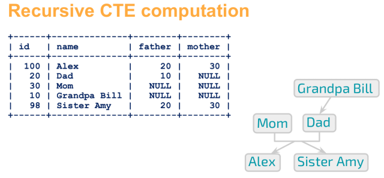
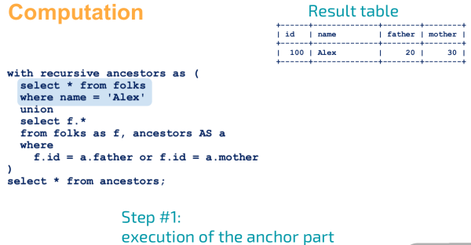
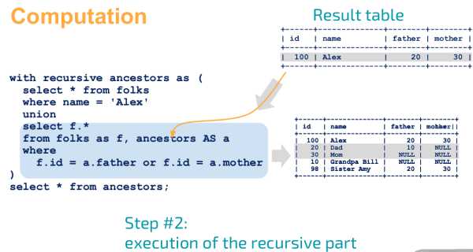
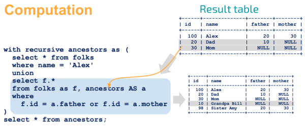
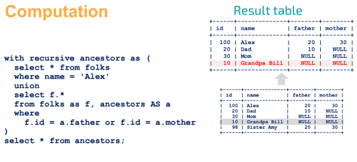
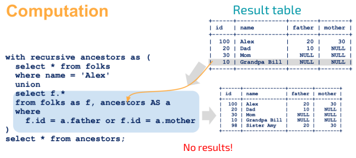

# Recursive Common Table Expressions Overview

Common Table Expressions (CTEs) are a standard SQL feature, and are essentially temporary named result sets. CTEs first appeared in the SQL standard in 1999, and the first implementations began appearing in 2007.


There are two kinds of CTEs:


* [Non-recursive](non-recursive-common-table-expressions-overview.md)
* Recursive, which this article covers.


SQL is generally poor at recursive structures.


CTEs permit a query to reference itself. A recursive CTE will repeatedly execute subsets of the data until it obtains the complete result set. This makes it particularly useful for handing hierarchical or tree-structured data. [max_recursive_iterations](../../../../../../server-usage/replication-cluster-multi-master/optimization-and-tuning/system-variables/server-system-variables.md#max_recursive_iterations) avoids infinite loops.


### Syntax example


[WITH RECURSIVE](../../../../geographic-geometric-features/geometry-relations/within.md) signifies a recursive CTE. It is given a name, followed by a body (the main query) as follows:


### Computation


Given the following structure:



First execute the anchor part of the query:



Next, execute the recursive part of the query:












### Summary so far


```
with recursive R as (
  select anchor_data
  union [all]
  select recursive_part
  from R, ...
)
select ...
```

1. Compute anchor_data
1. Compute recursive_part to get the new data
1. if (new data is non-empty) goto 2;


### CAST to avoid truncating data


As currently implemented by MariaDB and by the SQL Standard, data may be truncated if not correctly cast. It is necessary to [CAST](../../../built-in-functions/string-functions/cast.md) the column to the correct width if the CTE's recursive part produces wider values for a column than the CTE's nonrecursive part. Some other DBMS give an error in this situation, and MariaDB's behavior may change in future - see [MDEV-12325](https://jira.mariadb.org/browse/MDEV-12325). See the [examples below](#cast-to-avoid-data-truncation).


### Examples


#### Transitive closure - determining bus destinations


Sample data:


```
CREATE TABLE bus_routes (origin varchar(50), dst varchar(50));
INSERT INTO bus_routes VALUES 
  ('New York', 'Boston'), 
  ('Boston', 'New York'), 
  ('New York', 'Washington'), 
  ('Washington', 'Boston'), 
  ('Washington', 'Raleigh');
```

Now, we want to return the bus destinations with New York as the origin:


```
WITH RECURSIVE bus_dst as ( 
    SELECT origin as dst FROM bus_routes WHERE origin='New York' 
  UNION
    SELECT bus_routes.dst FROM bus_routes JOIN bus_dst ON bus_dst.dst= bus_routes.origin 
) 
SELECT * FROM bus_dst;
+------------+
| dst        |
+------------+
| New York   |
| Boston     |
| Washington |
| Raleigh    |
+------------+
```

The above example is computed as follows:


First, the anchor data is calculated:


* Starting from New York
* Boston and Washington are added


Next, the recursive part:


* Starting from Boston and then Washington
* Raleigh is added
* UNION excludes nodes that are already present.


#### Computing paths - determining bus routes


This time, we are trying to get bus routes such as “New York -> Washington -> Raleigh”.


Using the same sample data as the previous example:


```
WITH RECURSIVE paths (cur_path, cur_dest) AS (
    SELECT origin, origin FROM bus_routes WHERE origin='New York' 
  UNION
    SELECT CONCAT(paths.cur_path, ',', bus_routes.dst), bus_routes.dst 
     FROM paths
     JOIN bus_routes 
       ON paths.cur_dest = bus_routes.origin AND 
         NOT FIND_IN_SET(bus_routes.dst, paths.cur_path)
) 
SELECT * FROM paths;
+-----------------------------+------------+
| cur_path                    | cur_dest   |
+-----------------------------+------------+
| New York                    | New York   |
| New York,Boston             | Boston     |
| New York,Washington         | Washington |
| New York,Washington,Boston  | Boston     |
| New York,Washington,Raleigh | Raleigh    |
+-----------------------------+------------+
```

#### CAST to avoid data truncation


In the following example, data is truncated because the results are not specifically cast to a wide enough type:


```
WITH RECURSIVE tbl AS (
  SELECT NULL AS col
  UNION
  SELECT "THIS NEVER SHOWS UP" AS col FROM tbl
)
SELECT col FROM tbl
+------+
| col  |
+------+
| NULL |
|      |
+------+
```

Explicitly use [CAST](../../../built-in-functions/string-functions/cast.md) to overcome this:


```
WITH RECURSIVE tbl AS (
  SELECT CAST(NULL AS CHAR(50)) AS col
  UNION SELECT "THIS NEVER SHOWS UP" AS col FROM tbl
)  
SELECT * FROM tbl;
+---------------------+
| col                 |
+---------------------+
| NULL                |
| THIS NEVER SHOWS UP |
+---------------------+
```
