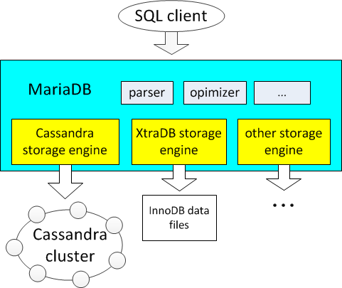

# Cassandra Storage Engine Overview

CassandraSE is no longer actively being developed and has been removed in [MariaDB 10.6](../../../../../release-notes/mariadb-community-server/what-is-mariadb-106.md). See [MDEV-23024](https://jira.mariadb.org/browse/MDEV-23024).


## Installing


##### MariaDB starting with [10.6](../../../../../release-notes/mariadb-community-server/what-is-mariadb-106.md)
Cassandra storage engine is no longer a part of MariaDB.


The Cassandra storage engine is included but is not installed/activated by
default.


If using the
[YUM repositories](https://downloads.mariadb.org/mariadb/repositories/)
on Fedora, Red Hat, or CentOS, first install the Cassandra storage engine
package with:


```
yum install MariaDB-cassandra-engine
```

If using the Debian or Ubuntu repositories, the Cassandra plugin is in the main
MariaDB server package.


To install/activate the storage engine into MariaDB, issue the following
command:


```
install soname 'ha_cassandra.so';
```

You can also activate the storage engine by using the `--plugin-load` command
on server startup.


## Introduction


The Cassandra Storage Engine allows access to data in a Cassandra cluster from
MariaDB. The overall architecture is shown in the picture below and is similar
to that of the NDB cluster storage engine.





You can access the same Cassandra cluster from multiple MariaDB instances,
provided each of them runs the Cassandra Storage Engine:


The primary goal of Cassandra SE (Storage Engine) is data integration between
the SQL and NoSQL worlds. Have you ever needed to:


* grab some of Cassandra's data from your web frontend, or SQL query?
* insert a few records into Cassandra from some part of your app?


Now, this is easily possible. Cassandra SE makes Cassandra's column family
appear as a table in MariaDB that you can insert to, update, and select from.
You can write joins against this table, it is possible to join data that's
stored in MariaDB with data that's stored in Cassandra.


### Versions in MariaDB


| Cassandra SE Version | Introduced | Maturity |
| --- | --- | --- |
| Cassandra SE Version | Introduced | Maturity |
| Cassandra SE 1.8 | [MariaDB 10.0.1](../../../../../release-notes/mariadb-community-server/old-releases/release-notes-mariadb-10-0-series/mariadb-1001-release-notes.md) | Experimental |


### What about CQL?


The Cassandra Query Language (CQL) is the best way to work with Cassandra. It
resembles SQL on first glance, however the resemblance is very shallow. CQL
queries are tightly bound to the way Cassandra accesses its data internally.
For example, you can't have even the smallest join. In fact, adding a mere
`... AND non_indexed_column=1` into a `WHERE` clause is already invalid
CQL.


Our goal is to let one work in SQL instead of having to move between CQL and
SQL all the time.


### Does this make Cassandra an SQL database?


No. Cassandra SE is not suitable for running analytics-type queries that sift
through huge amounts of data in a Cassandra cluster. That task is better
handled by Hadoop-based tools like Apache Pig or Apache Hive. Cassandra SE is
rather a "window" from an SQL environment into NoSQL.


## Data mapping


Let's get specific. In order to access Cassandra's data from MariaDB, one needs
to create a table with `engine=cassandra`. The table will represent a view
of a Column Family in Cassandra and its definition will look like so:


```
set cassandra_default_thrift_host='192.168.0.10' -- Cassandra's address. It can also
                                                 -- be specified as startup parameter
                                                 -- or on per-table basis

create table cassandra_tbl      -- table name can be chosen at will
(
  rowkey  type PRIMARY KEY,     -- represents Column Family's rowkey. Primary key
                                -- must be defined over this column.

  column1 type,                 -- Cassandra's static columns can be mapped to 
  column2 type,                 -- regular SQL columns.

  dynamic_cols blob DYNAMIC_COLUMN_STORAGE=yes -- If you need to access Cassandra's
                                               -- dynamic columns, you can define
                                               -- a blob which will receive all of 
                                               -- them, packed as MariaDB's dynamic
                                               -- columns.
) engine=cassandra
  keyspace= 'cassandra_key_space'        -- Cassandra's keyspace.columnFamily we  
  column_family='column_family_name';    -- are accessing.
```

The name of the table can be arbitrary. However, primary key, column names, and
types must "match" those of Cassandra.


### Cassandra's rowkey


The table must define a column that corresponds to the Column Family's rowkey.


* If Cassandra's `rowkey` has an alias (or name), then MariaDB's column must
 have the same name.

  * Otherwise, it must be named "rowkey".
* The type of MariaDB's column must match the validation_class of Cassandra's
 rowkey (datatype matching is covered in more detail below).


Note: Multi-column primary keys are currently not supported. Support may be
added in a future version, depending on whether there is a demand for it.


### Cassandra's static columns


Cassandra allows one to define a "static column family", where column metadata
is defined in the Column Family header and is obeyed by all records.


These "static" columns can be mapped to regular columns in MariaDB. A static
column named 'foo' in Cassandra should have a counterpart named 'foo' in
MariaDB. The types must also match, they are covered below.


### Cassandra's dynamic columns


Cassandra also allows individual rows to have their own sets of columns. In
other words, each row can have its own unique columns.


These columns can be accessed through MariaDB's
[Dynamic Columns](../../../sql-statements-and-structure/nosql/dynamic-columns-api.md) feature. To do so, one must define a
column:


* with an arbitrary name
* of type `blob`
* with the `DYNAMIC_COLUMN_STORAGE=yes` attribute


Here is an example:


```
dynamic_cols blob DYNAMIC_COLUMN_STORAGE=yes
```

Once define, one can access individual columns with the
[new variant](../../../sql-statements-and-structure/nosql/dynamic-columns-from-mariadb-10.md) of the Dynamic Column functions,
which now support string names (they used to support integers only).


### Super columns


Cassandra's SuperColumns are not supported, there are currently no plans to
support them.


### Datatypes


There is no direct 1-to-1 mapping between Cassandra's datatypes and
MySQL/MariaDB datatypes. Also, Cassandra's size limitations are often more
relaxed than MySQL/MariaDB's. For example, Cassandra's limit on rowkey length
is about 2G, while MySQL limits unique key length to about 1.5Kb.


The types must be mapped as follows:


| Cassandra | MariaDB |
| --- | --- |
| Cassandra | MariaDB |
| blob | BLOB, VARBINARY(n) |
| ascii | BLOB, VARCHAR(n), use charset=latin1 |
| text | BLOB, VARCHAR(n), use charset=utf8 |
| varint | VARBINARY(n) |
| int | INT |
| bigint | BIGINT, TINY, SHORT (pick the one that will fit the real data) |
| uuid | CHAR(36), the UUID will be represented in text form on the MariaDB side |
| timestamp | TIMESTAMP (second precision), TIMESTAMP(6) (microsecond precision), BIGINT (gets verbatim Cassandra's 64-bit milliseconds-since-epoch) |
| boolean | BOOL |
| float | FLOAT |
| double | DOUBLE |
| decimal | VARBINARY(n) |
| counter | BIGINT, only reading is supported |


For types like "`VARBINARY(n)`", `n` should be chosen sufficiently large to
accommodate all the data that is encountered in the table.


## Command mapping


### INSERT


Cassandra doesn't provide any practical way to make INSERT different from
UPDATE. Therefore, INSERT works as INSERT-or-UPDATE, it will overwrite the
data, if necessary.


`INSERT ... SELECT` and multi-line INSERT will try to write data in batches.
Batch size is controlled by the [cassandra_insert_batch_size](cassandra-system-variables.md#cassandra_insert_batch_size) system
variable, which specifies the max. batch size in columns.


The status variables [Cassandra_row_inserts](cassandra-status-variables.md#cassandra_row_inserts) and
[Cassandra_row_insert_batches](cassandra-status-variables.md#cassandra_row_insert_batches) allow one to see whether inserts are actually
batched.


### UPDATE


UPDATE works like one would expect SQL's UPDATE command to work (i.e. changing
a primary key value will result in the old record being deleted and a new
record being inserted)


### DELETE


* `DELETE FROM cassandra_table` maps to the `truncate(column_family)` call.


* The DELETE with WHERE clause will do per-row deletions.


### SELECT


Generally, all SELECT statements work like one expects SQL to work. Conditions
in the form `primary_key=...` allow the server to construct query plans which
access Cassandra's rows with key lookups.


#### Full table scan


Full table scans are performed in a memory-efficient way. Cassandra SE performs
a full table scan as a series of batches, each of which reads not more than
[cassandra_rnd_batch_size](cassandra-system-variables.md#cassandra_rnd_batch_size) records.


#### Batched Key Access support


Cassandra supports Batched Key Access in no-association mode. This means that
it requires the SQL layer to do hashing, which means the following settings are
required:


* optimizer_switch='join_cache_hashed=on'
* join_cache_level=7|8


Cassandra SE is currently unable to make use of space in the join buffer (the
one whose size is controlled by
[#join_buffer_size](../../../../server-usage/replication-cluster-multi-master/optimization-and-tuning/system-variables/server-system-variables.md#join_buffer_size)). Instead, it
will limit read batches to reading not more than
[cassandra_multiget_batch_size](cassandra-system-variables.md#cassandra_multiget_batch_size)
at a time, and memory will be allocated on the heap.


Note that the [#join_buffer_size](../../../../server-usage/replication-cluster-multi-master/optimization-and-tuning/system-variables/server-system-variables.md#join_buffer_size)
buffer is still needed by the SQL layer, so its value should still be increased
if you want to read in big batches.


It is possible to track the number of read batches, how many keys were
looked-up, and how many results were produced with these status variables:


| Variable_name | Value |
| --- | --- |
| Variable_name | Value |
| [Cassandra_multiget_reads](cassandra-status-variables.md#cassandra_multiget_reads) | 0 |
| [Cassandra_multiget_keys_scanned](cassandra-status-variables.md#cassandra_multiget_keys_scanned) | 0 |
| [Cassandra_multiget_rows_read](cassandra-status-variables.md#cassandra_multiget_rows_read) | 0 |


## System and status variables


The following [system variables](cassandra-system-variables.md) are available:


| Variable name | Description |
| --- | --- |
| Variable name | Description |
| [cassandra_default_thrift_host](cassandra-system-variables.md#cassandra_default_thrift_host) | Host to connect to, if not specified on per-table basis |
| [cassandra_failure_retries](cassandra-system-variables.md#cassandra_failure_retries) | Number of times to retry on timeout/unavailable failures |
| [cassandra_insert_batch_size](cassandra-system-variables.md#cassandra_insert_batch_size) | INSERT batch size |
| [cassandra_multiget_batch_size](cassandra-system-variables.md#cassandra_multiget_batch_size) | Batched Key Access batch size |
| [cassandra_rnd_batch_size](cassandra-system-variables.md#cassandra_rnd_batch_size) | Full table scan batch size |
| [cassandra_read_consistency](cassandra-system-variables.md#cassandra_read_consistency) | Consistency to use for reading |
| [cassandra_write_consistency](cassandra-system-variables.md#cassandra_write_consistency) | Consistency to use for writing |


The following [status variables](cassandra-status-variables.md) are available:


| Variable name | Description |
| --- | --- |
| Variable name | Description |
| [Cassandra_row_inserts](cassandra-status-variables.md#cassandra_row_inserts) | Number of rows inserted |
| [Cassandra_row_insert_batches](cassandra-status-variables.md#cassandra_row_insert_batches) | Number of insert batches performed |
| [Cassandra_multiget_reads](cassandra-status-variables.md#cassandra_multiget_reads) | Number of read operations |
| [Cassandra_multiget_keys_scanned](cassandra-status-variables.md#cassandra_multiget_keys_scanned) | Number of keys we've made lookups for |
| [Cassandra_multiget_rows_read](cassandra-status-variables.md#cassandra_multiget_rows_read) | Number of rows actually read |
| [Cassandra_timeout_exceptions](cassandra-status-variables.md#cassandra_timeout_exceptions) | Number of Timeout exceptions we got from Cassandra |
| [Cassandra_unavailable_exceptions](cassandra-status-variables.md#cassandra_unavailable_exceptions) | Number of Unavailable exceptions we got from Cassandra |


## A note about Cassandra 1.2


Cassandra 1.2 has slightly changed its data model, as described at
[thrift-to-cql3](https://www.datastax.com/dev/blog/thrift-to-cql3). This has caused some of
Thrift-based clients to no longer work (for example, here's a problem
experienced by Pig:
[CASSANDRA-5234](https://issues.apache.org/jira/browse/CASSANDRA-5234)).


Currently, Cassandra SE is only able to access Cassandra 1.2's column families
that were defined `WITH COMPACT STORAGE` attribute.


## See also


* Slides from talk at Percona Live 2013:[MariaDB Cassandra Interoperability](https://www.percona.com/live/mysql-conference-2013/sessions/mariadb-cassandra-interoperability)
* [MDEV-431](https://jira.mariadb.org/browse/MDEV-431) - JIRA task for Cassandra SE work
* [Instructions for creating binary tarball in MariaDB 5.5](building-cassandra-storage-engine-for-packaging.md)
* [Cassandra Storage Engine - Future Plans](cassandra-storage-engine-future-plans.md)
* [Cassandra Storage Engine - Use Example](cassandra-storage-engine-use-example.md)
* [Cassandra Storage Engine - Issues](cassandra-storage-engine-issues.md)
* [HBase Storage Engine](../../../../../general-resources/learning-and-training/training-and-tutorials/advanced-mariadb-articles/development-articles/outdated-pages/hbase-storage-engine.md)

