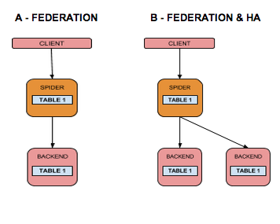
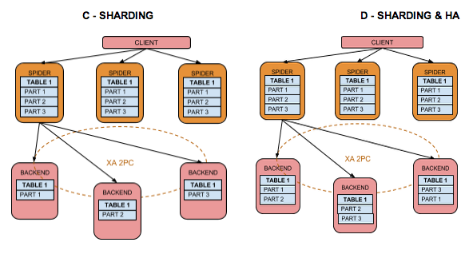
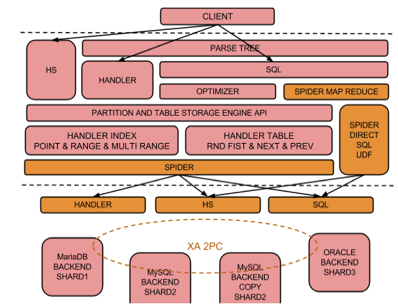
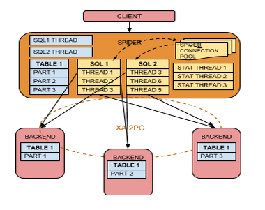

# Spider Storage Engine Core Concepts

A typical Spider deployment has a shared-nothing clustered architecture. The system works with any inexpensive hardware, and with a minimum of specific requirements for hardware or software. It consists of a set of computers, with one or more MariaDB processes known as nodes.

The nodes that store the data will be designed as `Backend Nodes`, and can be any MariaDB, MySQL, Oracle server instances using any storage engine available inside the backend.

The `Spider Proxy Nodes` are instances running at least MariaDB 10. `Spider Proxy Nodes` are used to declare per table attachment to the backend nodes. In addition `Spider Proxy Nodes` can be setup to enable the tables to be split and mirrored to multiple `Backend Nodes`.

### Spider Common Usage

 

In the default high availability setup #Spider Nodes

## produce SQL errors when a backend server is not responding. Per table monitoring can be setup to enable availability in case of unresponsive backends `monotoring_bg_kind=1` or `monotoring_bg_kind=2`. The Monitoring Spider Nodes will be inter-connected with usage of the system table `mysql.link_mon_servers` to manage network partitioning. Better known as split brain, an even number of `Spider Monitor Nodes` should be setup to allow a consensus based on the majority. Rather a single separated shared `Monitoring Node` instance or a minimum set of 3 `Spider Nodes`. More information can be found [here](https://fr.slideshare.net/Kentoku/spider-ha-20100922dtt7).

**MariaDB starting with** [**10.7.5**](https://app.gitbook.com/s/aEnK0ZXmUbJzqQrTjFyb/mariadb-community-server-release-notes/old-releases/release-notes-mariadb-10-7-series/mariadb-1075-release-notes)

Spider's high availability feature has been deprecated ([MDEV-28479](https://jira.mariadb.org/browse/MDEV-28479)), and will be deleted. Please use other high availability solutions like [replication](broken-reference) or [galera-cluster](../../../../kb/en/galera-cluster/).

### Spider Storage Engine Federation

Spider is a pluggable Storage Engine, acting as a proxy between the optimizer and the remote backends. When the optimizer requests multiple calls to the storage engine, Spider enforces consistency using the 2 phase commit protocol to the backends and by creating transactions on the backends to preserve atomic operations for a single SQL execution.\
Preserving atomic operation during execution is used at multiple levels in the architecture. For the regular optimizer plan, it refers to `multiple split reads` and for concurrent partition scans, it will refer to `semi transactions`.

Costly queries can be more efficient when it is possible to fully push down part of the execution plan on each backend and reduce the result afterwards. Spider enables such execution with some direct execution shortcuts.

### Spider Threading Model

Spider uses the per partitions and per table model to concurrently access the remote backend nodes. For memory workload that property can be used to define multiple partitions on a single remote backend node to better adapt the concurrency to available CPUs in the hardware.

Spider maintains an internal dictionary of Table and Index statistics based on separated threads. The statistics are pulled per default on a time line basis and refer to `crd` for cardinality and `sts` for table status.

### Spider Memory Model

Spider stores resultsets into memory, but [spider\_quick\_mode](spider-system-variables.md)=3 stores resultsets into internal temporary tables if the resultsets are larger than quick\_table\_size.

CC BY-SA / Gnu FDL
