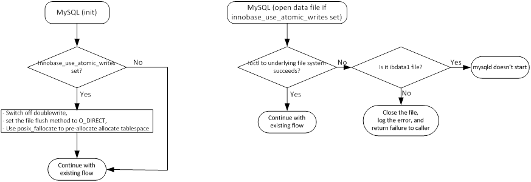

# Atomic Write Support


## Partial Write Operations


When Innodb writes to the filesystem, there is generally no guarantee that a given write operation will be complete (not partial) in cases of a poweroff event, or if the operating system crashes at the exact moment a write is being done.


Without detection or prevention of partial writes, the integrity of the database can be compromised after recovery.


## innodb_doublewrite - an Imperfect Solution


Since its inception, Innodb has had a mechanism to detect and ignore partial writes via the [InnoDB Doublewrite Buffer](../../../reference/storage-engines/innodb/innodb-doublewrite-buffer.md) (also innodb_checksum can be used to detect a partial write).


Doublewrites, controlled by the [innodb_doublewrite](../../../reference/storage-engines/innodb/innodb-system-variables.md) system variable, comes with its own set of problems. Especially on SSD, writing each page twice can have detrimental effects (write leveling).


## Atomic Write - a Faster Alternative to innodb_doublewrite


A better solution is to directly ask the filesystem to provide an atomic (all or nothing) write guarantee. Currently this is only available on [a few SSD cards](atomic-write-support.md#devices-that-support-atomic-writes-with-mariadb).


## Enabling Atomic Writes from [MariaDB 10.2](https://app.gitbook.com/s/aEnK0ZXmUbJzqQrTjFyb/mariadb-community-server-release-notes/old-releases/release-notes-mariadb-10-2-series/what-is-mariadb-102)


When starting, [MariaDB 10.2](https://app.gitbook.com/s/aEnK0ZXmUbJzqQrTjFyb/mariadb-community-server-release-notes/old-releases/release-notes-mariadb-10-2-series/what-is-mariadb-102) and beyond automatically detects if any of the supported SSD cards are used.


When opening an InnoDB table, there is a check if the tablespace for the table is [on a device that supports atomic writes](atomic-write-support.md#devices-that-support-atomic-writes-with-mariadb) and if yes, it will automatically enable atomic writes for the table. If atomic writes support is not detected, the doublewrite buffer will be used.


One can disable atomic write support for all cards by setting the variable
[innodb-use-atomic-writes](../../../reference/storage-engines/innodb/innodb-system-variables.md) to `OFF` in your my.cnf file. It's `ON` by default.


## Enabling Atomic Writes in [MariaDB 5.5](https://app.gitbook.com/s/aEnK0ZXmUbJzqQrTjFyb/mariadb-community-server-release-notes/old-releases/release-notes-mariadb-5-5-series/changes-improvements-in-mariadb-5-5) to [MariaDB 10.1](https://app.gitbook.com/s/aEnK0ZXmUbJzqQrTjFyb/mariadb-community-server-release-notes/old-releases/release-notes-mariadb-10-1-series/changes-improvements-in-mariadb-10-1)


To use atomic writes instead of the doublewrite buffer, add:


```
innodb_use_atomic_writes = 1
```

to the my.cnf config file.


Note that atomic writes are only supported on [Fusion-io devices that use the NVMFS file system](fusion-io/fusion-io-introduction.md#atomic-writes) in these versions of MariaDB.


### About innodb_use_atomic_writes (in [MariaDB 5.5](https://app.gitbook.com/s/aEnK0ZXmUbJzqQrTjFyb/mariadb-community-server-release-notes/old-releases/release-notes-mariadb-5-5-series/changes-improvements-in-mariadb-5-5) to [MariaDB 10.1](https://app.gitbook.com/s/aEnK0ZXmUbJzqQrTjFyb/mariadb-community-server-release-notes/old-releases/release-notes-mariadb-10-1-series/changes-improvements-in-mariadb-10-1))


The following happens when atomic writes are enabled


* if [innodb_flush_method](../../../reference/storage-engines/innodb/innodb-system-variables.md) is neither `O_DIRECT`, `ALL_O_DIRECT`, or `O_DIRECT_NO_FSYNC`, it is switched to `O_DIRECT`


* [innodb_use_fallocate](../../../reference/storage-engines/innodb/innodb-system-variables.md) is switched `ON` (files are extended using `posix_fallocate` rather than writing zeros behind the end of file)


* Whenever an Innodb datafile is opened, a special `ioctl()` is issued to switch on atomic writes. If the call fails, an error is logged and returned to the caller. This means that if the system tablespace is not located on an atomic write capable device or filesystem, InnoDB/XtraDB will refuse to start.


* if [innodb_doublewrite](../../../reference/storage-engines/innodb/innodb-system-variables.md) is set to `ON`, `innodb_doublewrite` will be switched `OFF` and a message written to the error log.


Here is a flowchart showing how atomic writes work inside InnoDB:





## Devices that Support Atomic Writes with MariaDB


MariaDB currently supports atomic writes on the following devices:


* [Fusion-io devices with the NVMFS file system](fusion-io/fusion-io-introduction.md#atomic-writes) . [MariaDB 5.5](https://app.gitbook.com/s/aEnK0ZXmUbJzqQrTjFyb/mariadb-community-server-release-notes/old-releases/release-notes-mariadb-5-5-series/changes-improvements-in-mariadb-5-5) and above.
* [Shannon SSD](https://www.shannon-sys.com). [MariaDB 10.2](https://app.gitbook.com/s/aEnK0ZXmUbJzqQrTjFyb/mariadb-community-server-release-notes/old-releases/release-notes-mariadb-10-2-series/what-is-mariadb-102) and above.


CC BY-SA / Gnu FDL

