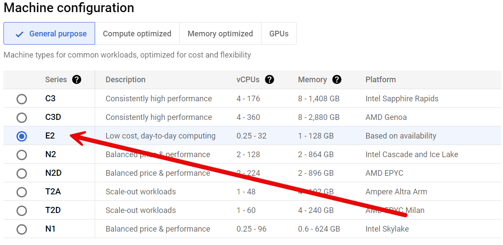
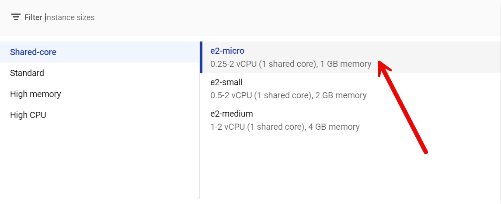
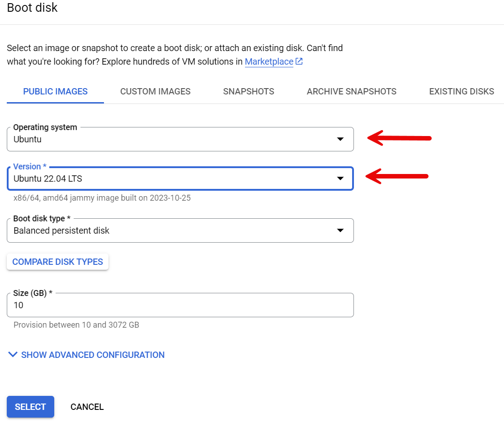
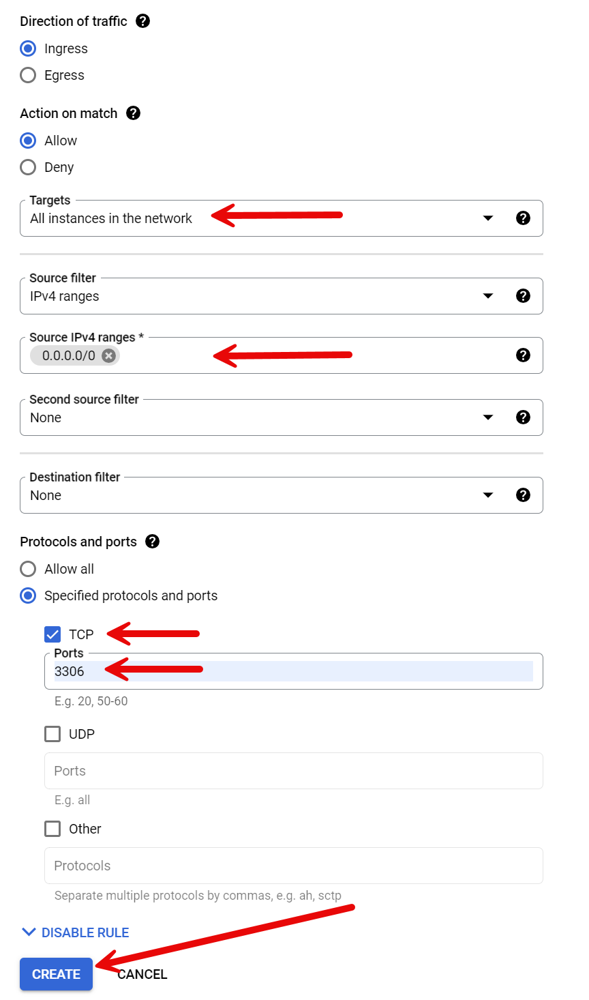

# Docker and Google Cloud

This process shows how to deploy MariaDB in a Docker container running on an GCE instance. First we'll create the GCE VM, then we'll deploy Docker to it. After that, we'll pull the MariaDB Docker image which we'll use to create a running container with a MariaDB instance. Finally, we'll load a sample database into the MariaDB instance.

**Create a VM in Google Cloud Compute Engine**

1. Install [MariaDB client](../../../../../../clients-and-utilities/mariadb-client/) on your local machine, either bundled with Maria DB server or standalone.
2. Login to Google Cloud, navigate to [VM instances](https://console.cloud.google.com/compute/instances/)
3. Enable Compute Engine API if you haven’t already.
4. Click create instance, give instance a name (e.g. mrdb-ubuntu-docker-use1b), choose a region and zone.
5. Machine configuration: Choose general-purpose / E2 micro

 

6. Boot Disk > Change

Switch the operating system to a modern Ubuntu release x86/64 CPU architecture, or similar free tier offering.

7. [Create a firewall rule](https://console.cloud.google.com/net-security/firewall-manager/firewall-policies/add) in the Firewall Policies section of the console. After naming it, change the targets, add 0.0.0.0/0 as a source IP range, and open TCP port 3306. Then Click create.
8. Connect using Google Cloud’s built in browser SSH. Accept all prompts for authorization.

**Install Docker on the GCE VM**

For more detailed instructions, refer to [Installing and Using MariaDB via Docker](installing-and-using-mariadb-via-docker.md)

9. Escalate to root Escalate to root

$ sudo su

10. Install Docker

$ curl -fsSL [get.docker.com](https://get.docker.com) | sudo sh

11. Pull Docker image

$ docker pull mariadb:lts

12. Start MDRB docker process

at your terminal / command line, type:

$ docker run --detach --name mariadb-docker -v \Users\YouUID\Documents\YourDirName:/var/lib/mysql:Z -p 3306:3306 -e MARIADB\_ROOT\_PASSWORD=yoursecurepassword mariadb:lts

The -v flag mounts a directory that you choose as /var/lib/mysql will ensure that the volume is persistent. Windows file paths like C:\Users\YouUID\Documents\YourDirName should be represented as above. Linux file paths should also be absolute vs. relative. Obviously replace the root password with something that is a bit more secure than you see in this example for anything other than development purposes.

13. Shell into container\
    $ docker exec -it mariadb-docker bash
14. Login to MRDB inside container

Using the root password specified in step 12, type:

$ mariadb -pyoursecurepassword

15. Setup admin account with permission for remote connection, configure access control\
    Execute these SQL commands in sequence:

MariaDB \[(none)]> CREATE USER 'admin'@'%' IDENTIFIED BY 'admin';

MariaDB \[(none)]> GRANT ALL ON _._ to 'admin'@'%' WITH GRANT OPTION;

MariaDB \[(none)]> SHOW GRANTS FOR admin;

Obviously replace these passwords with something that is a bit more secure than you see in this example for anything other than development purposes.

16. Setup service account for your app with permission for remote connection, configure access control\
    Execute these SQL commands in sequence:

MariaDB \[(none)]> CREATE USER 'yourappname'@'%' IDENTIFIED BY 'yoursecurepassword';

MariaDB \[(none)]> GRANT INSERT, UPDATE, DELETE ON _._ to 'yourappname'@'%';

MariaDB \[(none)]> SHOW GRANTS FOR yourappname;

Obviously replace these passwords with something that is a bit more secure than you see in this example for anything other than development purposes.

17. Load up your database from your preexisting SQL script that contains [CREATE DATABASE](../../../../../../reference/sql-statements/data-definition/create/create-database.md); [USE DATABASE](../../../../../../reference/sql-statements/administrative-sql-statements/use-database.md); and [CREATE TABLE](../../../../../../reference/sql-statements/data-definition/create/create-table.md) statements.

Copy the external IP address of your VM instance from the Console in the [VM instances](https://console.cloud.google.com/compute/instances/) list.

In a new local terminal window, not your SSH session, change directory to the directory containing your database creation script, say, init.sql in this example.

Type:\
$ mariadb --host=ww.xx.yyy.zzz --port=3306 --user=admin --password=admin -e “SOURCE init.sql”\
(switch ww.xx.yyy.zzz for your IP address from step 17.

CC BY-SA / Gnu FDL
