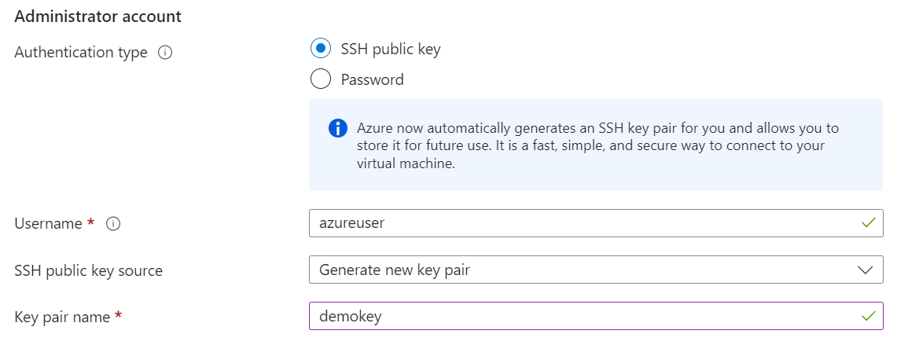
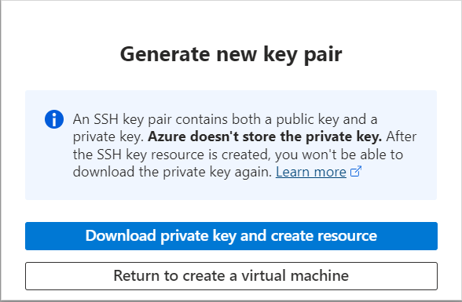
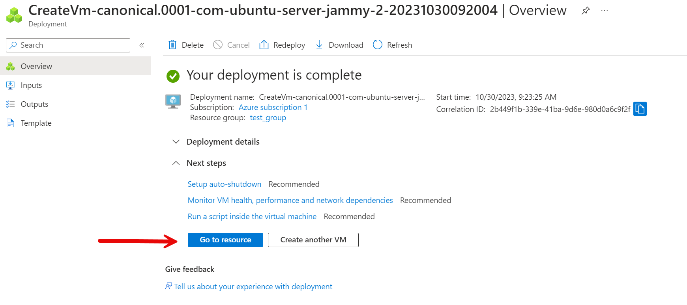

# Docker and Microsoft Azure

This process shows how to deploy MariaDB in a Docker container running on an Azure VM instance. First we'll create the Azure VM, then we'll deploy Docker to it. After that, we'll pull the MariaDB Docker image which we'll use to create a running container with a MariaDB instance. Finally, we'll load a sample database into the MariaDB instance.

**Create a VM in Azure**

1. Install [MariaDB client](../../../../../../clients-and-utilities/mariadb-client/) on your local machine, either bundled with Maria DB server or standalone.
2. Login to Azure, navigate to [Azure Virtual Machine](https://portal.azure.com/#view/HubsExtension/BrowseResource/resourceType/Microsoft.Compute%2FVirtualMachines)
3. [Create VM](https://portal.azure.com/#create/Microsoft.VirtualMachine-ARM). Give the VM a name (e.g. mrdb-ubuntu-docker-use1), and create new or use an existing resource group. Selection region and availability zone, and choose Ubuntu 22.04 LTS x64 (free services eligible).

4. Choose the VM instance size, like a B1s or similar free tier. Note that Azure free works on a credit based system for new accounts

5. Configure an administrator account and generate a new key pair, and give the key pair a name.

6. Click "Review + Create" at the very bottom of the "create virtual machine" page to create the VM.
7. Download the SSH keys and them in a safe place, you will need them later. For this example, let's name the key file mrdb-docker-pk.pem.

If your local machine is Linux or you are using WSL on Windows, open a terminal window and:\
$ mv /mnt/c/ /.ssh/\
$ chmod 400 /.ssh/

8. Once the VM is deployed, "click to resource" to get back to the virtual machine's overview page.
9. From the overview page, the left-hand navigation, choose settings > networking.
10. Click "add inbound port rule"
11. Configure the port rule to allow port TCP 3306 inbound (mySQL) so that you can make external connections from your local Maria DB command line client, to the dockerized Maria DB instance in your Azure Linux VM.
12. Navigate back to the virtual machine's overview page. Then copy the public IP address to the clipboard.

**Install Docker on the Azure VM**

For more detailed instructions, refer to [Installing and Using MariaDB via Docker](installing-and-using-mariadb-via-docker.md)

16. Open terminal window, referencing the path to the private key (\*.pem or \*.ppk) file, and start a SSH remote shell session by typing:

$ ssh -i /.ssh/mrdb-docker-pk.pem azureuser@ww.xx.yyy.zzz

(switch ww.xx.yyy.zzz for your IP address from step 12, and replace "mrdb-docker-pk.pem" with your keyfile name if you chose something different).

If you forget your administrator account details, simply go to the left-hand navigation and choose settings > connect, and Azure will display the public IP address, admin username, and port for you.

17. Are you sure you want to continue connecting (yes/no/\[fingerprint])?\
    Say yes
18. Escalate to root

$ sudo su

19. Microsoft Azure on two machines come with docker preinstalled. For any reason you need to reinstall it , chose another machine type is not have docker preinstalled, you can install docker inside your SSH session with cURL by typing:

$ curl -fsSL [get.docker.com](https://get.docker.com) | sudo sh

**Pull the MariaDB Docker image and create the container**

20. Pull MariaDB Docker image

$ docker pull mariadb:lts

21. Start MDRB docker process

at your terminal / command line, type:

$ docker run --detach --name mariadb-docker -v \Users\YouUID\Documents\YourDirName:/var/lib/mysql:Z -p 3306:3306 -e MARIADB\_ROOT\_PASSWORD=yoursecurepassword mariadb:lts

The -v flag mounts a directory that you choose as /var/lib/mysql will ensure that the volume is persistent.\
Windows file paths like C:\Users\YouUID\Documents\YourDirName should be represented as above.\
Linux file paths should also be absolute vs. relative. Obviously replace the root password with something that is a bit more secure than you see in this example for anything other than development purposes.

22. Shell into container

$ docker exec -it mariadb-docker bash

23. Login to MRDB inside container

Using the root password specified in step 20, type:

$ mariadb -pyoursecurepassword

24. Setup admin account with permission for remote connection, configure access control

MariaDB \[(none)]> CREATE USER 'admin'@'%' IDENTIFIED BY 'admin';

MariaDB \[(none)]> GRANT ALL ON _._ to 'admin'@'%' WITH GRANT OPTION;

MariaDB \[(none)]> SHOW GRANTS FOR admin;

Obviously replace these passwords with something that is a bit more secure than you see in this example for anything other than development purposes.

25. Setup service account for your app with permission for remote connection, configure access control

MariaDB \[(none)]> CREATE USER 'yourappname'@'%' IDENTIFIED BY 'yoursecurepassword';

MariaDB \[(none)]> GRANT INSERT, UPDATE, DELETE ON _._ to 'yourappname'@'%';

MariaDB \[(none)]> SHOW GRANTS FOR yourappname;

Obviously replace these passwords with something that is a bit more secure than you see in this example for anything other than development purposes.

26. Load up your database from your preexisting SQL script that contains [CREATE DATABASE](../../../../../../reference/sql-statements/data-definition/create/create-database.md); [USE DATABASE](../../../../../../reference/sql-statements/administrative-sql-statements/use-database.md); and [CREATE TABLE](../../../../../../reference/sql-statements/data-definition/create/create-table.md) statements.

In a new local terminal window, not your SSH session, change directory to the directory containing your database creation script, say, init.sql in this example. Then type:

$ mariadb --host=ww.xx.yyy.zzz --port=3306 --user=admin --password=admin -e “SOURCE init.sql”

(switch ww.xx.yyy.zzz for your IP address from step 12).

CC BY-SA / Gnu FDL


