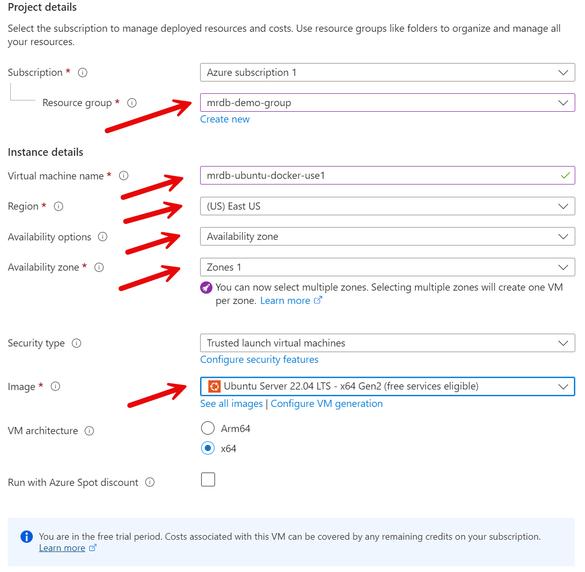
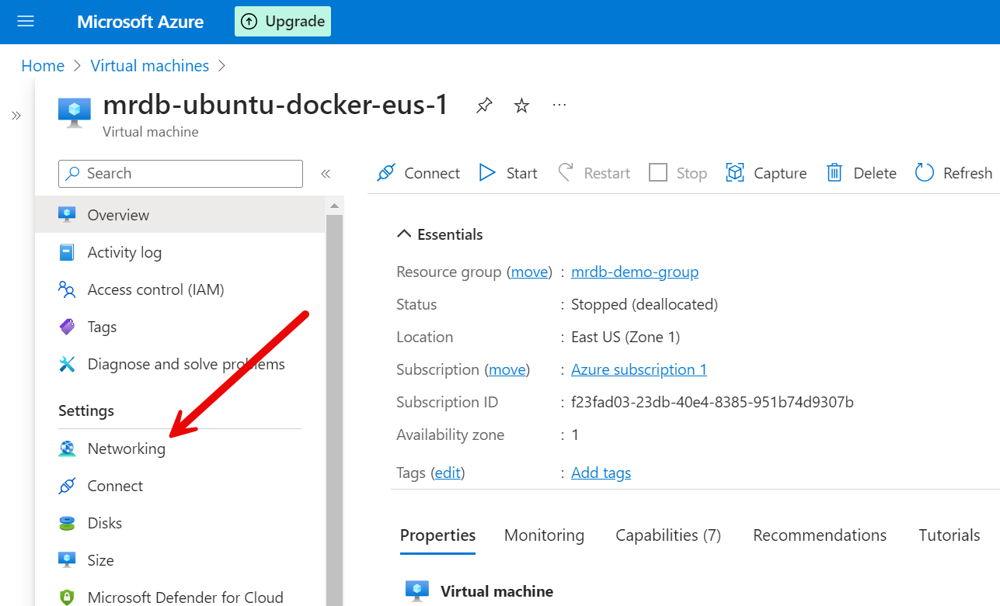

# Docker and Microsoft Azure

This process shows how to deploy MariaDB in a Docker container running on an Azure VM instance. First we'll create the Azure VM, then we'll deploy Docker to it. After that, we'll pull the MariaDB Docker image which we'll use to create a running container with a MariaDB instance. Finally, we'll load a sample database into the MariaDB instance.

**Create a VM in Azure**

1. Install [MariaDB client](../../../../../../clients-and-utilities/mariadb-client/) on your local machine, either bundled with Maria DB server or standalone.
2. Login to Azure, navigate to [Azure Virtual Machine](https://portal.azure.com/#view/HubsExtension/BrowseResource/resourceType/Microsoft.Compute%2FVirtualMachines)
3. [Create VM](https://portal.azure.com/#create/Microsoft.VirtualMachine-ARM). Give the VM a name (e.g. mrdb-ubuntu-docker-use1), and create new or use an existing resource group. Selection region and availability zone, and choose Ubuntu 22.04 LTS x64 (free services eligible).



4. Choose the VM instance size, like a B1s or similar free tier. Note that Azure free works on a credit based system for new accounts


5. Configure an administrator account and generate a new key pair, and give the key pair a name.


6.  Click "Review + Create" at the very bottom of the "create virtual machine" page to create the VM.

    <figure><figcaption></figcaption></figure>
7. Download the SSH keys and them in a safe place, you will need them later. For this example, let's name the key file `mrdb-docker-pk.pem`.

If your local machine is Linux or you are using WSL on Windows, open a terminal window and:

```bash
mv /mnt/c/ ~/.ssh/
chmod 400 ~/.ssh/
```

<figure><figcaption></figcaption></figure>

8.  Once the VM is deployed, "click to resource" to get back to the virtual machine's overview page.

    <figure><figcaption></figcaption></figure>
9. From the overview page, the left-hand navigation, choose settings > networking.
10. Click "add inbound port rule"

    <figure><figcaption></figcaption></figure>
11. Configure the port rule to allow port TCP 3306 inbound (mySQL) so that you can make external connections from your local Maria DB command line client, to the dockerized Maria DB instance in your Azure Linux VM.

    <figure><figcaption></figcaption></figure>
12. Navigate back to the virtual machine's overview page. Then copy the public IP address to the clipboard.

    <figure><figcaption></figcaption></figure>

**Install Docker on the Azure VM**

For more detailed instructions, refer to [Installing and Using MariaDB via Docker](installing-and-using-mariadb-via-docker.md)

16. To connect to your remote server using SSH, open a terminal window and use the following command, replacing placeholders with your specific details:

    ```bash
    ssh -i ~/.ssh/your-keyfile.pem azureuser@your.ip.address
    ```

    * Replace `your-keyfile.pem` with your private key file name.
    * Replace `your.ip.address` with your actual IP address from step 12.

    If you forget your admin details, go to Azure's left-hand navigation, select **Settings** > **Connect**. It will show the public IP address, admin username, and port.
17. Are you sure you want to continue connecting (yes/no/\[fingerprint])?\
    Say yes
18. To switch to the root user, use the following command:

    ```bash
    sudo su
    ```
19.

    Microsoft Azure offers two machine types with pre-installed Docker. If you need to reinstall Docker or choose a machine type without Docker pre-installed, you can install it manually. Connect to your machine via SSH and use the following command:

    ```bash
    curl -fsSL get.docker.com | sudo sh
    ```

**Pull the MariaDB Docker image and create the container**

20. To download the latest MariaDB Docker image, run the following command:

    ```
    docker pull mariadb:lts
    ```
21. To start the MariaDB Docker process, open your terminal or command line and enter the following command:

    ```
    docker run --detach --name mariadb-docker -v C:\Users\YourUID\Documents\YourDirName:/var/lib/mysql:Z -p 3306:3306 -e MARIADB_ROOT_PASSWORD=yoursecurepassword mariadb:lts
    ```

    * Use the `-v` flag to mount a directory for persistent storage under `/var/lib/mysql`.
    * Windows paths like `C:\Users\YourUID\Documents\YourDirName` should be specified as shown above.
    * Ensure paths are absolute, not relative.
    * Replace `yoursecurepassword` with a strong password, especially for environments beyond development.
22. &#x20;To access the MariaDB container's shell, use the following command:

    ```bash
    docker exec -it mariadb-docker bash
    ```
23. To login to MRDB inside the container, use the root password from step 20:

    ```bash
    mariadb -p'yoursecurepassword'
    ```
24. Setup admin account with permission for remote connection, configure access control

```sql
MariaDB [(none)]> CREATE USER 'admin'@'%' IDENTIFIED BY 'admin';
MariaDB [(none)]> GRANT ALL ON *.* to 'admin'@'%' WITH GRANT OPTION;
MariaDB [(none)]> SHOW GRANTS FOR admin;
```

Obviously replace these passwords with something that is a bit more secure than you see in this example for anything other than development purposes.

25. Setup service account for your app with permission for remote connection, configure access control

```sql
MariaDB [(none)]> CREATE USER 'yourappname'@'%' IDENTIFIED BY 'yoursecurepassword';
MariaDB [(none)]> GRANT INSERT, UPDATE, DELETE ON _._ to 'yourappname'@'%';
MariaDB [(none)]> SHOW GRANTS FOR yourappname;
```

Obviously replace these passwords with something that is a bit more secure than you see in this example for anything other than development purposes.

26. Load up your database from your preexisting SQL script that contains [CREATE DATABASE](../../../../../../reference/sql-statements/data-definition/create/create-database.md); [USE DATABASE](../../../../../../reference/sql-statements/administrative-sql-statements/use-database.md); and [CREATE TABLE](../../../../../../reference/sql-statements/data-definition/create/create-table.md) statements.

Open a new local terminal window and navigate to the directory containing your `init.sql` script. Then, run the command: `mariadb --host=ww.xx.yyy.zzz --port=3306 --user=admin --password=admin -e "SOURCE init.sql"`, replacing `ww.xx.yyy.zzz` with your server's IP address.

<sub>_This page is licensed: CC BY-SA / Gnu FDL_</sub>


