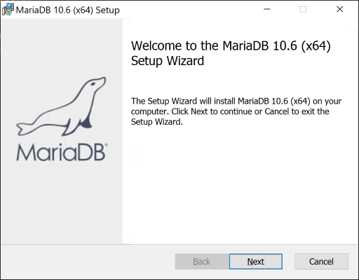
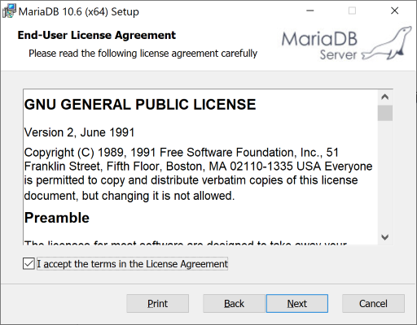
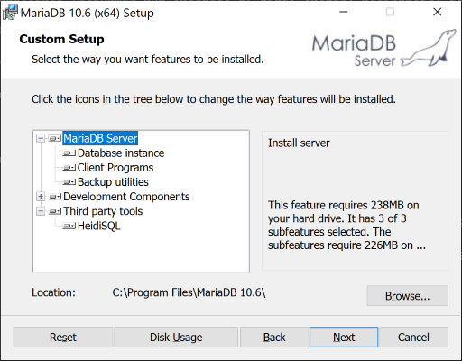
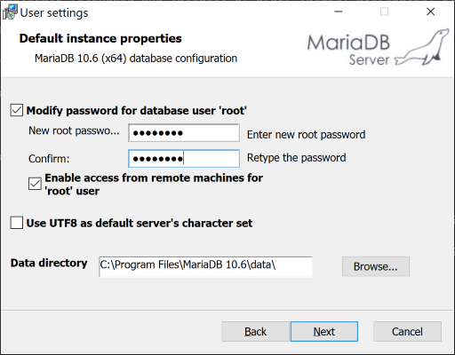
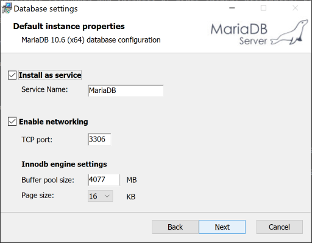
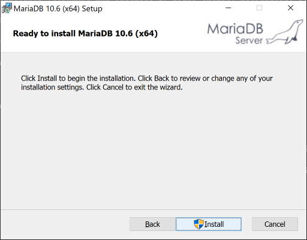
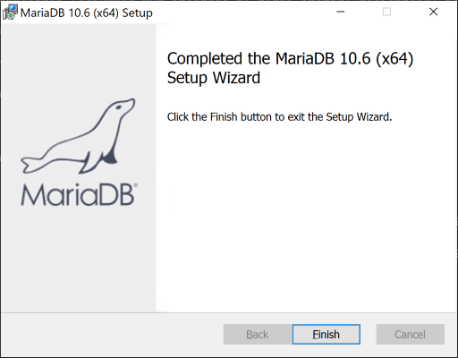
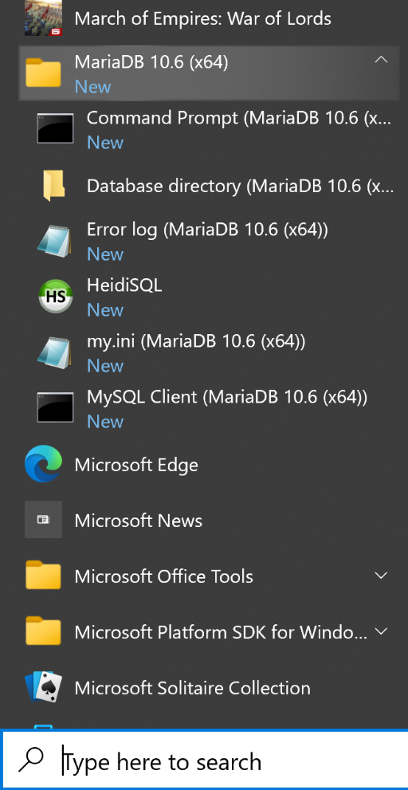
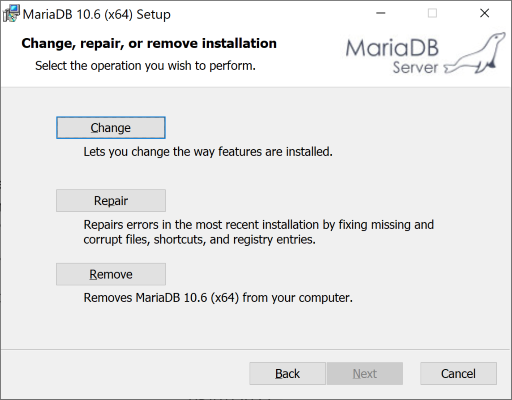
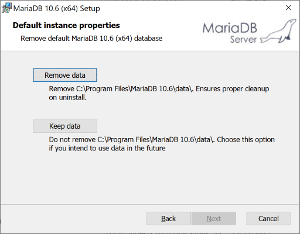

# Installing MariaDB MSI Packages on Windows

MSI packages is available for x64 (64 bit) processor architectures and, in some older releases only, for x86 (32 bit). We'll use screenshots from an x64 installation below (the 32 bit installer is very similar).

## Installation UI

This is the typical mode of installation. To start the installer, just click on\
the mariadb-...msi

### Welcome



### License Agreement



Click on "I accept the terms"

### Custom Setup



Here, you can choose what features to install. By default, all features are\
installed with the exception of the debug symbols. If the "Database instance"\
feature is selected, the installer will create a database instance, by default\
running as a service. In this case the installer will present additional\
dialogs to control various database properties. Note that you do not\
necessarily have to create an instance at this stage. For example, if you\
already have MySQL or MariaDB databases running as services, you can just\
upgrade them during the installation. Also, you can create additional database\
instances after the installation, with the `[mysql_install_db.exe](../mariadb-install-db-exe.md)` utility.

**NOTE**: By default, if you install a database instance, the data directory\
will be in the "data" folder under the installation root. To change the data\
directory location, select "Database instance" in the feature tree, and use the\
"Browse" button to point to another place.

### Database Authentication/Security Related Properties



This dialog is shown if you selected the "Database instance" feature. Here, you\
can set the password for the "root" database user and specify whether root can\
access database from remote machines. The "Create anonymous account" setting\
allows for anonymous (non-authenticated) users. It is off by default and it is\
not recommended to change this setting.

### Other Database Properties



* Install as service
* Defines whether the database should be run as a service. If it should be run as a service, then it also defines the service name. It is recommended to run your database instance as a service as it greatly\
  simplifies database management. In [MariaDB 10.4](https://github.com/mariadb-corporation/docs-server/blob/test/server/server-management/install-and-upgrade-mariadb/installing-mariadb/binary-packages/broken-reference/README.md) and later, the default service name used by the MSI installer is "MariaDB". In 10.3 and before, the default service name used by the MSI installer is "MySQL". Note that the default service name for the `[--install](../starting-and-stopping-mariadb/mariadbd-options.md)` and `[--install-manual](../starting-and-stopping-mariadb/mariadbd-options.md)` options for `mysqld.exe` is "MySQL" in all versions of MariaDB.
* Enable Networking
* Whether to enable TCP/IP (recommended) and which port MariaDB should\
  listen to. If security is a concern, you can change the [bind-address](../../../../ha-and-performance/optimization-and-tuning/system-variables/server-system-variables.md#bind_address)\
  parameter post-installation to bind to only local addresses. If the "Enable\
  networking" checkbox is deselected, the database will use named pipes for\
  communication.
* InnoDB engine settings
* Defines the [InnoDB buffer pool](../../../../server-usage/storage-engines/innodb/innodb-buffer-pool.md) size, and the InnoDB [page size](../../../../server-usage/storage-engines/innodb/innodb-system-variables.md#innodb_page_size). The default buffer pool size is 12.5% of RAM, and depending on your requirements you can give InnoDB more (up to 70-80% RAM). 32 bit versions of MariaDB have restrictions on maximum buffer pool size, which is approximately 1GB, due to virtual address space limitations for 32bit processes. A 16k page size is suitable for most situations. See the [innodb\_page\_size](../../../../server-usage/storage-engines/innodb/innodb-system-variables.md#innodb_page_size) system variable for details on other settings.

### Ready to Install



At this point, all installation settings are collected. Click on the "Install"\
button.

### End



Installation is finished now. If you have upgradable instances of\
MariaDB/MySQL, running as services, this dialog will present a "Do you want to\
upgrade existing instances" checkbox (if selected, it launches the Upgrade\
Wizard post-installation).

If you installed a database instance as service, the service will be running\
already.

## New Entries in Start Menu

Installation will add some entries in the Start Menu:



* MariaDB Client - Starts command line client mysql.exe
* Command Prompt - Starts a command prompt. Environment is set such that "bin"\
  directory of the installation is included into PATH environment variable, i.e\
  you can use this command prompt to issue MariaDB commands (mysqldadmin, mysql\
  etc...)
* Database directory - Opens the data directory in Explorer.
* Error log - Opens the database error log in Notepad.
* my.ini - Opens the database configuration file my.ini in Notepad.
* Upgrade Wizard - Starts the Wizard to upgrade an existing MariaDB/MySQL\
  database instance to this MariaDB version.

## Uninstall UI

In the Explorer applet "Programs and Features" (or "Add/Remove programs" on\
older Windows), find the entry for MariaDB, choose Uninstall/Change and click\
on the "Remove" button in the dialog below.



If you installed a database instance, you will need to decide if you want to\
remove or keep the data in the database directory.



## Silent Installation

The MSI installer supports silent installations as well. In its simplest form\
silent installation with all defaults can be performed from an elevated command\
prompt like this:

```
msiexec /i path-to-package.msi /qn
```

**Note:** the installation is silent due to msiexe.exe's /qn switch (no user\
interface), if you omit the switch, the installation will have the full UI.

### Properties

Silent installations also support installation properties (a property would\
correspond for example to checked/unchecked state of a checkbox in the UI, user\
password, etc). With properties the command line to install the MSI package\
would look like this:

```
msiexec /i path-to-package.msi [PROPERTY_1=VALUE_1 ... PROPERTY_N=VALUE_N] /qn
```

The MSI installer package requires property names to be all capitals and contain\
only English letters. By convention, for a boolean property, an empty value\
means "false" and a non-empty is "true".

MariaDB installation supports the following properties:

| Property name         | Default value             | Description                                                                                   |
| --------------------- | ------------------------- | --------------------------------------------------------------------------------------------- |
| Property name         | Default value             | Description                                                                                   |
| INSTALLDIR            | %ProgramFiles%\MariaDB \\ | Installation root                                                                             |
| PORT                  | 3306                      | --port parameter for the server                                                               |
| ALLOWREMOTEROOTACCESS |                           | Allow remote access for root user                                                             |
| BUFFERPOOLSIZE        | RAM/8                     | Bufferpoolsize for innodb                                                                     |
| CLEANUPDATA           | 1                         | Remove the data directory (uninstall only)                                                    |
| DATADIR               | INSTALLDIR\data           | Location of the data directory                                                                |
| DEFAULTUSER           |                           | Allow anonymous users                                                                         |
| PASSWORD              |                           | Password of the root user                                                                     |
| SERVICENAME           |                           | Name of the Windows service. A service is not created if this value is empty.                 |
| SKIPNETWORKING        |                           | Skip networking                                                                               |
| STDCONFIG             | 1                         | Corresponds to "optimize for transactions" in the GUI, default engine innodb, strict sql mode |
| UTF8                  |                           | if set, adds character-set-server=utf8 to my.ini file                                         |
| PAGESIZE              | 16K                       | page size for innodb                                                                          |

### Features

_Feature_ is a Windows installer term for a unit of installation. Features\
can be selected and deselected in the UI in the feature tree in the "Custom\
Setup" dialog.

Silent installation supports adding features with the special property`ADDLOCAL=Feature_1,..,Feature_N` and removing features with`REMOVE=Feature_1,..., Feature_N`

Features in the MariaDB installer:

| Feature id      | Installed by default? | Description                                     |
| --------------- | --------------------- | ----------------------------------------------- |
| Feature id      | Installed by default? | Description                                     |
| DBInstance      | yes                   | Install database instance                       |
| Client          | yes                   | Command line client programs                    |
| MYSQLSERVER     | yes                   | Install server                                  |
| SharedLibraries | yes                   | Install client shared library                   |
| DEVEL           | yes                   | install C/C++ header files and client libraries |
| HeidiSQL        | yes                   | Installs HeidiSQL                               |

### Silent Installation Examples

All examples here require running as administrator (and elevated command line\
in Vista and later)

* Install default features, database instance as service, non-default datadir\
  and port

```
msiexec /i path-to-package.msi SERVICENAME=MySQL DATADIR=C:\mariadb5.2\data PORT=3307 /qn
```

* Install service, add debug symbols, do not add development components (client\
  libraries and headers)

```
msiexec /i path-to-package.msi SERVICENAME=MySQL ADDLOCAL=DEBUGSYMBOLS REMOVE=DEVEL /qn
```

### Silent Uninstall

To uninstall silently, use the `REMOVE=ALL` property with msiexec:

```
msiexec /i path-to-package.msi REMOVE=ALL /qn
```

To keep the data directory during an uninstall, you will need to pass an\
additional parameter:

```
msiexec /i path-to-package.msi REMOVE=ALL CLEANUPDATA="" /qn
```

## Installation Logs

If you encounter a bug in the installer, the installer logs should be used for\
diagnosis. Please attach verbose logs to the bug reports you create. To create a verbose\
installer log, start the installer from the command line with the `/l*v`\
switch, like so:

```
msiexec.exe /i path-to-package.msi  /l*v path-to-logfile.txt
```

## Running 32 and 64 Bit Distributions on the Same Machine

It is possible to install 32 and 64 bit packages on the same Windows x64.

Apart from testing, an example where this feature can be useful is a\
development scenario, where users want to run a 64 bit server and develop both\
32 and 64 bit client components. In this case the full 64 bit package can be\
installed, including a database instance plus development-related features\
(headers and libraries) from the 32 bit package.

<sub>_This page is licensed: CC BY-SA / Gnu FDL_</sub>


