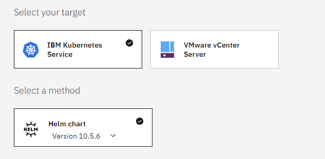
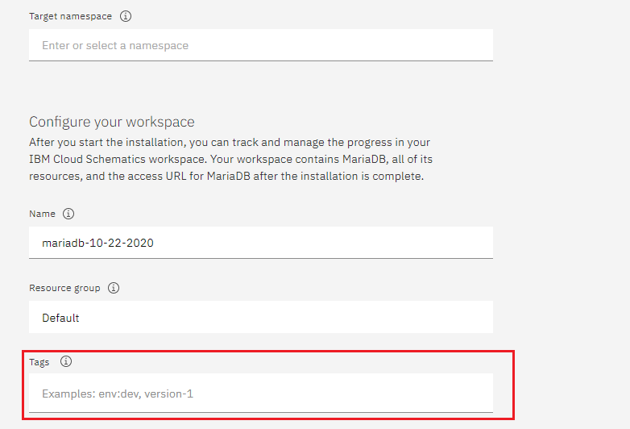

# Installing MariaDB on IBM Cloud

Get MariaDB on IBM Cloud

You should have an IBM Cloud account, otherwise you can [register here](https://cloud.ibm.com/registration).\
At the end of the tutorial you will have a cluster with MariaDB up and running. IBM Cloud uses Bitnami charts to deploy MariaDB on with helm

1. We will provision a new Kubernetes Cluster for you if, you already have one skip to step **2**
2. We will deploy the IBM Cloud Block Storage plug-in, if already have it skip to step **3**
3. MariaDB deployment

## Step 1 provision Kubernetes Cluster

1. Click the Catalog button on the top.
2. Select Service from the catalog.
3. Search for Kubernetes Service and click on it.

.png>)

4. Choose a plan: standard or free.


The free plan includes one worker node and no subnet.


5. To provision a standard cluster, upgrade your account to Pay-As-You-Go.
6. To upgrade to a Pay-As-You-Go account, follow these steps:
   1. In the console, go to **Manage > Account**.
   2. Select **Account settings**, and click **Add credit card**.
   3. Enter your payment information, click **Next**, and submit your information.
7. Choose between classic or VPC after reviewing the documentation to determine the most suitable option.

.png>)

8. Now choose your location settings, for more information please visit [Locations](https://cloud.ibm.com/docs/containers?topic=containers-regions-and-zones#zones)
9. Choose **Geography** (continent)

.png>)

10. Select either **Single-Zone** or **Multi-Zone** storage. Single Zone stores your data in one data center, while Multi-Zone distributes your data across multiple zones, offering greater safety in the event of unexpected zone failures.

.png>)

11. Choose a **Worker Zone** if using Single zones or Metro if Multizone

.png>)

12. Set up your account with VRF or enable VLAN spanning to use Multizone.
13. If no Virtual LAN is available at your selected location, a new VLAN will be created for you.
14. Choose a Worker node setup or use the preselected one.
15. Set the **Worker node per zone**.

.png>)

16. Choose Master Service Endpoint, In VRF-enabled accounts, you can choose **Private endpoint only** to make your master accessible on the private network or via VPN tunnel. Choose **Public endpoint only** to make your master publicly accessible. When you have a VRF-enabled account, your cluster is set up by default to use **Both private and public endpoints**. For more information visit [endpoints](https://cloud.ibm.com/docs/account?topic=account-service-endpoints-overview).

.png>)

17. Give **Cluster name**

.png>)

18. Give desired **Tags** to your cluster, for more information visit [tags](https://cloud.ibm.com/docs/account?topic=account-tag)

.png>)

19. Click **Create**

.png>)

20. Wait for you cluster to be provisioned

.png>)

21. Your cluster is ready for usage

.png>)

## Step 2 deploy IBM Cloud Block Storage plug-in

The Block Storage plug-in is a persistent, high-performance iSCSI storage that you can add to your apps by using Kubernetes Persistent Volumes (PVs).

1. Click the **Catalog** button on the top
2. Select **Software** from the catalog
3. Search for _IBM Cloud Block Storage plug-in_ and click on it

.png>)

4. On the application page, select the cluster you wish to use
5. Click on **Enter or select namespace** and choose the default Namespace or use a custom one (if you get error please wait 30 minutes for the cluster to finalize)

.png>)

6. Give a **Name** to this workspace
7. Click **Install** and wait for the deployment

.png>)

## Step 3 deploy MariaDB

We will deploy MariaDB on our cluster

1. Click the **Catalog** button on the top
2. Select **Software** from the catalog
3. Search for _MariaDB_ and click on it

.png>)

4. Please select **IBM Kubernetes Service**



5. On the application page, select the cluster you wish to use

.png>)

6. Click on **Enter or select namespace** and choose the default Namespace or use a custom one

.png>)

7. Give a unique name to workspace, which you can easily recognize

.png>)

8. Select which **Resource Group** you want to use, it's for access controll and billing purposes. For more information please visit [resource groups](https://cloud.ibm.com/docs/account?topic=account-account_setup#bp_resourcegroups)

.png>)

9. Give **Tags** to your MariaDB, for more information visit [tags](https://cloud.ibm.com/docs/account?topic=account-tag)



10. Click on **Parameters with default values**, You can set deployment values or use the default ones

.png>)

11. Please set the MariaDB root password in the parameters


12. After finishing everything, tick the box next to the agreements and click **Install**

.png>)

13. The MariaDB workspace will start installing, wait a couple of minutes

.png>)

14. Your MariaDB workspace has been successfully deployed

.png>)

## Verify MariaDB installation

1. Go to [Resources](https://cloud.ibm.com/resources) in your browser
2. Expand **Clusters.** Click on your cluster

.png>)

3. On the **Overview** page, click **Actions**, then select **Web Terminal** from the dropdown menu.

.png>)

4. Click Install and wait for sometime
5. Click on Actions
6. Click Web terminal. A terminal window will open up
7. On the terminal window, please change NAMESPACE to the namespace you choose at the deployment setup:

```bash
$ kubectl get ns
```

.png>)

```bash
$ kubectl get pod -n NAMESPACE -o wide
```


```bash
$ kubectl get service -n NAMESPACE
```


8. Enter your pod with bash , please replace PODNAME with your mariadb pod's name

```bash
$ kubectl exec --stdin --tty PODNAME -n NAMESPACE -- /bin/bash
```

.png>)

9. After you are in your pod please enter Mariadb and enter your root password after the prompt

```bash
$ mysql -u root -p
```

.png>)

You have successfully deployed MariaDB IBM Cloud!

<sub>_This page is licensed: CC BY-SA / Gnu FDL_</sub>


