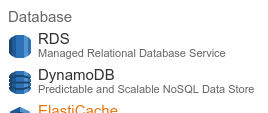
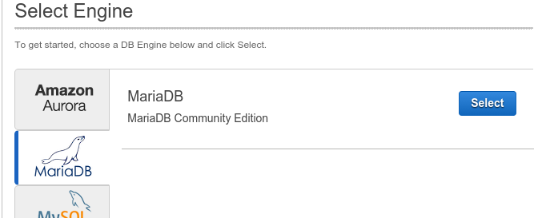
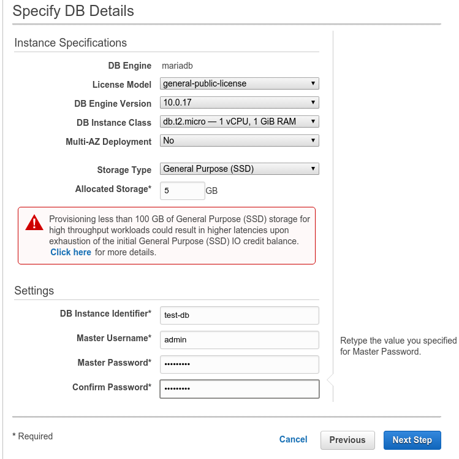

# MariaDB on Amazon RDS

MariaDB is available on Amazon AWS, as one of the database options when using Amazon's RDS service, or using a MariaDB AMI on Amazon EC2 from the AWS Marketplace.

## Amazon RDS

To get started with MariaDB on Amazon's RDS service, click on the RDS link in\
the Database section of the [AWS console](https://console.aws.amazon.com/console/home).

Next, click on the **Get Started Now** button. Alternatively, you can click on\
the **Launch DB Instance** button from the [Instances section of the RDS Dashboard](https://console.aws.amazon.com/rds/home#dbinstances:).

In either case, you will be brought to the page where you can select the\
database engine you want to use. Click on the **MariaDB** logo and then click\
on the **Select** button.

You will then move to step 2 where you choose whether or not you want to use\
your MariaDB instance for production or non-production usage. Amazon has links\
on this page to documentation on the various options.

After selecting the choice you want you will move to step 3 where you specify\
the details for your database, including setting up an admin user in the\
database.

You will then move to step 4 where you can configure advanced settings,\
including security settings, various options, backup settings, maintenance\
defaults, and so on.

Refer to[Amazon's RDS documentation](https://aws.amazon.com/documentation/rds/) for complete documentation\
on all the various settings and for information on connecting to and using\
your RDS MariaDB instances.

## AMI on EC2

MariaDB AMIs (Amazon Machine Images) are available in the AWS Marketplace. These AMIs, kept up-to-date with the most recently released versions of MariaDB, are a great way to try out the newest MariaDB versions before they make it to RDS and/or to use MariaDB in a more traditional server environment.

_This page is licensed: CC BY-SA / Gnu FDL_


