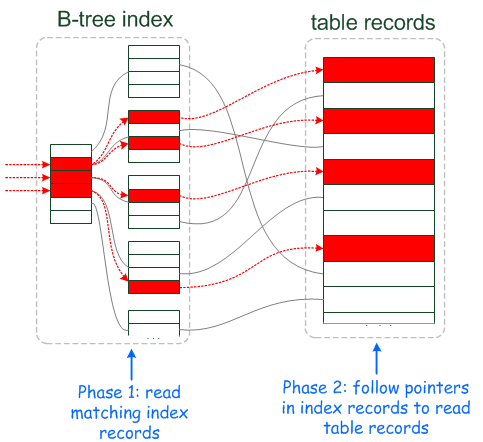

# Index Condition Pushdown


Index Condition Pushdown is an optimization that is applied for access methods that access table data through indexes: `range`, `ref`, `eq_ref`, `ref_or_null`, and [Batched Key Access](../../../../reference/mariadb-internals/mariadb-internals-documentation-query-optimizer/block-based-join-algorithms.md#batch-key-access-join).


The idea is to check part of the WHERE condition that refers to index fields (we call it *Pushed Index Condition*) as soon as we've accessed the index. If the *Pushed Index Condition* is not satisfied, we won't need to read the whole table record.


Index Condition Pushdown is **on** by default. To disable it, set its optimizer_switch flag like so:


```
SET optimizer_switch='index_condition_pushdown=off'
```

When Index Condition Pushdown is used, EXPLAIN will show "Using index condition":


```
MariaDB [test]> explain select * from tbl where key_col1 between 10 and 11 and key_col2 like '%foo%';
+----+-------------+-------+-------+---------------+----------+---------+------+------+-----------------------+
| id | select_type | table | type  | possible_keys | key      | key_len | ref  | rows | Extra                 |
+----+-------------+-------+-------+---------------+----------+---------+------+------+-----------------------+
|  1 | SIMPLE      | tbl   | range | key_col1      | key_col1 | 5       | NULL |    2 | Using index condition |
+----+-------------+-------+-------+---------------+----------+---------+------+------+-----------------------+
```

## The Idea Behind Index Condition Pushdown


In disk-based storage engines, making an index lookup is done in two steps, like shown on the picture:





Index Condition Pushdown optimization tries to cut down the number of full record reads by checking whether index records satisfy part of the WHERE condition that can be checked for them:


How much speed will be gained depends on
- How many records will be filtered out 
- How expensive it was to read them


The former depends on the query and the dataset. The latter is generally bigger when table records are on disk and/or are big, especially when they have [blobs](../../../../reference/data-types/string-data-types/blob.md).


## Example Speedup


I used DBT-3 benchmark data, with scale factor=1. Since the benchmark defines very few indexes, we've added a multi-column index (index condition pushdown is usually useful with multi-column indexes: the first component(s) is what index access is done for, the subsequent have columns that we read and check conditions on).


```
alter table lineitem add index s_r (l_shipdate, l_receiptdate);
```

The query was to find big (l_quantity > 40) orders that were made in January 1993 that took more than 25 days to ship:


```
select count(*) from lineitem
where
  l_shipdate between '1993-01-01' and '1993-02-01' and
  datediff(l_receiptdate,l_shipdate) > 25 and
  l_quantity > 40;
```

EXPLAIN without Index Condition Pushdown:


```
-+----------+-------+----------------------+-----+---------+------+--------+-------------+
 | table    | type | possible_keys         | key | key_len | ref | rows    | Extra       |
-+----------+-------+----------------------+-----+---------+------+--------+-------------+
 | lineitem | range | s_r                  | s_r | 4       | NULL | 152064 | Using where |
-+----------+-------+----------------------+-----+---------+------+--------+-------------+
```

with Index Condition Pushdown:


```
-+-----------+-------+---------------+-----+---------+------+--------+------------------------------------+
 | table     | type | possible_keys | key | key_len | ref | rows     | Extra                              |
-+-----------+-------+---------------+-----+---------+------+--------+------------------------------------+
 | lineitem | range | s_r            | s_r | 4       | NULL | 152064 | Using index condition; Using where |
-+-----------+-------+---------------+-----+---------+------+--------+------------------------------------+
```

The speedup was:


* Cold buffer pool: from 5 min down to 1 min
* Hot buffer pool: from 0.19 sec down to 0.07 sec


## Status Variables


There are two server status variables:


| Variable name | Meaning |
| --- | --- |
| Variable name | Meaning |
| [Handler_icp_attempts](../system-variables/server-status-variables.md#handler_icp_attempts) | Number of times pushed index condition was checked. |
| [Handler_icp_match](../system-variables/server-status-variables.md#handler_icp_match) | Number of times the condition was matched. |


That way, the value `Handler_icp_attempts - Handler_icp_match` shows the number records that the server did not have to read because of Index Condition Pushdown.


## Limitations


* Currently, virtual column indexes can't be used for index condition pushdown. Instead, a generated column can be made declared STORED. Then, index condition pushdown will be possible.


* Index Condition Pushdown can't be used with backward-ordered index scan. When the optimizer needs to execute an `ORDER BY ... DESC` query which can be handled by using a backward-ordered index scan, it will disable Index Condition Pushdown.


## Partitioned Tables


Index condition pushdown support for [partitioned tables](../../../../server-management/partitioning-tables/README.md) was added in [MariaDB 11.5](https://app.gitbook.com/s/aEnK0ZXmUbJzqQrTjFyb/mariadb-community-server-release-notes/old-releases/release-notes-mariadb-11-5-rolling-releases/what-is-mariadb-115).

