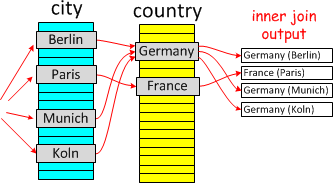

# DuplicateWeedout Strategy

`DuplicateWeedout` is an execution strategy for [Semi-join subqueries](../subquery-optimizations/semi-join-subquery-optimizations.md).


## The idea


The idea is to run the semi-join (a query with uses `WHERE X IN (SELECT Y FROM ...)`) as if it were a regular inner join, and then eliminate the duplicate record combinations using a temporary table.


Suppose, you have a query where you're looking for countries which have more than 33% percent of their population in one big city:


```
select * 
from Country 
where 
   Country.code IN (select City.Country
                    from City 
                    where 
                      City.Population > 0.33 * Country.Population and 
                      City.Population > 1*1000*1000);
```

First, we run a regular inner join between the `City` and `Country` tables:





The Inner join produces duplicates. We have Germany three times, because it has three big cities.
Now, lets put `DuplicateWeedout` into the picture:


Here one can see that a temporary table with a primary key was used to avoid producing multiple records with 'Germany'.


## DuplicateWeedout in action


The `Start temporary` and `End temporary` from the last diagram are shown in the `EXPLAIN` output:


```
explain select * from Country where Country.code IN 
  (select City.Country from City where City.Population > 0.33 * Country.Population 
   and City.Population > 1*1000*1000)\G
*************************** 1. row ***************************
           id: 1
  select_type: PRIMARY
        table: City
         type: range
possible_keys: Population,Country
          key: Population
      key_len: 4
          ref: NULL
         rows: 238
        Extra: Using index condition; Start temporary
*************************** 2. row ***************************
           id: 1
  select_type: PRIMARY
        table: Country
         type: eq_ref
possible_keys: PRIMARY
          key: PRIMARY
      key_len: 3
          ref: world.City.Country
         rows: 1
        Extra: Using where; End temporary
2 rows in set (0.00 sec)
```

This query will read 238 rows from the `City` table, and for each of them will make a primary key lookup in the `Country` table, which gives another 238 rows. This gives a total of 476 rows, and you need to add 238 lookups in the temporary table (which are typically *much* cheaper since the temporary table is in-memory).


If we run the same query with semi-join optimizations disabled, we'll get:


```
explain select * from Country where Country.code IN 
  (select City.Country from City where City.Population > 0.33 * Country.Population 
    and City.Population > 1*1000*1000)\G
*************************** 1. row ***************************
           id: 1
  select_type: PRIMARY
        table: Country
         type: ALL
possible_keys: NULL
          key: NULL
      key_len: NULL
          ref: NULL
         rows: 239
        Extra: Using where
*************************** 2. row ***************************
           id: 2
  select_type: DEPENDENT SUBQUERY
        table: City
         type: index_subquery
possible_keys: Population,Country
          key: Country
      key_len: 3
          ref: func
         rows: 18
        Extra: Using where
2 rows in set (0.00 sec)
```

This plan will read `(239 + 239*18) = 4541` rows, which is much slower.


## Factsheet


* `DuplicateWeedout` is shown as "Start temporary/End temporary" in `EXPLAIN`.
* The strategy can handle correlated subqueries.
* But it cannot be applied if the subquery has meaningful `GROUP BY` and/or aggregate functions.
* `DuplicateWeedout` allows the optimizer to freely mix a subquery's tables and the parent select's tables.
* There is no separate @@optimizer_switch flag for `DuplicateWeedout`. The strategy can be disabled by switching off all semi-join optimizations with `SET @@optimizer_switch='optimizer_semijoin=off'` command.


## See Also


* [What is MariaDB 5.3](https://app.gitbook.com/s/aEnK0ZXmUbJzqQrTjFyb/mariadb-community-server-release-notes/old-releases/release-notes-mariadb-5-3-series/changes-improvements-in-mariadb-5-3)
* [Subquery Optimizations Map](../subquery-optimizations/subquery-optimizations-map.md)

