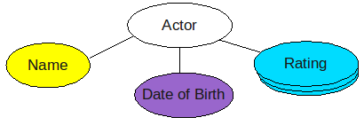

# What is Table Elimination?

The basic idea behind table elimination is that sometimes it is possible to
resolve a query without even accessing some of the tables that the query refers
to. One can invent many kinds of such cases, but in Table Elimination we
targeted only a certain class of SQL constructs that one ends up writing when
they are querying [highly-normalized](https://app.gitbook.com/s/iJPrPCGi329TSR8WIXJW/learning-and-training/training-and-tutorials/intermediate-mariadb-articles/database-theory/database-normalization/) data.


The sample queries were drawn from “Anchor Modeling”, a database modeling
technique which takes normalization to the extreme. The
[slides](https://www.anchormodeling.com/tiedostot/SU_KTH_Course_Presentation.pdf)
at the 
[anchor modeling website](https://www.anchormodeling.com)
have an in-depth explanation of Anchor modeling and its merits, but the part
that's important for table elimination can be shown with an example.


Suppose the database stores information about actors, together with their
names, birthdays, and ratings, where ratings can change over time:





According to anchor modeling, each attribute should go into its own table:


* the 'anchor' table which only has a synthetic primary key:


```
create table  ac_anchor(AC_ID int primary key);
```

* a table for the 'name' attribute:


```
create table ac_name(AC_ID int, ACNAM_name char(N),
                     primary key(AC_ID));
```

* a table for the 'birthdate' attribute:


```
create table ac_dob(AC_ID int,
                    ACDOB_birthdate date,
                    primary key(AC_ID));
```

* a table for the ‘rating’ attribute, which is historized:


```
create table ac_rating(AC_ID int,
                       ACRAT_rating int,
                       ACRAT_fromdate date,
                       primary key(AC_ID, ACRAT_fromdate));
```

With this approach it becomes easy to add/change/remove attributes, but this
comes at a cost of added complexity in querying the data: in order to answer
the simplest, select-star question of displaying actors and their current
ratings one has to write outer joins:


Display actors, with their names and current ratings:


```
select
  ac_anchor.AC_ID, ACNAM_Name, ACDOB_birthdate, ACRAT_rating
from
  ac_anchor
  left join ac_name on ac_anchor.AC_ID=ac_name.AC_ID
  left join ac_dob on ac_anchor.AC_ID=ac_dob.AC_ID
  left join ac_rating on (ac_anchor.AC_ID=ac_rating.AC_ID and
                          ac_rating.ACRAT_fromdate = 
                            (select max(sub.ACRAT_fromdate)
                             from ac_rating sub where sub.AC_ID = ac_rating.AC_ID))
```

We don't want to write the joins every time we need to access an actor's
properties, so we’ll create a view:


```
create view actors as
  select  ac_anchor.AC_ID, ACNAM_Name,  ACDOB_birthdate, ACRAT_rating
  from <see the select above>
```

This will allow us to access the data as if it was stored in a regular way:


```
select ACRAT_rating from actors where ACNAM_name='Gary Oldman'
```

And this is where table elimination will be needed.


## See Also


* This page is based on the following blog post about table elimination:
 [?p=58](https://s.petrunia.net/blog/?p=58)

