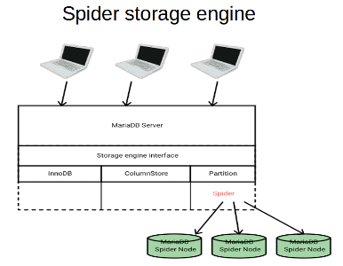
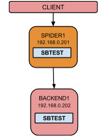
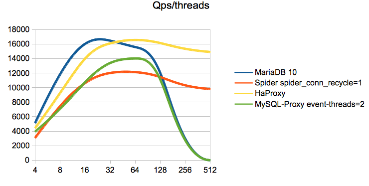
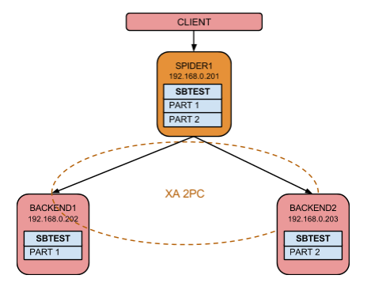
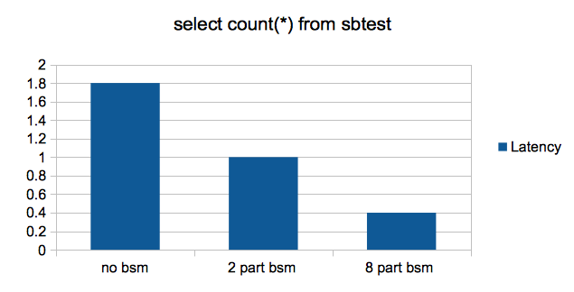
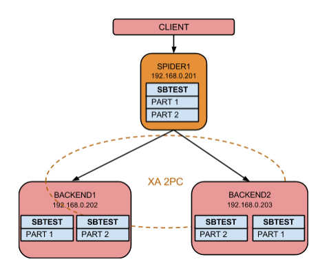
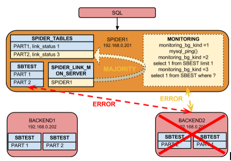

# Spider Storage Engine Overview

## About



The Spider storage engine is a [storage engine](../) with built-in sharding features. It supports partitioning and [xa transactions](../../../reference/sql-statements/transactions/xa-transactions.md), and allows tables of different MariaDB instances to be handled as if they were on the same instance. It refers to one possible implementation of ISO/IEC 9075-9:2008 SQL/MED.

When a table is created with the Spider storage engine, the table links to the table on a remote server. The remote table can be of any storage engine. The table link is concretely achieved by the establishment of the connection from a local MariaDB server to a remote MariaDB server. The link is shared for all tables that are part of a the same transaction.

The Spider documentation on the MariaDB documentation is currently incomplete. See the Spider website for more:, as well as the spider-1.0-doc and spider-2.0-doc repositories.

## Spider Versions in MariaDB

| Spider Version | Introduced                                                                                                                                                                                                                                                                                                                                                               | Maturity |
| -------------- | ------------------------------------------------------------------------------------------------------------------------------------------------------------------------------------------------------------------------------------------------------------------------------------------------------------------------------------------------------------------------ | -------- |
| Spider 3.3.15  | [MariaDB 10.5.7](https://app.gitbook.com/s/aEnK0ZXmUbJzqQrTjFyb/mariadb-community-server-release-notes/mariadb-10-5-series/mariadb-1057-release-notes), [MariaDB 10.4.6](https://app.gitbook.com/s/aEnK0ZXmUbJzqQrTjFyb/mariadb-community-server-release-notes/old-releases/release-notes-mariadb-10-4-series/mariadb-1046-release-notes)                                | Stable   |
| Spider 3.3.15  | [MariaDB 10.5.4](https://app.gitbook.com/s/aEnK0ZXmUbJzqQrTjFyb/mariadb-community-server-release-notes/mariadb-10-5-series/mariadb-1054-release-notes)                                                                                                                                                                                                                   | Gamma    |
| Spider 3.3.14  | [MariaDB 10.4.3](https://app.gitbook.com/s/aEnK0ZXmUbJzqQrTjFyb/mariadb-community-server-release-notes/old-releases/release-notes-mariadb-10-4-series/mariadb-1043-release-notes), [MariaDB 10.3.13](https://app.gitbook.com/s/aEnK0ZXmUbJzqQrTjFyb/mariadb-community-server-release-notes/old-releases/release-notes-mariadb-10-3-series/mariadb-10313-release-notes)   | Stable   |
| Spider 3.3.13  | [MariaDB 10.3.7](https://app.gitbook.com/s/aEnK0ZXmUbJzqQrTjFyb/mariadb-community-server-release-notes/old-releases/release-notes-mariadb-10-3-series/mariadb-1037-release-notes)                                                                                                                                                                                        | Stable   |
| Spider 3.3.13  | [MariaDB 10.3.3](https://app.gitbook.com/s/aEnK0ZXmUbJzqQrTjFyb/mariadb-community-server-release-notes/old-releases/release-notes-mariadb-10-3-series/mariadb-1033-release-notes)                                                                                                                                                                                        | Gamma    |
| Spider 3.2.37  | [MariaDB 10.1.10](https://app.gitbook.com/s/aEnK0ZXmUbJzqQrTjFyb/mariadb-community-server-release-notes/old-releases/release-notes-mariadb-10-1-series/mariadb-10110-release-notes), [MariaDB 10.0.23](https://app.gitbook.com/s/aEnK0ZXmUbJzqQrTjFyb/mariadb-community-server-release-notes/old-releases/release-notes-mariadb-10-0-series/mariadb-10023-release-notes) | Gamma    |
| Spider 3.2.21  | [MariaDB 10.1.5](https://app.gitbook.com/s/aEnK0ZXmUbJzqQrTjFyb/mariadb-community-server-release-notes/old-releases/release-notes-mariadb-10-1-series/mariadb-10-1-5-release-notes), [MariaDB 10.0.18](https://app.gitbook.com/s/aEnK0ZXmUbJzqQrTjFyb/mariadb-community-server-release-notes/old-releases/release-notes-mariadb-10-0-series/mariadb-10018-release-notes) | Gamma    |
| Spider 3.2.18  | [MariaDB 10.0.17](https://app.gitbook.com/s/aEnK0ZXmUbJzqQrTjFyb/mariadb-community-server-release-notes/old-releases/release-notes-mariadb-10-0-series/mariadb-10017-release-notes)                                                                                                                                                                                      | Gamma    |
| Spider 3.2.11  | [MariaDB 10.0.14](https://app.gitbook.com/s/aEnK0ZXmUbJzqQrTjFyb/mariadb-community-server-release-notes/old-releases/release-notes-mariadb-10-0-series/mariadb-10014-release-notes)                                                                                                                                                                                      | Gamma    |
| Spider 3.2.4   | [MariaDB 10.0.12](https://app.gitbook.com/s/aEnK0ZXmUbJzqQrTjFyb/mariadb-community-server-release-notes/old-releases/release-notes-mariadb-10-0-series/mariadb-10012-release-notes)                                                                                                                                                                                      | Gamma    |
| Spider 3.2     | [MariaDB 10.0.11](https://app.gitbook.com/s/aEnK0ZXmUbJzqQrTjFyb/mariadb-community-server-release-notes/old-releases/release-notes-mariadb-10-0-series/mariadb-10011-release-notes)                                                                                                                                                                                      | Gamma    |
| Spider 3.0     | [MariaDB 10.0.4](https://app.gitbook.com/s/aEnK0ZXmUbJzqQrTjFyb/mariadb-community-server-release-notes/old-releases/release-notes-mariadb-10-0-series/mariadb-1004-release-notes)                                                                                                                                                                                        | Beta     |

## Usage

### Basic Usage

To create a table in the Spider storage engine format, the COMMENT and/or CONNECTION clauses of the [CREATE TABLE](../../../reference/sql-statements/data-definition/create/create-table.md) statement are used to pass connection information about the remote server.

For example, the following table exists on a remote server (in this example, the remote node was created with the [MySQL Sandbox](../../../clients-and-utilities/legacy-clients-and-utilities/mysql-sandbox.md) tool, an easy way to test with multiple installations)::

```sql
node1 >CREATE TABLE s(
  id INT NOT NULL AUTO_INCREMENT,
  code VARCHAR(10),
  PRIMARY KEY(id));
```

On the local server, a Spider table can be created as follows:

```sql
CREATE TABLE s(
  id INT NOT NULL AUTO_INCREMENT,
  code VARCHAR(10),
  PRIMARY KEY(id)
)
ENGINE=SPIDER 
COMMENT='host "127.0.0.1", user "msandbox", password "msandbox", port "8607"';
```

Records can now be inserted on the local server, and they will be stored on the remote server:

```sql
INSERT INTO s(code) VALUES ('a');

node1 > SELECT * FROM s;
+----+------+
| id | code |
+----+------+
|  1 | a    |
+----+------+
```

**MariaDB starting with** [**10.8.1**](https://app.gitbook.com/s/aEnK0ZXmUbJzqQrTjFyb/mariadb-community-server-release-notes/old-releases/release-notes-mariadb-10-8-series/mariadb-1081-release-notes)

Alternative to specifying the data node information in the COMMENT, certain information (server, database, table) can also be specified using Table Options, like so:

```sql
CREATE SERVER srv FOREIGN DATA WRAPPER mysql OPTIONS(
  HOST '127.0.0.1',
  USER 'msandbox',
  PASSWORD 'msandbox',
  PORT 8607);

CREATE TABLE s(
  id INT NOT NULL AUTO_INCREMENT,
  code VARCHAR(10),
  PRIMARY KEY(id)
)
ENGINE=SPIDER REMOTE_SERVER="srv" REMOTE_DATABASE="db" REMOTE_TABLE="s";
```

### Further Examples

Preparing 10M record table using the [sysbench](https://github.com/akopytov/sysbench) utility

```
/usr/local/skysql/sysbench/bin/sysbench --test=oltp  --db-driver=mysql  --mysql-table-engine=innodb --mysql-user=skysql --mysql-password=skyvodka --mysql-host=192.168.0.202 --mysql-port=5054 --oltp-table-size=10000000  --mysql-db=test  prepare
```

Make a first read only benchmark to check the initial single node performance.

```
/usr/local/skysql/sysbench/bin/sysbench --test=oltp  --db-driver=mysql  --mysql-table-engine=innodb --mysql-user=skysql --mysql-password=skyvodka --mysql-host=192.168.0.202 --mysql-port=5054 --mysql-db=test --oltp-table-size=10000000 --num-threads=4 --max-requests=100000 --oltp-read-only=on run
```

```
sysbench 0.4.12:  multi-threaded system evaluation benchmark

Running the test with following options:
Number of threads: 4

Doing OLTP test.
Running mixed OLTP test
Doing read-only test
Using Special distribution (12 iterations,  1 pct of values are returned in 75 pct cases)
Using "BEGIN" for starting transactions
Using auto_inc on the id column
Maximum number of requests for OLTP test is limited to 100000
Threads started!
Done.

OLTP test statistics:
    queries performed:
        read:                            1400196
        write:                           0
        other:                           200028
        total:                           1600224
    transactions:                        100014 (1095.83 per sec.)
    deadlocks:                           0      (0.00 per sec.)
    read/write requests:                 1400196 (15341.58 per sec.)
    other operations:                    200028 (2191.65 per sec.)

Test execution summary:
    total time:                          91.2681s
    total number of events:              100014
    total time taken by event execution: 364.3693
    per-request statistics:
         min:                                  1.85ms
         avg:                                  3.64ms
         max:                                 30.70ms
         approx.  95 percentile:               4.66ms

Threads fairness:
    events (avg/stddev):           25003.5000/84.78
    execution time (avg/stddev):   91.0923/0.00
```

Define an easy way to access the nodes from the MariaDB or MySQL client.

```
alias backend1='/usr/local/skysql/mysql-client/bin/mysql  --user=skysql --password=skyvodka --host=192.168.0.202 --port=5054'
alias backend2='/usr/local/skysql/mysql-client/bin/mysql  --user=skysql --password=skyvodka --host=192.168.0.203 --port=5054' 
alias spider1='/usr/local/skysql/mysql-client/bin/mysql  --user=skysql --password=skyvodka --host=192.168.0.201 --port=5054'
```

Create the empty tables to hold the data and repeat for all available backend nodes.

```sql
backend1 << EOF 
CREATE DATABASE backend;
CREATE TABLE backend.sbtest (
  id INT(10) UNSIGNED NOT NULL AUTO_INCREMENT,
  k INT(10) UNSIGNED NOT NULL DEFAULT '0',
  c CHAR(120) NOT NULL DEFAULT '',
  pad CHAR(60) NOT NULL DEFAULT '',
  PRIMARY KEY (id),
  KEY k (k)
) ENGINE=InnoDB;
EOF

backend2 << EOF 
CREATE DATABASE backend;
CREATE TABLE backend.sbtest (
  id INT(10) UNSIGNED NOT NULL AUTO_INCREMENT,
  k INT(10) UNSIGNED NOT NULL DEFAULT '0',
  c CHAR(120) NOT NULL DEFAULT '',
  pad CHAR(60) NOT NULL DEFAULT '',
  PRIMARY KEY (id),
  KEY k (k)
) ENGINE=InnoDB;
EOF
```

#### Federation Setup



```sql
spider1 << EOF
CREATE SERVER backend 
  FOREIGN DATA WRAPPER mysql 
OPTIONS( 
  HOST '192.168.0.202', 
  DATABASE 'test',
  USER 'skysql',
  PASSWORD 'skyvodka',
  PORT 5054
);

CREATE  TABLE test.sbtest
(
  id INT(10) UNSIGNED NOT NULL AUTO_INCREMENT,
  k INT(10) UNSIGNED NOT NULL DEFAULT '0',
  c CHAR(120) NOT NULL DEFAULT '',
  pad CHAR(60) NOT NULL DEFAULT '',
  PRIMARY KEY (id),
  KEY k (k)
) ENGINE=spider COMMENT='wrapper "mysql",srv "backend"';
SELECT * FROM test.sbtest LIMIT 10;
EOF
```



Without connection pool or MariaDB thread pool, HaProxy and Spider have been protecting the tcp socket overflow without specific TCP tuning. In reality with a well tuned TCP stack or thread pool the curve should not decrease so abruptly to 0. Refer to the [MariaDB Thread Pool](../../../ha-and-performance/optimization-and-tuning/buffers-caches-and-threads/thread-pool/thread-pool-in-mariadb.md) to explore this feature.

#### Sharding Setup



Create the spider table on the Spider Node

```sql
#spider1 << EOF
CREATE SERVER backend1 
  FOREIGN DATA WRAPPER mysql 
OPTIONS( 
  HOST '192.168.0.202', 
  DATABASE 'backend',
  USER 'skysql',
  PASSWORD 'skyvodka',
  PORT 5054
);
CREATE SERVER backend2 
  FOREIGN DATA WRAPPER mysql 
OPTIONS( 
  HOST '192.168.0.203', 
  DATABASE 'backend',
  USER 'skysql',
  PASSWORD 'skyvodka',
  PORT 5054
);
CREATE DATABASE IF NOT EXISTS backend;
CREATE  TABLE backend.sbtest
(
  id INT(10) UNSIGNED NOT NULL AUTO_INCREMENT,
  k INT(10) UNSIGNED NOT NULL DEFAULT '0',
  c CHAR(120) NOT NULL DEFAULT '',
  pad CHAR(60) NOT NULL DEFAULT '',
  PRIMARY KEY (id),
  KEY k (k)
) ENGINE=spider COMMENT='wrapper "mysql", TABLE "sbtest"'
 PARTITION BY KEY (id) 
(
 PARTITION pt1 COMMENT = 'srv "backend1"',
 PARTITION pt2 COMMENT = 'srv "backend2"' 
) ;
EOF
```

Copy the data from the original sysbench table to the spider table

```sql
#/usr/local/skysql/mariadb/bin/mysqldump  --user=skysql --password=skyvodka --host=192.168.0.202 --port=5054 --no-create-info test sbtest | spider1 backend 

#backend2 -e"SELECT count(*) FROM backend.sbtest;"
+----------+
| count(*) |
+----------+
|  3793316 |
+----------+
#backend1 -e"SELECT count(*) FROM backend.sbtest;"
+----------+
| count(*) |
+----------+
|  6206684 |
+----------+
```

We observe a common issue with partitioning is a non uniform distribution of data between the backends. based on the partition key hashing algorithm.

Rerun the Benchmark with less queries

```
#/usr/local/skysql/sysbench/bin/sysbench --test=oltp  --db-driver=mysql  --mysql-table-engine=innodb --mysql-user=skysql --mysql-password=skyvodka --mysql-host=192.168.0.201 --mysql-port=5054 --mysql-db=backend --mysql-engine-trx=yes --oltp-table-size=10000000 --num-threads=4 --max-requests=100 --oltp-read-only=on run
```

```
OLTP test statistics:
    queries performed:
        read:                            1414
        write:                           0
        other:                           202
        total:                           1616
    transactions:                        101    (22.95 per sec.)
    deadlocks:                           0      (0.00 per sec.)
    read/write requests:                 1414   (321.30 per sec.)
    other operations:                    202    (45.90 per sec.)

Test execution summary:
    total time:                          4.4009s
    total number of events:              101
    total time taken by event execution: 17.2960
    per-request statistics:
         min:                                114.48ms
         avg:                                171.25ms
         max:                                200.98ms
         approx.  95 percentile:             195.12ms

Threads fairness:
    events (avg/stddev):           25.2500/0.43
    execution time (avg/stddev):   4.3240/0.04
```

The response time decreases to 0.04.\
This is expected because the query latency is increased from multiple network round trips and condition push down is not implemented yet. Sysbench doing a lot of range queries. Just consider for now that this range query can be a badly optimized query.

We need to increase the concurrency to get better throughput.


#### Background Setup

We have no background search available in MariaDB. It won't be available before [MariaDB 10.2](https://app.gitbook.com/s/aEnK0ZXmUbJzqQrTjFyb/mariadb-community-server-release-notes/old-releases/release-notes-mariadb-10-2-series/what-is-mariadb-102), but the next table definition mainly enables improving the performance of a single complex query plan with background search that can be found via the upstream spiral binaries MariaDB branch.

We have 4 cores per backend and 2 backends .

On `backend1`

```sql
#backend1 << EOF 
CREATE DATABASE bsbackend1;
CREATE DATABASE bsbackend2;
CREATE DATABASE bsbackend3;
CREATE DATABASE bsbackend4;
CREATE TABLE bsbackend1.sbtest (
  id INT(10) UNSIGNED NOT NULL AUTO_INCREMENT,
  k INT(10) UNSIGNED NOT NULL DEFAULT '0',
  c CHAR(120) NOT NULL DEFAULT '',
  pad CHAR(60) NOT NULL DEFAULT '',
  PRIMARY KEY (id),
  KEY k (k)
) ENGINE=InnoDB;
CREATE TABLE bsbackend2.sbtest (
  id INT(10) UNSIGNED NOT NULL AUTO_INCREMENT,
  k INT(10) UNSIGNED NOT NULL DEFAULT '0',
  c CHAR(120) NOT NULL DEFAULT '',
  pad CHAR(60) NOT NULL DEFAULT '',
  PRIMARY KEY (id),
  KEY k (k)
) ENGINE=InnoDB;
CREATE TABLE bsbackend3.sbtest (
  id INT(10) UNSIGNED NOT NULL AUTO_INCREMENT,
  k INT(10) UNSIGNED NOT NULL DEFAULT '0',
  c CHAR(120) NOT NULL DEFAULT '',
  pad CHAR(60) NOT NULL DEFAULT '',
  PRIMARY KEY (id),
  KEY k (k)
) ENGINE=InnoDB;
CREATE TABLE bsbackend4.sbtest (
  id INT(10) UNSIGNED NOT NULL AUTO_INCREMENT,
  k INT(10) UNSIGNED NOT NULL DEFAULT '0',
  c CHAR(120) NOT NULL DEFAULT '',
  pad CHAR(60) NOT NULL DEFAULT '',
  PRIMARY KEY (id),
  KEY k (k)
) ENGINE=InnoDB;
EOF
```

On `backend2`

```sql
#backend2 << EOF 
CREATE DATABASE bsbackend5;
CREATE DATABASE bsbackend6;
CREATE DATABASE bsbackend7;
CREATE DATABASE bsbackend8;
CREATE TABLE bsbackend5.sbtest (
  id INT(10) UNSIGNED NOT NULL AUTO_INCREMENT,
  k INT(10) UNSIGNED NOT NULL DEFAULT '0',
  c CHAR(120) NOT NULL DEFAULT '',
  pad CHAR(60) NOT NULL DEFAULT '',
  PRIMARY KEY (id),
  KEY k (k)
) ENGINE=InnoDB;
CREATE TABLE bsbackend6.sbtest (
  id INT(10) UNSIGNED NOT NULL AUTO_INCREMENT,
  k INT(10) UNSIGNED NOT NULL DEFAULT '0',
  c CHAR(120) NOT NULL DEFAULT '',
  pad CHAR(60) NOT NULL DEFAULT '',
  PRIMARY KEY (id),
  KEY k (k)
) ENGINE=InnoDB;
CREATE TABLE bsbackend7.sbtest (
  id INT(10) UNSIGNED NOT NULL AUTO_INCREMENT,
  k INT(10) UNSIGNED NOT NULL DEFAULT '0',
  c CHAR(120) NOT NULL DEFAULT '',
  pad CHAR(60) NOT NULL DEFAULT '',
  PRIMARY KEY (id),
  KEY k (k)
) ENGINE=InnoDB;
CREATE TABLE bsbackend8.sbtest (
  id INT(10) UNSIGNED NOT NULL AUTO_INCREMENT,
  k INT(10) UNSIGNED NOT NULL DEFAULT '0',
  c CHAR(120) NOT NULL DEFAULT '',
  pad CHAR(60) NOT NULL DEFAULT '',
  PRIMARY KEY (id),
  KEY k (k)
) ENGINE=InnoDB;
EOF
```

On `Spider Node`

```sql
#spider2 << EOF
CREATE SERVER bsbackend1 FOREIGN DATA WRAPPER mysql OPTIONS( HOST '192.168.0.202', DATABASE 'bsbackend1',USER 'skysql', PASSWORD 'skyvodka',PORT 5054);
CREATE SERVER bsbackend2 FOREIGN DATA WRAPPER mysql OPTIONS( HOST '192.168.0.202', DATABASE 'bsbackend2',USER 'skysql', PASSWORD 'skyvodka',PORT 5054);
CREATE SERVER bsbackend3 FOREIGN DATA WRAPPER mysql OPTIONS( HOST '192.168.0.202', DATABASE 'bsbackend3',USER 'skysql', PASSWORD 'skyvodka',PORT 5054);
CREATE SERVER bsbackend4 FOREIGN DATA WRAPPER mysql OPTIONS( HOST '192.168.0.202', DATABASE 'bsbackend4',USER 'skysql', PASSWORD 'skyvodka',PORT 5054);
CREATE SERVER bsbackend5 FOREIGN DATA WRAPPER mysql OPTIONS( HOST '192.168.0.203', DATABASE 'bsbackend5',USER 'skysql', PASSWORD 'skyvodka',PORT 5054);
CREATE SERVER bsbackend6 FOREIGN DATA WRAPPER mysql OPTIONS( HOST '192.168.0.203', DATABASE 'bsbackend6',USER 'skysql', PASSWORD 'skyvodka',PORT 5054);
CREATE SERVER bsbackend7 FOREIGN DATA WRAPPER mysql OPTIONS( HOST '192.168.0.203', DATABASE 'bsbackend7',USER 'skysql', PASSWORD 'skyvodka',PORT 5054);
CREATE SERVER bsbackend8 FOREIGN DATA WRAPPER mysql OPTIONS( HOST '192.168.0.203', DATABASE 'bsbackend8',USER 'skysql', PASSWORD 'skyvodka',PORT 5054);

CREATE DATABASE IF NOT EXISTS bsbackend;
CREATE  TABLE bsbackend.sbtest
(
  id INT(10) UNSIGNED NOT NULL AUTO_INCREMENT,
  k INT(10) UNSIGNED NOT NULL DEFAULT '0',
  c CHAR(120) NOT NULL DEFAULT '',
  pad CHAR(60) NOT NULL DEFAULT '',
  PRIMARY KEY (id),
  KEY k (k)
) ENGINE=spider COMMENT='wrapper "mysql", TABLE "sbtest"'
 PARTITION BY KEY (id) 
(
 PARTITION pt1 COMMENT = 'srv "bsbackend1"',
 PARTITION pt2 COMMENT = 'srv "bsbackend2"', 
 PARTITION pt3 COMMENT = 'srv "bsbackend3"',
 PARTITION pt4 COMMENT = 'srv "bsbackend4"', 
 PARTITION pt5 COMMENT = 'srv "bsbackend5"',
 PARTITION pt6 COMMENT = 'srv "bsbackend6"',
 PARTITION pt7 COMMENT = 'srv "bsbackend7"',
 PARTITION pt8 COMMENT = 'srv "bsbackend8"'
) ;
EOF
INSERT INTO  bsbackend.sbtest SELECT * FROM backend.sbtest;
```

Now test the following query :

```sql
SELECT count(*) FROM sbtest;
+----------+
| count(*) |
+----------+
| 10000001 |
+----------+
1 row IN SET (8,38 sec)

SET spider_casual_read=1;
SET spider_bgs_mode=2;

SELECT count(*) FROM sbtest;
+----------+
| count(*) |
+----------+
| 10000001 |
+----------+
1 row IN SET (4,25 sec)

mysql> SELECT sum(k) FROM sbtest;
+--------+
| sum(k) |
+--------+
|      0 |
+--------+
1 row IN SET (5,67 sec)

mysql> SET spider_casual_read=0;
mysql> SELECT sum(k) FROM sbtest;
+--------+
| sum(k) |
+--------+
|      0 |
+--------+
1 row IN SET (12,56 sec)
```



#### High Availability Setup

**MariaDB starting with** [**10.7.5**](https://app.gitbook.com/s/aEnK0ZXmUbJzqQrTjFyb/mariadb-community-server-release-notes/old-releases/release-notes-mariadb-10-7-series/mariadb-1075-release-notes)

Spider's high availability feature has been deprecated ([MDEV-28479](https://jira.mariadb.org/browse/MDEV-28479)), and will be deleted. Please use other high availability solutions like [replication](../myrocks/myrocks-and-replication.md) or [galera-cluster](https://app.gitbook.com/s/3VYeeVGUV4AMqrA3zwy7/readme/mariadb-galera-cluster-usage-guide).



```sql
#backend1 -e "CREATE DATABASE backend_rpl"
#backend2 -e "CREATE DATABASE backend_rpl"

#/usr/local/skysql/mariadb/bin/mysqldump  --user=skysql --password=skyvodka --host=192.168.0.202 --port=5054  backend sbtest | backend1 backend_rpl
#/usr/local/skysql/mariadb/bin/mysqldump  --user=skysql --password=skyvodka --host=192.168.0.203 --port=5054  backend sbtest | backend2 backend_rpl

#spider1 << EOF
DROP TABLE backend.sbtest;
CREATE SERVER backend1_rpl 
  FOREIGN DATA WRAPPER mysql 
OPTIONS( 
  HOST '192.168.0.202', 
  DATABASE 'backend_rpl',
  USER 'skysql',
  PASSWORD 'skyvodka',
  PORT 5054
);
CREATE SERVER backend2_rpl 
  FOREIGN DATA WRAPPER mysql 
OPTIONS( 
  HOST '192.168.0.203', 
  DATABASE 'backend_rpl',
  USER 'skysql',
  PASSWORD 'skyvodka',
  PORT 5054
);
CREATE  TABLE backend.sbtest
(
  id INT(10) UNSIGNED NOT NULL AUTO_INCREMENT,
  k INT(10) UNSIGNED NOT NULL DEFAULT '0',
  c CHAR(120) NOT NULL DEFAULT '',
  pad CHAR(60) NOT NULL DEFAULT '',
  PRIMARY KEY (id),
  KEY k (k)
) ENGINE=spider COMMENT='wrapper "mysql", TABLE "sbtest"'
 PARTITION BY KEY (id) 
(
 PARTITION pt1 COMMENT = 'srv "backend1 backend2_rpl"',
 PARTITION pt2 COMMENT = 'srv "backend2 backend1_rpl"' 
) ;
INSERT INTO backend.sbtest SELECT 10000001, 0, '' ,'replicas test';
EOF
#backend1 -e "SELECT * FROM backend.sbtest WHERE id=10000001";
+----------+---+---+---------------+
| id       | k | c | pad           |
+----------+---+---+---------------+
| 10000001 | 0 |   | replicas test |
+----------+---+---+---------------+
# backend2 -e "SELECT * FROM backend.sbtest WHERE id=10000001";
# backend2 -e "SELECT * FROM backend_rpl.sbtest WHERE id=10000001";
+----------+---+---+---------------+
| id       | k | c | pad           |
+----------+---+---+---------------+
| 10000001 | 0 |   | replicas test |
+----------+---+---+---------------+
```

What is happening if we stop one backend?

```sql
#spider1 -e "SELECT * FROM backend.sbtest WHERE id=10000001";
ERROR 1429 (HY000) at line 1: Unable to connect to foreign data source: backend1
```

Let's fix this with spider monitoring. Note that msi is the list of spider nodes @@server\_id variable participating in the quorum.

```sql
#spider1 << EOF
DROP  TABLE backend.sbtest;
CREATE  TABLE backend.sbtest
(
  id INT(10) UNSIGNED NOT NULL AUTO_INCREMENT,
  k INT(10) UNSIGNED NOT NULL DEFAULT '0',
  c CHAR(120) NOT NULL DEFAULT '',
  pad CHAR(60) NOT NULL DEFAULT '',
  PRIMARY KEY (id),
  KEY k (k)
) ENGINE=spider COMMENT='wrapper "mysql", TABLE "sbtest"'
 PARTITION BY KEY (id) 
(
 PARTITION pt1 COMMENT = 'srv "backend1 backend2_rpl",  mbk "2", mkd "2", msi "5054", link_status "0 0"',
 PARTITION pt2 COMMENT = 'srv "backend2 backend1_rpl",  mbk "2", mkd "2", msi "5054", link_status "0 0" ' 
) ;

CREATE SERVER mon
  FOREIGN DATA WRAPPER mysql 
OPTIONS( 
  HOST '192.168.0.201’, 
  DATABASE 'backend',
  USER 'skysql',
  PASSWORD 'skyvodka',
  PORT 5054
);
INSERT INTO `mysql`.`spider_link_mon_servers` VALUES
('%','%','%',5054,'mon',NULL,NULL,NULL,NULL,NULL,NULL,NULL,NULL,NULL,NULL,NULL,0,NULL,NULL);
SELECT spider_flush_table_mon_cache();
EOF
```

Monitoring should be setup between Spider nodes participating in the cluster. We only have one `Spider Node` and spider\_link\_mon\_servers represent the inter-connection of all Spider nodes in our setup.

This simple setup does not bring HA in case the `Spider Node` is not available. In a production setup the number of `Spider Nodes` in the spider\_link\_mon\_servers table should be at least 3 to get a majority consensus.

```sql
#spider1 -e "SELECT * FROM backend.sbtest WHERE id=10000001"
+----------+---+---+---------------+
| id       | k | c | pad           |
+----------+---+---+---------------+
| 10000001 | 0 |   | replicas test |
+----------+---+---+---------------+
```

Checking the state of the nodes:

```sql
#spider1 -e "SELECT db_name, table_name,server  FROM mysql.spider_tables WHERE link_status=3"
+---------+--------------+----------+
| db_name | table_name   | server   |
+---------+--------------+----------+
| backend | sbtest#P#pt1 | backend1 |
+---------+--------------+----------+
```



No change has been made to cluster, so let's create a divergence:

```sql
# spider1 -e "INSERT INTO backend.sbtest SELECT 10000003, 0, '' ,'replicas test';"
# backend1 -e "SELECT * FROM backend.sbtest WHERE id=10000003"
# backend2 -e "SELECT * FROM backend_rpl.sbtest WHERE id=10000003"
+----------+---+---+---------------+
| id       | k | c | pad           |
+----------+---+---+---------------+
| 10000003 | 0 |   | replicas test |
+----------+---+---+---------------+
```

Reintroducing the failed backend1 in the cluster:

```sql
#spider1 << EOF
ALTER TABLE backend.sbtest 
ENGINE=spider COMMENT='wrapper "mysql", TABLE "sbtest"'
 PARTITION BY KEY (id) 
(
 PARTITION pt1 COMMENT = 'srv "backend1 backend2_rpl"  mbk "2", mkd "2", msi "5054", link_status "2 0"',
 PARTITION pt2 COMMENT = 'srv "backend2 backend1_rpl"  mbk "2", mkd "2", msi "5054", link_status "0 2" ' 
) ;
SELECT spider_copy_tables('backend.sbtest#P#pt1','0','1');
SELECT spider_copy_tables('backend.sbtest#P#pt2','1','0');
ALTER TABLE backend.sbtest 
ENGINE=spider COMMENT='wrapper "mysql", TABLE "sbtest"'
 PARTITION BY KEY (id) 
(
 PARTITION pt1 COMMENT = 'srv "backend1 backend2_rpl"  mbk "2", mkd "2", msi "5054", link_status "1 0"',
 PARTITION pt2 COMMENT = 'srv "backend2 backend1_rpl"  mbk "2", mkd "2", msi "5054", link_status "0 1" ' 
) ;
EOF
```

<sub>_This page is licensed: CC BY-SA / Gnu FDL_</sub>


