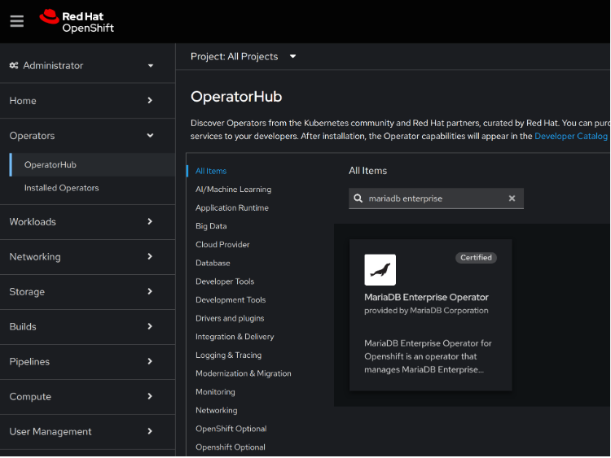
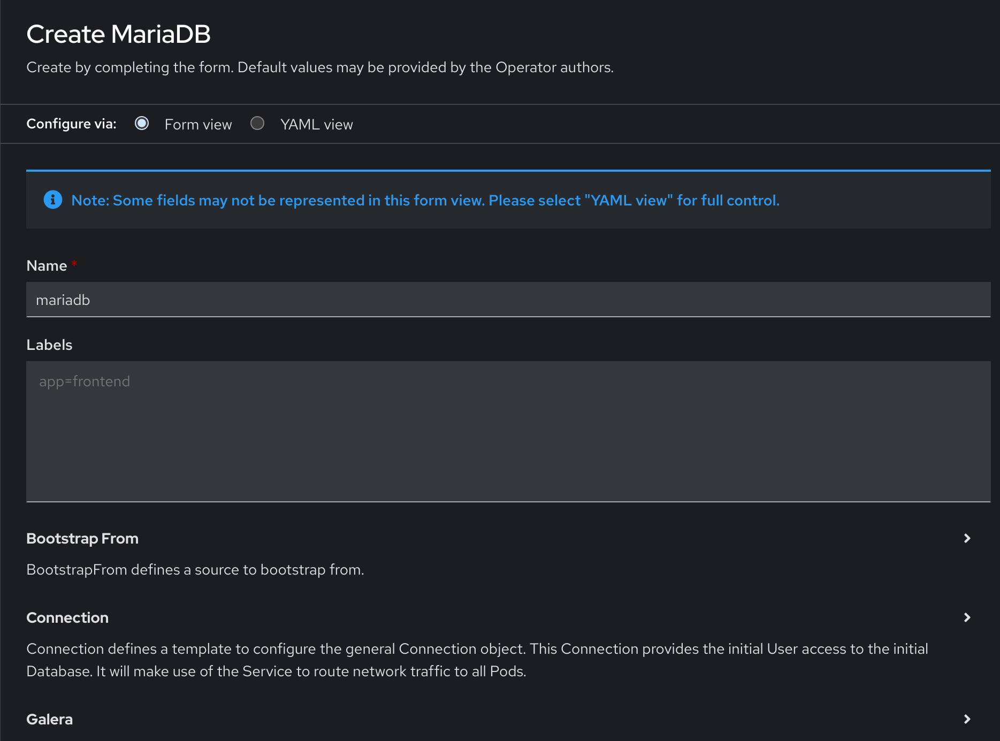

# OpenShift

This documentation provides guidance on installing the MariaDB Enterprise Operator operator in OpenShift. This operator has been [certified by Red Hat](https://connect.redhat.com/en/partner-with-us/what-are-operators) and it is available in the OpenShift console.

Operators are deployed into OpenShift with the [Operator Lifecycle Manager (OLM)](https://olm.operatorframework.io/), which facilitates the installation, updates, and overall management of their lifecycle.

## Prerequisites

Configure your [customer credentials as described in the documentation](../customer-access-to-docker-mariadb-com.md#openshift) to be able to pull images.

The recommended way to configure credentials is to use the [global pull secret](https://docs.redhat.com/en/documentation/openshift_container_platform/4.18/html/images/managing-images#images-update-global-pull-secret_using-image-pull-secrets) provided by OpenShift, as described [in this section](../customer-access-to-docker-mariadb-com.md#openshift). Alternatively, the operator bundle has a `mariadb-enterprise` `imagePullSecret` configured by default. This means that you can configure a `Secret` named `mariadb-enterprise` in same namespace where the operator will be installed in order to pull images from the MariaDB Enterprise registry.

## `PackageManifest`

You can install the certified operator in OpenShift clusters that have the `mariadb-enterprise-operator` `packagemanifest` available. In order to check this, run the following command:

```sh
oc get packagemanifests -n openshift-marketplace mariadb-enterprise-operator

NAME                          CATALOG                 AGE
mariadb-enterprise-operator   Certified Operators     21h
```

## `SecurityContextConstraints`

Both the operator and the operand `Pods` run with the `restricted-v2` `SecurityContextConstraint`, the most restrictive SCC in OpenShift in terms of container permissions. This implies that OpenShift automatically assigns a `SecurityContext` for the `Pods` with minimum permissions, for example:

```yaml
securityContext:
  allowPrivilegeEscalation: false
  capabilities:
    drop:
    - ALL
  runAsNonRoot: true
  runAsUser: 1000650000
```


OpenShift does not assign `SecurityContexts` in the `default` and `kube-system` namespaces. Please refrain from deploying operands on them, as it will result in permission errors when trying to write to the filesystem.


You can read more about [SecurityContextConstraints in the OpenShift documentation](https://docs.redhat.com/en/documentation/openshift_container_platform/4.18/html/authentication_and_authorization/managing-pod-security-policies).

## Installation in all namespaces

To install the operator watching resources on all namespaces, you need to to create a `Subscription` object for `mariadb-enterprise-operator` using the `stable` channel in the `openshift-operators` namespace:

```yaml
apiVersion: operators.coreos.com/v1alpha1
kind: Subscription
metadata:
  name: mariadb-enterprise-operator
  namespace: openshift-operators
spec:
  channel: stable
  installPlanApproval: Automatic
  name: mariadb-enterprise-operator
  source: certified-operators
  sourceNamespace: openshift-marketplace
  startingCSV: mariadb-enterprise-operator.v1.0.0
```

This will use the `global-operators` `OperatorGroup` that is created by default in the `openshift-operators` namespace. This `OperatorGroup` will watch all namespaces in the cluster, and the operator will be able to manage resources across all namespaces.

You can read more about [OperatorGroups in the OpenShift documentation](https://olm.operatorframework.io/docs/concepts/crds/operatorgroup/).

## Installation in specific namespaces

In order to define which namespaces the operator will be watching, you need to create an `OperatorGroup` in the namespace where the operator will be installed:

```yaml
apiVersion: operators.coreos.com/v1
kind: OperatorGroup
metadata:
  name: mariadb-enterprise-operator
  namespace: my-namespace
spec:
  targetNamespaces:
  - my-namespace
  - my-other-namespace
  - my-other-other-namespace
  upgradeStrategy: Default
```

This `OperatorGroup` will watch the namespaces defined in the `targetNamespaces` field. The operator will be able to manage resources only in these namespaces.

Then, the operator can be installed by creating a `Subscription` object in the same namespace as the `OperatorGroup`:

```yaml
apiVersion: operators.coreos.com/v1alpha1
kind: Subscription
metadata:
  name: mariadb-enterprise-operator
  namespace: my-namespace
spec:
  channel: stable
  installPlanApproval: Automatic
  name: mariadb-enterprise-operator
  source: certified-operators
  sourceNamespace: openshift-marketplace
  startingCSV: mariadb-enterprise-operator.v1.0.0
```

## Release channels

Currently, the only release channel available to install the operator is `stable`, which contains supported releases of the operator. This is controlled by the `channel` field in the `Subscription` object.

## Updates

Updates are fully managed by OLM and controlled by the `installPlanApproval` field in the `Subscription` object. The default value is `Automatic`, which means that OLM will automatically update the operator to the latest version available in the channel. If you want to control the updates, you can set this field to `Manual`, and OLM will only update the operator when you approve the update.

## Uninstalling

The first step for uninstalling the operator is to delete the `Subscription` object. This will not remove the operator, but it will stop OLM from managing the operator:

```sh
oc delete subscription mariadb-enterprise-operator
```

After that, you can uninstall the `ClusterServiceVersion` (CSV) object that was created by OLM. This will remove the operator from the cluster:

```sh
oc delete clusterserviceversion mariadb-enterprise-operator.v1.0.0
```

## OpenShift console

As an alternative to create `Subscription` objects via the command line, you can install operators by using the OpenShift console. Go to the `Operators > OperatorHub` section and search by `mariadb enterprise`:



Select `MariaDB Enterprise Operator`, click on install, and you will be able to create a `Subscription` object via the UI.

Once deployed, the operator comes with example resources that can be deployed from the console directly. For instance, to create a `MariaDB`:



As you can see in the previous screenshot, the form view that the OpenShift console offers is limited, we recommend using the YAML view:


<sub>_This page is licensed: CC BY-SA / Gnu FDL_</sub>


